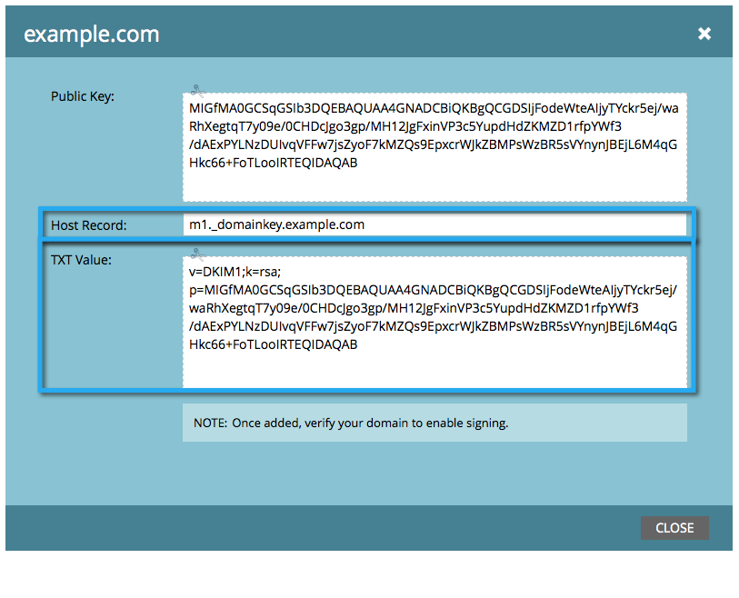

# Configuración de una firma DKIM personalizada {#set-up-a-custom-dkim-signature}

Para garantizar la capacidad de envío superior, firmamos automáticamente todos los correos salientes con una firma DKIM compartida de Marketo.

>[!NOTE]
>
>Es posible que necesite la ayuda de su equipo de TI para completar algunos de los pasos de este artículo.

Puede personalizar la firma DKIM para que refleje los dominios de su elección. Así es como.

1. Vaya a la **Administrador** para obtener más información.

   

   >[!NOTE]
   >
   >Si configuras una firma DKIM personalizada a la manera antigua, seguirá funcionando y debería aparecer aquí.

1. Haga clic en **Correo electrónico**, luego la variable **DKIM** y finalmente **Agregar dominio**.

   

1. Introduzca el dominio que utilizará en los correos electrónicos de Marketo como Dirección de origen y haga clic en **Agregar**.

   >[!TIP]
   >
   >Si utiliza un dominio diferente en su dirección De, utilizaremos la firma DKIM compartida de Marketo.

   

1. Envíe el **Registro de host** y **Valor TXT** a su TI. Solicite que creen el registro por usted y asegúrese de que se propaga a todos los servidores de nombres asociados al dominio de origen. La verificación DKIM de Marketo requiere que la clave DKIM se propague a todos los servidores de nombres asociados con el dominio que está siendo firmado por DKIM.

   

1. Una vez que confirmen que han creado el registro, vuelva a Marketo, seleccione su dominio y haga clic en **Comprobar DNS**.

   

   >[!NOTE]
   >
   >Si la confirmación falla y el departamento de TI ha creado el registro correctamente, puede tratarse de una propagación de DNS. Inténtelo de nuevo más tarde.

   >[!CAUTION]
   >
   >Modificar/quitar el registro DNS correspondiente dañará la capacidad de envío. Asegúrese de eliminar la entrada en Marketo antes de realizar cambios en DNS.

   Esto le ayudará en absoluto con la capacidad de envío de su correo electrónico. Debe obtener la validación de que el registro está allí y es correcto.
