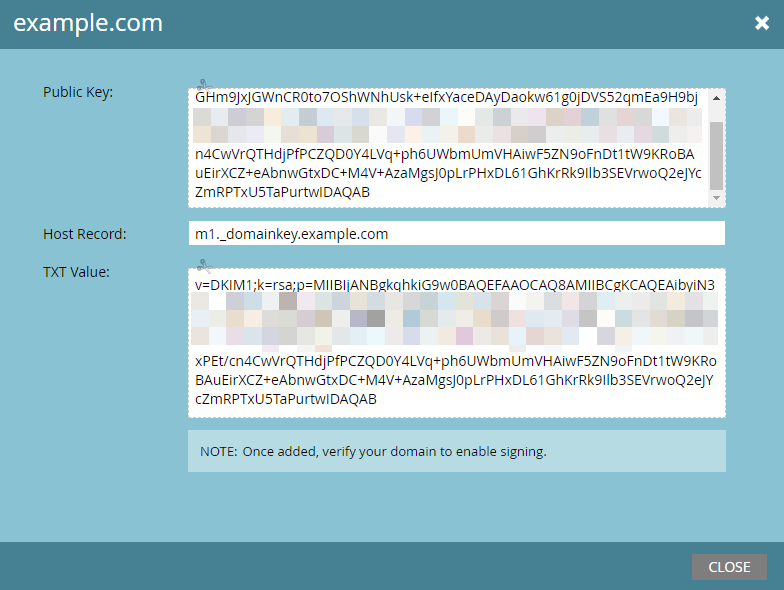

# Configurar una firma DKIM personalizada {#set-up-a-custom-dkim-signature}

Para garantizar la máxima capacidad de entrega, firmamos automáticamente todo el correo saliente con una firma DKIM compartida de Marketo.

>[!NOTE]
>
>Es posible que necesite la ayuda de su equipo de TI para completar algunos de los pasos de este artículo.

Puede personalizar la firma DKIM para reflejar los dominios que elija. Así es como.

1. Vaya a la **Administrador** sección.

   

   >[!NOTE]
   >
   >Si configura una firma DKIM personalizada de la forma antigua, seguirá funcionando y debería aparecer aquí.

1. Clic **Correo electrónico**.

   

1. Haga clic en **SPF/DKIM** pestaña, luego **Añadir dominio**.

   

1. Introduzca el dominio que utilizará en los correos electrónicos de Marketo como dirección de origen. Elija un Selector y un Tamaño de clave. Clic **Añadir** cuando termine.

   

   <table> 
   <tr>
   <td width="20%"><b>Selector</b></td>
   <td>Cadena o identificador único que se utiliza para localizar la parte de clave pública del registro DKIM. Puede ser una cadena arbitraria o un identificador único para separar e identificar el propósito de esa clave/registro DKIM.</td>
   </tr>
   <tr> 
   <td width="20%"><b>Tamaño de clave</b></td>
   <td>El nivel de seguridad con el que desea que se cifre su firma DKIM.</td>
   </tr>
   </tbody>
   </table>

   

   >[!TIP]
   >
   >* Recomendamos un tamaño de clave de 2048.
   >* Si utiliza un dominio diferente en la dirección remitente, se utilizará la firma DKIM compartida de Marketo.

   >[!IMPORTANT]
   >
   >Si necesita actualizar el selector DKIM o el tamaño de codificación DKIM para su dominio, debe eliminar el registro existente y volver a publicar el registro recién generado con los nuevos valores.
   >
   >Tenga en cuenta que al hacerlo, DKIM no se firmará para su dominio hasta que nuestro sistema publique y valide su nuevo registro. Planifique el cambio en consecuencia, ya que pueden pasar de 24 a 48 horas antes de que el nuevo registro DKIM se propague completamente por Internet.

1. Envíe el **Registro de host** y **Valor TXT** a su equipo de TI. Pídale que cree el registro y asegúrese de que se propaga a todos los servidores de nombres asociados con el dominio de origen. La verificación DKIM de Marketo requiere que la clave DKIM se propague a todos los servidores de nombres asociados con el dominio que se está firmando con DKIM.

   

1. Una vez que confirmen que han creado el registro, vuelva a Marketo, seleccione el dominio y haga clic en **Comprobar DNS**.

   

   >[!NOTE]
   >
   >Si la confirmación falla y el equipo de TI ha creado el registro correctamente, puede ser una cuestión de propagación del DNS. Inténtelo de nuevo más tarde.

   >[!CAUTION]
   >
   >Modificar o eliminar el registro DNS correspondiente resultará en una capacidad de envío dañada. Asegúrese de eliminar la entrada en Marketo antes de realizar cambios en DNS.

   Esto le ayudará en absoluto con su capacidad de envío de correo electrónico. Debe obtener la validación de que el registro está allí y corregirlo.
