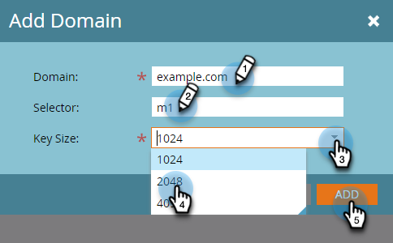

# Configurar una firma personalizada de DKIM {#set-up-a-custom-dkim-signature}

Para garantizar una capacidad de envío óptima, Marketo firma automáticamente todo el correo saliente con una firma DKIM compartida.

>[!NOTE]
>
>Es posible que necesite la ayuda de su equipo de TI para completar algunos de los pasos de este artículo.

Puede personalizar la firma de DKIM para que refleje los dominios que elija.

1. Vaya a la sección **[!UICONTROL Admin]**.

   

   >[!NOTE]
   >
   >Si configura una firma de DKIM personalizada mediante el método heredado, seguirá funcionando y debería aparecer aquí.

1. Haga clic en **Correo electrónico**.

   

1. Haga clic en la ficha **SPF/DKIM** y luego en **Agregar dominio**.

   

1. Introduzca el dominio que utilizará en los correos electrónicos de Marketo como dirección de origen. Elija un Selector y un Tamaño de clave. Haga clic en **Agregar** cuando haya terminado.

   

   <table>
   <tr>
   <td width="20%"><b>Selector</b></td>
   <td>Cadena o identificador único que se utiliza para localizar la parte de clave pública del registro de DKIM. Puede ser una cadena arbitraria o un identificador único para separar e identificar el propósito de esa clave/registro de DKIM.</td>
   </tr>
   <tr>
   <td width="20%"><b>Tamaño de clave</b></td>
   <td>El nivel de seguridad con el que desea que se cifre la firma de DKIM.</td>
   </tr>
   </tbody>
   </table>

   

   >[!TIP]
   >
   >* Se recomienda un tamaño de clave de 2048.
   >* Si utiliza un dominio diferente en la dirección remitente, Marketo utilizará la firma compartida de DKIM.

   >[!IMPORTANT]
   >
   >Si necesita actualizar el Selector de DKIM o el Tamaño de cifrado de DKIM para su dominio, debe eliminar el registro existente y volver a publicar el registro recién generado con los nuevos valores.
   >
   >Al hacerlo, DKIM no se firmará para su dominio hasta que nuestro sistema publique y valide su nuevo registro. Planifique el cambio en consecuencia, ya que pueden pasar de 24 a 48 horas antes de que el nuevo registro de DKIM se propague completamente por Internet.

1. Envíe el **[!UICONTROL registro de host]** y el **[!UICONTROL valor TXT]** a su equipo de TI. Pídale que cree el registro y asegúrese de que se propaga a todos los servidores de nombres asociados con el dominio de origen. La verificación DKIM de Marketo requiere que la clave de DKIM se propague a todos los servidores de nombres asociados con el dominio que se firma con DKIM.

   

1. Una vez que confirmen que han creado el registro, vuelva a Marketo, seleccione su dominio y haga clic en **[!UICONTROL Comprobar DNS]**.

   

   >[!NOTE]
   >
   >Si la confirmación falla y el equipo de TI ha creado el registro correctamente, puede ser una cuestión de propagación del DNS. Inténtelo de nuevo más tarde.

   >[!CAUTION]
   >
   >Modificar o eliminar el registro DNS correspondiente resultará en una capacidad de envío dañada. Elimine la entrada en Marketo antes de realizar cambios en DNS.

   Esto mejorará la capacidad de envío de correo electrónico. Debe obtener la validación de que el registro está allí y corregirlo.
