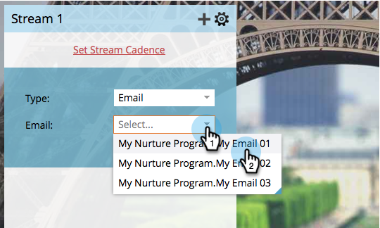
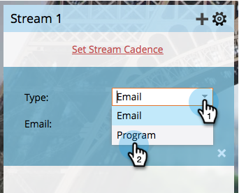

# Añadir contenido en un flujo {#add-content-to-a-stream}

Una vez que haya creado el programa de participación, deberá agregar contenido a los flujos. Puede agregar correos electrónicos o programas a un flujo.

## Añadir un correo electrónico en un flujo {#add-an-email-to-a-stream}

1. Vaya a Actividades **de marketing**.

   

1. Seleccione el programa de participación y vaya a la ficha **Flujos** .

   

   Puede agregar el primer correo electrónico de tres maneras diferentes:

**Botón añadir contenido**

1. Haga clic en el botón **Añadir contenido** .

   

1. Deje el **tipo** establecido en **Correo electrónico** y, a continuación, seleccione el correo electrónico que desee agregar.

   

   >[!TIP]
   >
   >Los correos electrónicos locales a este programa de participación se ordenarán en la parte superior.

**Flujo + icono**

1. Haga clic en el icono de flujos **+** , deje **Tipo** como **Correo electrónico** y seleccione el correo electrónico que desee agregar.

   

**Arrastrar y soltar**

1. Basta con arrastrar el correo electrónico del árbol al flujo.

   

## Añadir un Programa en un flujo {#add-a-program-to-a-stream}

1. Vaya a Actividades **de marketing**.

   

1. Seleccione el programa de participación y vaya a la ficha **Flujos** .

   

   Puede agregar un programa al flujo de tres maneras diferentes:

**Botón añadir contenido**

1. Haga clic en **Añadir contenido**.

   

1. Cambiar **Tipo** a Programa.

   

1. Busque y seleccione el programa.

   

1. Ahora escoja la campaña inteligente en el programa por el que quiere que la gente pase.

   

   >[!NOTE]
   >
   >**Recordatorio**
   >
   >
   >La campaña inteligente debe tener el Programa **** Miembro de compromiso para que funcione correctamente.

**Flujo + icono**

1. Haga clic en el icono de flujo **+** y, a continuación, cambie **Tipo** por Programa.

   

1. Busque y seleccione su programa.

   

1. Seleccione la campaña inteligente en la que desea que se procesen las personas.

   

**Arrastrar y soltar**

1. Arrastre y suelte el programa que desee del árbol en el flujo.

   

1. Ahora sólo escoja la campaña inteligente que quiere que la gente pase.

   

¡bueno trabajo! Ahora conoce diferentes formas de agregar contenido a sus flujos de programa. Añada tantos como necesite para su crianza. Consulte el artículo relacionado a continuación para obtener más detalles.

>[!NOTE]
>
>**Artículos relacionados**
>
>* [Añadir un Programa en un flujo de Programa de participación](adding-a-program-to-an-engagement-program-stream.md)

>

