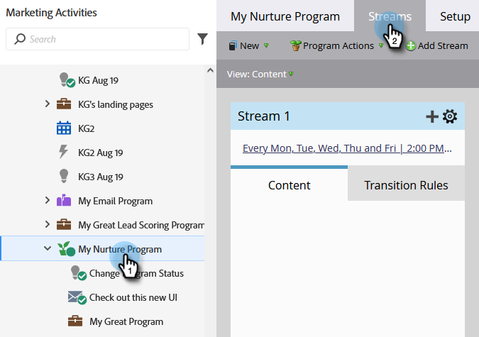

# Añadir contenido a un flujo {#add-content-to-a-stream}

Una vez que haya creado su programa de participación, debe añadir contenido a los flujos. Puede agregar correos electrónicos o programas a un flujo.

1. Vaya a **[!UICONTROL Actividades de marketing]**.

   

1. Seleccione su programa de participación y vaya a la ficha **[!UICONTROL Transmisiones]**.

   

   Puede añadir contenido de dos formas diferentes:

**Botón Agregar contenido**

1. Haga clic en el botón **[!UICONTROL Agregar contenido]**.

   

1. Elija **[!UICONTROL Correo electrónico]** _o_ **[!UICONTROL Programa]** y, a continuación, seleccione el correo electrónico, el programa o la campaña inteligente que desee agregar.

   

   >[!TIP]
   >
   >Los correos electrónicos locales de este programa de participación se ordenarán arriba.

**+ Icono**

1. Haga clic en el icono **+**, elija **[!UICONTROL Correo electrónico]** _o_ **[!UICONTROL Programa]** y, a continuación, seleccione el correo electrónico, el programa o la campaña inteligente que desee agregar.

   

   >[!NOTE]
   >
   >Una campaña inteligente debe contener el filtro **[!UICONTROL Miembro del programa de participación]** para que funcione correctamente.

¡Buen trabajo! Ahora sabe cómo agregar contenido a las secuencias de programas. Añada todo lo que necesite para su nutrición. Consulte el artículo relacionado siguiente para obtener más información.

>[!MORELIKETHIS]
>
>[Agregar un programa a un flujo de programa de participación](/help/marketo/product-docs/email-marketing/drip-nurturing/creating-an-engagement-program/adding-a-program-to-an-engagement-program-stream.md)
