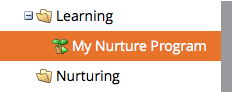

# Creación de un programa de participación {#create-an-engagement-program}

Puede utilizar programas de participación en Marketo para nutrir el correo electrónico con facilidad.

1. Vaya a **[!UICONTROL Actividades de marketing]**.

   

1. Seleccione la carpeta en la que desea crear el programa de participación y, a continuación, haga clic en **[!UICONTROL Nuevo]** y **[!UICONTROL Nuevo programa]**.

   

1. Escriba un **[!UICONTROL Nombre]**, seleccione **[!UICONTROL Participación]** para **[!UICONTROL Tipo de programa]** y haga clic en **[!UICONTROL Crear]**.

   

1. Ahora que ya tiene un programa de participación, sigamos adelante y completémoslo.

   

   >[!MORELIKETHIS]
   >
   >* [Añadir contenido a un flujo](/help/marketo/product-docs/email-marketing/drip-nurturing/creating-an-engagement-program/add-content-to-a-stream.md)
   >* [Establecer cadencia de la secuencia](/help/marketo/product-docs/email-marketing/drip-nurturing/engagement-program-streams/set-stream-cadence.md)
