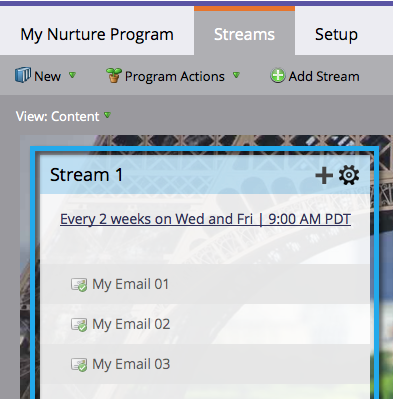
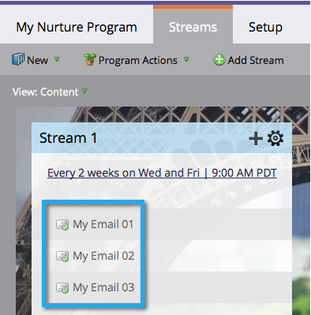
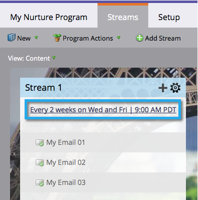

# Explicación de los programas de participación {#understanding-engagement-programs}

Los programas de participación están diseñados para comercializar con nuevas personas a las que se presenta contenido de manera sistemática.

>[!NOTE]
>
>Hay un límite de 100 programas de participación **activos** por suscripción.

## Programa de participación {#engagement-program}

Un **programa de participación** es un tipo de programa que puede llevar a cabo complejas tareas de cultivo con facilidad.

>[!MORELIKETHIS]
>
>[Creación de un programa de participación](/help/marketo/product-docs/email-marketing/drip-nurturing/creating-an-engagement-program/create-an-engagement-program.md)

## Secuencia {#stream}

Una **secuencia** es un conjunto de contenido prioritario que el programa de participación usa para cultivar a las personas.

>[!MORELIKETHIS]
>
>* [Añadir una secuencia](/help/marketo/product-docs/email-marketing/drip-nurturing/creating-an-engagement-program/add-a-stream.md)
>* [Clonar una secuencia](/help/marketo/product-docs/email-marketing/drip-nurturing/engagement-program-streams/clone-a-stream.md)

## Contenido {#content}

Existen dos tipos de **contenido** que puede añadir a las secuencias de programas de participación: correos electrónicos y programas. Se enviarán correos electrónicos a las personas en el momento de difusión.

>[!MORELIKETHIS]
>
>* [Añadir contenido a un flujo](/help/marketo/product-docs/email-marketing/drip-nurturing/creating-an-engagement-program/add-content-to-a-stream.md)
>* [Priorizar contenido de secuencia](/help/marketo/product-docs/email-marketing/drip-nurturing/using-stream-content/prioritize-stream-content.md)
>* [Editar disponibilidad de contenido de secuencia](/help/marketo/product-docs/email-marketing/drip-nurturing/using-stream-content/edit-availability-of-stream-content.md)
>* [Quitar contenido de secuencia](/help/marketo/product-docs/email-marketing/drip-nurturing/using-stream-content/remove-stream-content.md)
>* [Archivar y desarchivar contenido de secuencia](/help/marketo/product-docs/email-marketing/drip-nurturing/using-stream-content/archive-and-unarchive-stream-content.md)

## Transmisión {#cast}

Una **difusión** es el evento de envío de correos electrónicos desde un programa de participación.

>[!NOTE]
>
>Los programas de participación no están diseñados para utilizarse con correos electrónicos operativos.

## Cadencia de la secuencia {#stream-cadence}

Usted decide cuándo se produce una difusión estableciendo la **cadencia de secuencia**. A continuación se indica cómo se programa la publicación de contenido a intervalos regulares.

>[!MORELIKETHIS]
>
>[Establecer cadencia de la secuencia](/help/marketo/product-docs/email-marketing/drip-nurturing/engagement-program-streams/set-stream-cadence.md)

## Cadencia de la persona {#person-cadence}

Una **cadencia de persona** es un estado que define su capacidad para recibir contenido procedente de un programa de participación. Puede usar el paso de flujo **[!UICONTROL Cambiar cadencia del programa de participación]** para cambiarlo a [!UICONTROL En pausa] o [!UICONTROL Normal].

## Agotados {#exhausted}

Una vez que una persona ha recibido cada fragmento de contenido de una secuencia, la persona se denomina como **Agotada**.

>[!MORELIKETHIS]
>
>[Personas que tienen contenido agotado](/help/marketo/product-docs/email-marketing/drip-nurturing/using-engagement-programs/people-who-have-exhausted-content.md)

## Nivel de interacción con el contenido {#content-engagement-level}

Nivel de participación en el contenido hace referencia a la puntuación de 0 a 100 puntos que Marketo proporcionará a su contenido. Este número se determina mediante una fórmula sofisticada que usa aperturas, clics, cancelaciones de suscripción, éxito del programa y otros factores.

>[!MORELIKETHIS]
>
>[Explicación de la puntuación de participación](/help/marketo/product-docs/email-marketing/drip-nurturing/reports-and-notifications/understanding-the-engagement-score.md)
