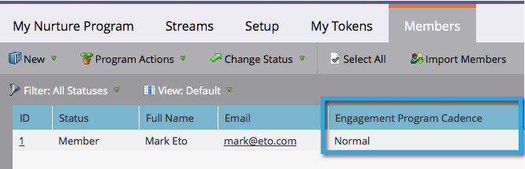

# Explicación de los programas de participación {#understanding-engagement-programs}

Los programas de participación están diseñados para comercializar con nuevas personas presentándoles contenido de una manera sistemática.

>[!NOTE]
>
>Hay un límite de 100 **programas de participación activos** por suscripción.

## Programa de participación {#engagement-program}

Un **programa de participación** es un tipo de programa que puede llevar a cabo tareas de nutrición complejas con facilidad.

>[!MORELIKETHIS]
>
>[Crear un programa de participación](/help/marketo/product-docs/email-marketing/drip-nurturing/creating-an-engagement-program/create-an-engagement-program.md)

## Secuencia {#stream}

Un **flujo** es un conjunto de contenido priorizado que el programa de participación usará para educar a las personas.

>[!MORELIKETHIS]
>
>* [Agregar una secuencia](/help/marketo/product-docs/email-marketing/drip-nurturing/creating-an-engagement-program/add-a-stream.md)
>* [Clonar una secuencia](/help/marketo/product-docs/email-marketing/drip-nurturing/engagement-program-streams/clone-a-stream.md)

## Contenido {#content}

Existen dos tipos de **contenido** que puede agregar a los flujos de programas de participación: correos electrónicos y programas. Se enviarán correos electrónicos a las personas en el momento del lanzamiento.

>[!MORELIKETHIS]
>
>* [Agregar contenido a un flujo](/help/marketo/product-docs/email-marketing/drip-nurturing/creating-an-engagement-program/add-content-to-a-stream.md)
>* [Priorizar contenido de la emisión](/help/marketo/product-docs/email-marketing/drip-nurturing/using-stream-content/prioritize-stream-content.md)
>* [Editar disponibilidad de contenido de la emisión](/help/marketo/product-docs/email-marketing/drip-nurturing/using-stream-content/edit-availability-of-stream-content.md)
>* [Quitar contenido de la emisión](/help/marketo/product-docs/email-marketing/drip-nurturing/using-stream-content/remove-stream-content.md)
>* [Archivar y desarchivar contenido de la emisión](/help/marketo/product-docs/email-marketing/drip-nurturing/using-stream-content/archive-and-unarchive-stream-content.md)

## Fundir {#cast}

Un **cast** es el evento de envío de correos electrónicos desde un programa de participación.

>[!NOTE]
>
>Los programas de participación no están diseñados para utilizarse con correos electrónicos operativos.

## Cadencia de la secuencia {#stream-cadence}

Usted decide cuándo se produce una conversión estableciendo **cadencia de flujo**. Así es como se programa que el contenido se publique a intervalos regulares.

>[!MORELIKETHIS]
>
>[Establecer cadencia de flujo](/help/marketo/product-docs/email-marketing/drip-nurturing/engagement-program-streams/set-stream-cadence.md)

## Cadencia de persona {#person-cadence}

Una cadencia de **persona** es un estado que define su capacidad para recibir contenido de un programa de participación. Puede usar el paso de flujo **Cambiar cadencia del programa de participación** para cambiar esto a En pausa o Normal.

## Agotados {#exhausted}

Una vez que una persona ha recibido cada fragmento de contenido en un flujo, llamamos a la persona **Agotada**.

>[!MORELIKETHIS]
>
>[Personas Con Contenido Agotado](/help/marketo/product-docs/email-marketing/drip-nurturing/using-engagement-programs/people-who-have-exhausted-content.md)

## Nivel de interacción de contenido {#content-engagement-level}

El nivel de participación en el contenido es una puntuación de 0 a 100 puntos que Marketo le proporcionará al contenido. Este número está determinado por una fórmula sofisticada que utiliza aperturas, clics, cancelaciones de suscripción, éxito del programa y otros factores.

>[!MORELIKETHIS]
>
>[Explicación de la puntuación de participación](/help/marketo/product-docs/email-marketing/drip-nurturing/reports-and-notifications/understanding-the-engagement-score.md)
