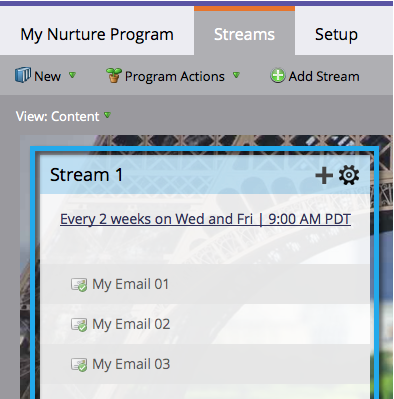

# Explicación de los Programas de compromiso {#understanding-engagement-programs}

Los programas de compromiso están diseñados para comercializar a las personas nuevas presentándoles contenido de manera sistemática.

>[!NOTE]
>
>**FYI**
>
>Marketo ahora está estandarizando el idioma en todas las suscripciones, por lo que puede ver posibles clientes/posibles clientes en su suscripción y persona/personas en docs.marketo.com. Estos términos significan lo mismo; no afecta a las instrucciones del artículo. También hay otros cambios. [Más información](http://docs.marketo.com/display/DOCS/Updates+to+Marketo+Terminology).

>[!NOTE]
>
>Existe un límite de 100 programas de participación **activa** por suscripción.

## Programa de participación {#engagement-program}

Un **compromiso pr****ograma** es un tipo de programa que puede llevar a cabo la crianza compleja con facilidad.

Artículo relacionado:

* [Crear un Programa de compromiso](create-an-engagement-program.md)

## Flujo {#stream}

Un **flujo** es un grupo de contenido con prioridad que el programa de participación utilizará para alimentar a las personas.

Artículos relacionados:

* [Añadir un flujo](add-a-stream.md)
* [Clonar un flujo](../../../../product-docs/email-marketing/drip-nurturing/engagement-program-streams/clone-a-stream.md)

## Contenido {#content}

Existen dos tipos de **contenido** que puede agregar a los flujos de programas de participación: correos electrónicos y programas. Los mensajes de correo electrónico se enviarán a las personas en el momento del lanzamiento.

Artículos relacionados:

* [Añadir contenido en un flujo](add-content-to-a-stream.md)
* [Priorizar el contenido del flujo](../../../../product-docs/email-marketing/drip-nurturing/using-stream-content/prioritize-stream-content.md)
* [Editar disponibilidad del contenido del flujo](../../../../product-docs/email-marketing/drip-nurturing/using-stream-content/edit-availability-of-stream-content.md)
* [Eliminar contenido del flujo](../../../../product-docs/email-marketing/drip-nurturing/using-stream-content/remove-stream-content.md)
* [Archivar y desarchivar contenido de flujo](../../../../product-docs/email-marketing/drip-nurturing/using-stream-content/archive-and-unarchive-stream-content.md)

## Cast {#cast}

Un **envío** es el evento de enviar correos electrónicos desde un Programa de compromiso.

>[!NOTE]
>
>Los Programas de participación no están diseñados para utilizarse con correos electrónicos operativos.

## Cadenas de flujo {#stream-cadence}

Usted decide cuándo se produce un reparto configurando la cadencia **del flujo**. Así es como se programa la salida del contenido a intervalos regulares.

` 

`

Artículo relacionado:

* [Definir secuencia de flujo](../../../../product-docs/email-marketing/drip-nurturing/engagement-program-streams/set-stream-cadence.md)

## Persona Cadence {#person-cadence}

Una cadencia **de** persona es un estado que define su capacidad para recibir contenido de un programa de participación. Puede utilizar el paso **Cambiar el flujo de Programa de compromiso** para cambiar esto a En pausa o Normal.

` 

`

## Agotado {#exhausted}

Una vez que una persona ha recibido cada fragmento de contenido en un flujo, llamamos a la persona **Agotada**.

>[!NOTE]
>
>**Artículos relacionados**
>
>* [Personas que han caducado el contenido](../../../../product-docs/email-marketing/drip-nurturing/using-engagement-programs/people-who-have-exhausted-content.md)

>

## Nivel de compromiso de contenido {#content-engagement-level}

El nivel de participación en el contenido es una puntuación de 0 a 100 puntos que el Marketing proporcionará a su contenido. Este número está determinado por una fórmula sofisticada que utiliza aperturas, clics, cancelaciones de suscripción, éxito de programas y otros factores.

>[!NOTE]
>
>**Artículos relacionados**
>
>* [Explicación de la puntuación de participación](../../../../product-docs/email-marketing/drip-nurturing/reports-and-notifications/understanding-the-engagement-score.md)

>

