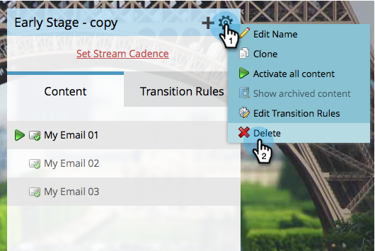

# Eliminar un flujo {#delete-a-stream}

Si alguna vez necesita eliminar un flujo del programa de participación, siga estos pasos rápidos y sencillos.

1. Vaya a **Actividades de marketing**.

   

1. Seleccione el programa de participación y vaya a **Flujos**.

   

   >[!CAUTION]
   >
   >Al eliminar una secuencia, se perderán datos históricos del contenido de dicha secuencia.

1. Haga clic en el icono de engranaje y seleccione **Eliminar**.

   

1. Confirme la eliminación haciendo clic en **Eliminar**.

   

   >[!NOTE]
   >
   >Si el flujo tiene personas en él, se le pedirá que [las mueva](/help/marketo/product-docs/core-marketo-concepts/smart-campaigns/program-flow-actions/change-engagement-program-stream.md) primero.
