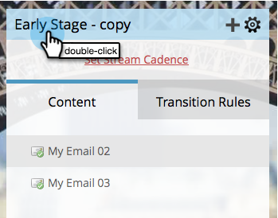

# Cambiar nombre de flujo {#rename-a-stream}

Si desea mantenerse organizado, puede cambiar el nombre de los flujos. Así es como se hace.

1. Busque y seleccione su programa de participación y luego haga clic en **[!UICONTROL Transmisiones]**.

   

1. Haga doble clic en el nombre de la secuencia actual.

   

1. Escriba el nuevo flujo **[!UICONTROL Name]** y haga clic en **[!UICONTROL Guardar]**.

   

   ¡Y voilà! Ahora sabe cómo cambiar el nombre de las secuencias.
