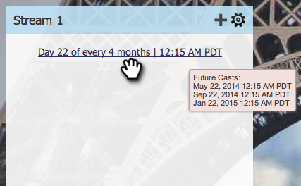

# Definir secuencia de flujo {#set-stream-cadence}

Puede enviar contenido de participación en cualquier intervalo que desee. Por ejemplo: una vez a la semana o cada tres martes del mes.

## Establecer la cadencia {#set-cadence}

1. Vaya a Actividades **de marketing**.

   

1. Busque y seleccione el programa de participación, haga clic en la ficha **Streams **y, a continuación, haga clic en **Definir secuencia** de flujo.

   

1. Seleccione la frecuencia con la que desea que se repita la cadencia. Puede elegir** semanal** o **mensual**.

## Semanal {#weekly}

1. Seleccione **Semanal**.

   

   >[!NOTE]
   >
   >Al seleccionar **Ninguno **se cerrará el flujo.

1. Elija la fecha del primer reparto.

   

1. Ahora elija si desea que la cadencia ocurra cada semana o más espaciada. Vamos a elegir cada dos semanas.

   

1. Decida qué días de la semana. En este caso, hagamos martes, miércoles y jueves.

   

   >[!TIP]
   >
   >Puede configurar la cadencia para que se ejecute todos los días seleccionando **Repeticiones: Semanal** /** Cada: 1 Semana** /** ****El**: todos los días.

   Ahora elija la hora. Marque la casilla si desea utilizar el huso horario del [Destinatario](set-stream-cadence/schedule-engagement-programs-with-recipient-time-zone.md)(es decir, entregar según los husos horarios locales) y haga clic en Guardar.
   

   >[!CAUTION]
   >
   >El contenido se publicará en la fecha que seleccione para el primer lanzamiento, por lo que asegúrese de que coincide con el día de la semana que elija; de lo contrario, saldrá dos veces en la primera semana.

1. Pase el ratón sobre la cadencia. Verás los días en que saldrán las proyecciones futuras.

   

   >[!NOTE]
   >
   >En este ejemplo, un correo electrónico saldrá el jueves. Luego saltamos una semana y enviamos nuevamente el martes, miércoles y jueves de la semana siguiente. Y luego volvemos.

¡Eso es todo! Sigue leyendo si quieres configurar una cadencia mensual.

## Mensual {#monthly}

1. Seleccione **Mensual **para la frecuencia con la que se repite.

   

1. Elija la fecha del primer reparto.

   

1. Seleccione si desea que esté cada mes o más espaciado... Vamos a elegir cada cuatro meses.

   

1. Elija el día del mes especificado, en este caso el 22 de cada cuatro meses.

   

   >[!TIP]
   >
   >También puede elegir el día de la semana.

1. Elija una **Hora** y haga clic en **Guardar**.

   

1. Pase el ratón sobre la cadencia. Verás los días en que saldrán las proyecciones futuras.

   

   >[!CAUTION]
   >
   >Si decide modificar la cadencia del flujo de participación más adelante, asegúrese de que el primer reparto se establezca en una fecha futura.

Ahora ya sabes cómo configurar una cadencia de flujo!

>[!NOTE]
>
>**Artículos relacionados**
>
>* [Explicación del huso horario del Destinatario](../../../../product-docs/email-marketing/email-programs/email-program-actions/scheduling-with-recipient-time-zone/understanding-recipient-time-zone.md)
>* [Programar Programas de participación con huso horario de Destinatario](set-stream-cadence/schedule-engagement-programs-with-recipient-time-zone.md)

>

