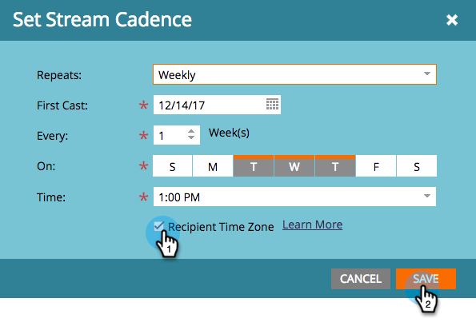

# Programar programas de participación con huso horario del destinatario {#schedule-engagement-programs-with-recipient-time-zone}

Cuando se programa un flujo de programa de participación y el huso horario del destinatario está activo, el reparto del programa empezará a ejecutarse a medianoche en el primer huso horario (UTC +14:00). Le pedimos que programe el primer reparto **al menos 25 horas** en el futuro porque puede haber personas que califiquen para el reparto en cada zona horaria en todo el mundo. Al iniciar el procesamiento en este momento en el primer huso horario, se garantiza que se enviará el correo electrónico en la fecha y hora programadas para cada destinatario.

1. En su programa de participación, vaya a la **Transmisiones** y haga clic en la programación de cadencia de un flujo para editarla.

   

1. [Configurar la cadencia](/help/marketo/product-docs/email-marketing/drip-nurturing/engagement-program-streams/set-stream-cadence.md) como lo haría normalmente, marque **Zona horaria del destinatario** en la ventana Recuerde que su primer reparto debe ser de al menos 25 horas en el futuro. Haga clic en **Guardar**.

   

1. Tenga en cuenta que con la zona horaria del destinatario activa, la programación de cadencia no mostrará una zona horaria específica, ya que podría haber varias. Solo se mostrará la hora.

   

>[!MORELIKETHIS]
>
>* [Explicación de la zona horaria del destinatario](/help/marketo/product-docs/email-marketing/email-programs/email-program-actions/scheduling-with-recipient-time-zone/understanding-recipient-time-zone.md)
>* [Establecer secuencia de flujo](/help/marketo/product-docs/email-marketing/drip-nurturing/engagement-program-streams/set-stream-cadence.md)

