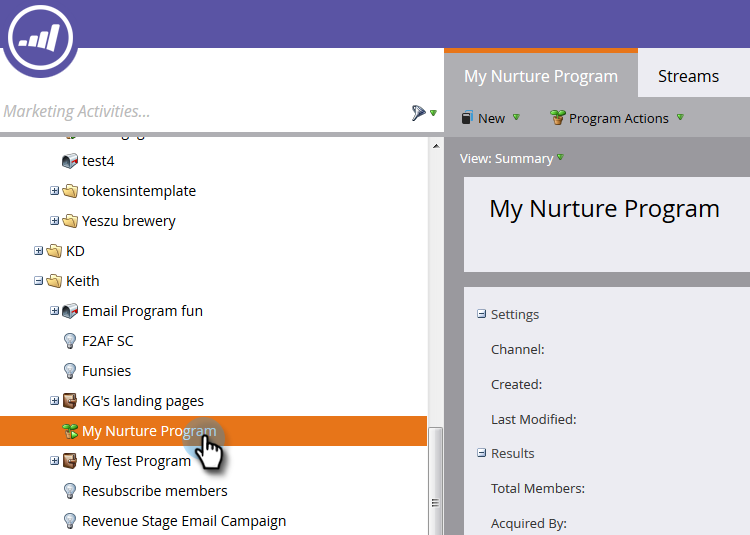
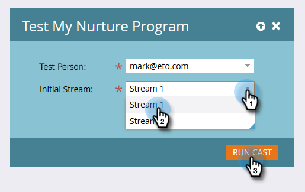

# Probar un flujo de participación {#test-an-engagement-stream}

Una vez que haya agregado todo el contenido a una emisión, puede probarlo de una en una.

1. Vaya a **Actividades de marketing**.

   

1. Seleccione su programa de participación.

   

1. Haga clic en **Acciones de programa** y seleccione **Flujo de prueba**.

   

1. Seleccione a su persona de la lista **Persona de prueba** lista desplegable. Recuerde que el contenido saldrá, así que tenga eso en cuenta al elegir.

   

   >[!CAUTION]
   >
   >Asegúrese de que la persona de prueba sea única y no tenga duplicados en la base de datos.

   >[!TIP]
   >
   >Si la persona de prueba que está buscando no existe, use la variable **Crear persona** para crear una sobre la marcha.

   Haga clic en Flujo inicial, seleccione el flujo que desee probar y haga clic en Ejecutar flujo.
   

1. Después de que la persona pase por el [reglas de transición](/help/marketo/product-docs/email-marketing/drip-nurturing/engagement-program-streams/transition-people-between-engagement-streams.md) anteriormente configurado, haga clic en el icono Actualizar .

   

1. Aparecerá el nuevo flujo, lo que indica que la prueba se ha realizado correctamente.

   

   ¡Buen trabajo!

   >[!NOTE]
   >
   >No se enviará ningún otro contenido a menos que haga clic en **Ejecutar Cast de nuevo**.
