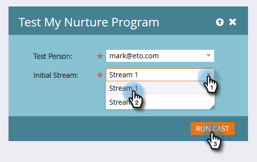

# Prueba de un flujo de participación {#test-an-engagement-stream}

Después de agregar todo el contenido a un flujo, puede probarlo de a una pieza a la vez.

1. Vaya a **[!UICONTROL Actividades de marketing]**.

   

1. Seleccione el programa de participación.

   

1. Haga clic en **[!UICONTROL Acciones de programa]** y seleccione **[!UICONTROL Probar secuencia]**.

   

1. Seleccione a su persona en la lista desplegable **[!UICONTROL Persona de prueba]**. Recuerde, el contenido se publicará, así que tenga esto en cuenta al elegir.

   

   >[!CAUTION]
   >
   >Asegúrese de que la persona de prueba sea única y no tenga duplicados en la base de datos.

   >[!TIP]
   >
   >Si la persona de prueba que busca no existe, use la opción **[!UICONTROL Crear persona]** para crear una sobre la marcha.

   Haga clic en **[!UICONTROL Secuencia inicial]**, seleccione la secuencia que desee probar y haga clic en **[!UICONTROL Ejecutar emisión]**.
   

1. Una vez que la persona haya pasado por las [reglas de transición](/help/marketo/product-docs/email-marketing/drip-nurturing/engagement-program-streams/transition-people-between-engagement-streams.md) que configuró anteriormente, haga clic en el icono Actualizar.

   

1. Aparecerá el nuevo flujo, lo que indica que la prueba se ha realizado correctamente.

   

   >[!NOTE]
   >
   >No se enviará ningún otro contenido a menos que haga clic en **[!UICONTROL Ejecutar difusión de nuevo]**.
