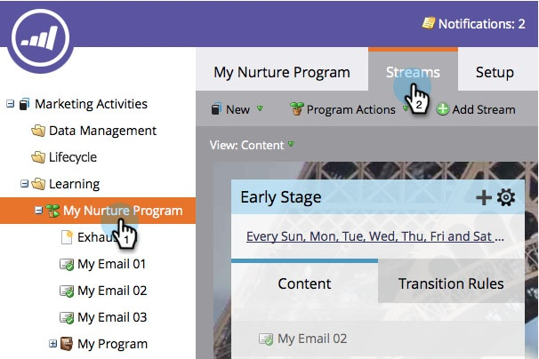

# Transición de personas entre flujos de participación {#transition-people-between-engagement-streams}

Los programas de participación pueden tener más de un flujo. Si [agrega una secuencia](/help/marketo/product-docs/email-marketing/drip-nurturing/creating-an-engagement-program/add-a-stream.md), defina la forma en que las personas puedan pasar de una secuencia a otra. Se denominan **reglas de transición.**

1. Vaya a **[!UICONTROL Actividades de marketing]**.

   

1. Seleccione su programa de participación de varias transmisiones y vaya a **[!UICONTROL Transmisiones]**.

   

1. Haga clic en **[!UICONTROL Reglas de transición]** para el flujo que quiera extraer de otros flujos y luego haga clic en **[!UICONTROL Editar reglas de transición]**.

   

   >[!NOTE]
   >
   >Las reglas de transición entran en un flujo; defina siempre las reglas del flujo en el que desee entrar.

   Una vez abierta la ventana de la regla de transición, busque y arrastre el déclencheur que desee. En este ejemplo, las personas se moverán a la [!UICONTROL etapa intermedia] cuando se agreguen a una oportunidad.

   

1. Establezca el operador en **[!UICONTROL is any]** para que las personas se muevan para cualquier oportunidad agregada.

   

   >[!TIP]
   >
   >Puede añadir varios déclencheur y filtros a una regla de transición, pero la regla de transición utiliza todos los filtros (el uso de TODOS los filtros es la única opción). Si necesita utilizar OR en una regla de transición, se recomienda configurar una campaña inteligente externa en su lugar.

1. Haga clic en **[!UICONTROL Cerrar]**.

   

   Ahora, cualquier persona del programa de participación que se agregue a una oportunidad se moverá al flujo de [!UICONTROL Etapa intermedia].

   

   >[!NOTE]
   >
   >Los pasos descritos anteriormente *do* se aplican a las personas que están [en pausa](/help/marketo/product-docs/email-marketing/drip-nurturing/using-engagement-programs/pause-people-in-an-engagement-program.md) también.
