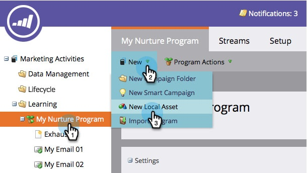
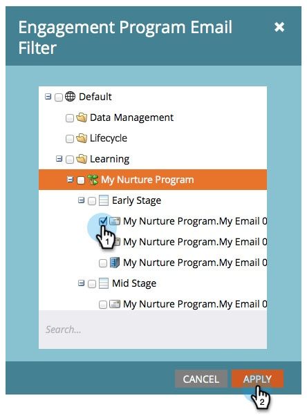

# Informe Rendimiento del flujo de participación {#engagement-stream-performance-report}

¿Quiere saber el rendimiento de su contenido de participación? Pruebe el informe de rendimiento del flujo de participación.

## Creación del informe {#create-the-report}

1. Busque y seleccione su programa de participación en **Nuevo** click **Nuevo recurso local**.

   

1. Seleccionar **Informe**.

   

   >[!TIP]
   >
   >La creación del informe en el programa se limitará automáticamente al contenido del programa.

   Seleccione Rendimiento del flujo de participación como tipo de informe.
   

1. Asigne un nombre al informe y haga clic en **Crear**.

   

   ¡Bien! Ahora vamos a ver la configuración.

## Editar configuración {#edit-settings}

1. Busque y seleccione el informe.

   

1. En el **Configurar** , haga doble clic en **Correo electrónico del programa de participación** filtro.

   

1. Seleccione los correos electrónicos sobre los que desea informar y haga clic en **Aplicar**.

   

## Ejecutar informe {#run-report}

1. Para ejecutar el informe, simplemente haga clic en **Informe** pestaña.

   

   >[!TIP]
   >
   >Aunque no se ilustra, la puntuación de participación es una columna de este informe. Consulte [Explicación de la puntuación de participación](/help/marketo/product-docs/email-marketing/drip-nurturing/reports-and-notifications/understanding-the-engagement-score.md) para obtener más información sobre qué es.

   ¡bueno trabajo! Observe que el informe se agrupa por programa de participación.
