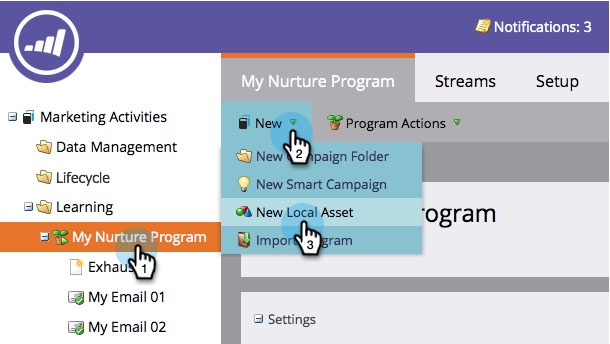
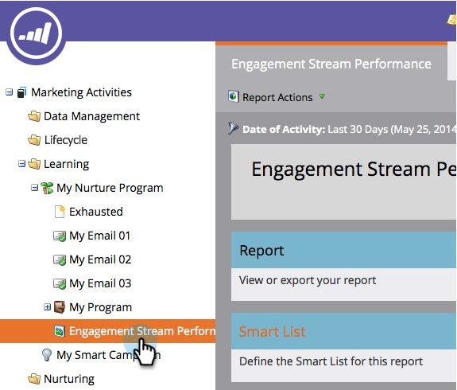
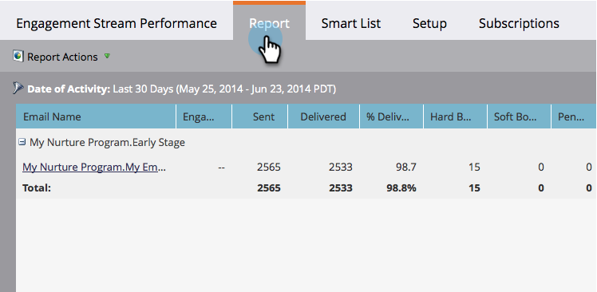

# Informe de rendimiento del flujo de participación {#engagement-stream-performance-report}

¿Quiere saber el rendimiento de su contenido de participación? Pruebe el informe de rendimiento del flujo de participación.

## Creación del informe {#create-the-report}

1. Busque y seleccione su programa de participación y, a continuación, en **[!UICONTROL Nuevo]**, haga clic en **[!UICONTROL Nuevo recurso local]**.

   

1. Seleccionar **[!UICONTROL informe]**.

   

   >[!TIP]
   >
   >La creación del informe en el programa se limitará automáticamente al contenido del programa.

   Seleccione **[!UICONTROL Rendimiento de flujo de participación]** como informe **[!UICONTROL Tipo]**.
   

1. Asigne un nombre al informe y haga clic en **[!UICONTROL Crear]**.

   

   Ahora configure los ajustes de.

## Editar configuración {#edit-settings}

1. Busque y seleccione el informe.

   

1. En la ficha **[!UICONTROL Configuración]**, haga doble clic en el filtro **[!UICONTROL Correos electrónicos del programa de participación]**.

   

1. Seleccione los correos electrónicos sobre los que quiere informar y haga clic en **[!UICONTROL Aplicar]**.

   

## Ejecutar informe {#run-report}

1. Para ejecutar el informe, haga clic en la ficha **[!UICONTROL Informe]**.

   

   >[!TIP]
   >
   >Aunque no se ilustra, la puntuación de participación es una columna de este informe. Vea [Descripción de la puntuación de participación](/help/marketo/product-docs/email-marketing/drip-nurturing/reports-and-notifications/understanding-the-engagement-score.md) para obtener detalles sobre qué es.

   Observe que el informe se agrupa por programa de participación.
