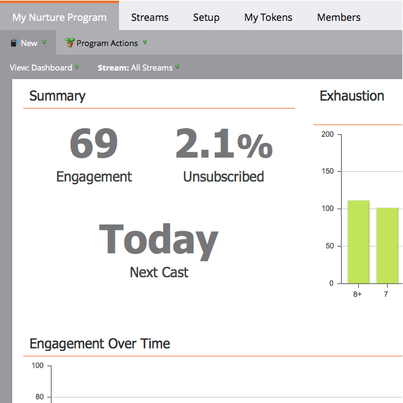
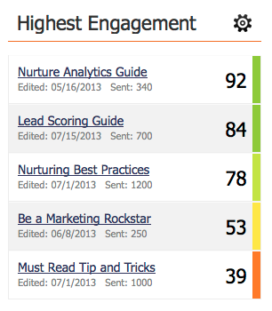

# El panel de participación {#the-engagement-dashboard}

El panel de participación es la forma más sencilla de ver el rendimiento del contenido del programa de participación.

>[!NOTE]
>
>La puntuación de participación incluye datos de sus últimos tres lanzamientos. Se calcula una nueva 72 horas después de cada lanzamiento. Más información sobre la [puntuación de participación](/help/marketo/product-docs/email-marketing/drip-nurturing/reports-and-notifications/understanding-the-engagement-score.md).

## Ver el panel de participación {#view-the-engagement-dashboard}

Seleccione su programa de participación y haga clic en **Ver** > **[!UICONTROL Tablero]**.

>[!TIP]
>
>Consulte el [informe de rendimiento del flujo de participación](/help/marketo/product-docs/email-marketing/drip-nurturing/reports-and-notifications/engagement-stream-performance-report.md) para obtener estadísticas más detalladas.

## Comprender el widget de agotamiento {#understand-the-exhaustion-widget}

Este widget le ayuda a anticipar cuándo los posibles clientes habrán agotado todo el contenido. La puntuación de agotamiento se calcula inmediatamente después de cada lanzamiento. El ejemplo siguiente muestra que en 1 lanzamiento, 195 posibles clientes habrán agotado todo el contenido.

>[!NOTE]
>
>Debe ir a la ficha [!UICONTROL Configuración] y asegurarse de que las [!UICONTROL notificaciones de contenido agotado] están **[!UICONTROL activadas]** para ver el gráfico de arriba. Si están desactivados, el gráfico tendrá un aspecto diferente.

>[!CAUTION]
>
>Las personas que están &quot;agotadas&quot; no recibirán ninguna comunicación en el siguiente reparto.

## Comprensión del widget Participación a lo largo del tiempo {#understand-the-engagement-over-time-widget}

Muestra la puntuación de participación media a lo largo del tiempo y el impacto de las ediciones de contenido.

>[!AVAILABILITY]
>
>Esta función está disponible como complemento para los clientes que utilizan el Explorador del ciclo de ingresos de Marketo. Póngase en contacto con el equipo de cuenta de Adobe (su administrador de cuentas) para obtener más información.

Para mostrar un solo fragmento de contenido en lugar de un promedio, haga clic en el icono de engranaje y, a continuación, seleccione el fragmento de contenido.

## Comprender el widget de participación más alto {#understand-the-highest-engagement-widget}

Una lista de todo el contenido, ordenada por la puntuación de participación más alta.

Para cambiar la clasificación, haga clic en el icono de engranaje y, a continuación, seleccione el orden.

_Más reciente_ y _Más antiguo_ se basan en la hora de la última aprobación.

>[!NOTE]
>
>Obtenga más información en la explicación detallada de [Crear un programa de participación](/help/marketo/product-docs/email-marketing/drip-nurturing/creating-an-engagement-program/create-an-engagement-program.md).
