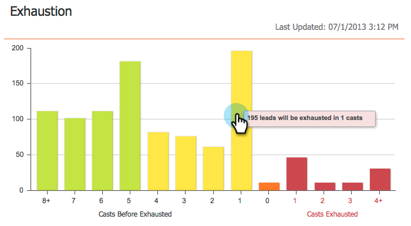

# El Panel de compromiso {#the-engagement-dashboard}

El Panel de participación es la forma más sencilla de ver el rendimiento del contenido en el programa de participación.

>[!NOTE]
>
>La puntuación de participación se calcula 72 horas después de cada emisión. Obtenga más información sobre la [puntuación de participación](/help/marketo/product-docs/email-marketing/drip-nurturing/reports-and-notifications/understanding-the-engagement-score.md).

## Vista del Panel de compromiso {#view-the-engagement-dashboard}

Seleccione el programa de participación y haga clic en **Vista** > **Panel**.

>[!TIP]
>
>Consulte el [informe de rendimiento del flujo de participación](/help/marketo/product-docs/email-marketing/drip-nurturing/reports-and-notifications/engagement-stream-performance-report.md) para obtener estadísticas más detalladas.

## Comprender la utilidad de agotamiento {#understand-the-exhaustion-widget}

Esta utilidad le ayuda a anticipar cuándo los posibles clientes habrán agotado todo el contenido. La puntuación de agotamiento se calcula inmediatamente después de cada fundido. El ejemplo siguiente muestra que en 1 cast, 195 leads habrán agotado todo el contenido.

>[!NOTE]
>
>Debe ir a la ficha Ajustes y asegurarse de que las Notificaciones de contenido agotadas están **activadas** para ver el gráfico anterior. Si están desactivados, el gráfico tendrá un aspecto diferente.

>[!CAUTION]
>
>Las personas &quot;exhaustas&quot; no recibirán ninguna comunicación en la próxima emisión.

## Comprender la utilidad Participación en el transcurso del tiempo {#understand-the-engagement-over-time-widget}

Muestra la puntuación de participación promedio a lo largo del tiempo y el impacto de las ediciones de contenido.

>[!AVAILABILITY]
>
>Esta función está disponible como complemento para los clientes que utilizan el Explorador del ciclo de ingresos de Marketing Cloud. Póngase en contacto con el administrador de éxito del cliente para obtener más detalles.

Para mostrar un solo fragmento de contenido en lugar de un promedio, haga clic en el icono de engranaje y seleccione el contenido.

## Comprender la utilidad de mayor participación {#understand-the-highest-engagement-widget}

Lista de todo el contenido, ordenada según la puntuación de participación más alta.

Para cambiar la clasificación, haga clic en el icono de engranaje y seleccione el orden.

__ Newestand y  __ Oldestare según el tiempo de la última aprobación.

>[!NOTE]
>
>Obtenga más información en la sección [Crear un Programa de compromiso](/help/marketo/product-docs/email-marketing/drip-nurturing/creating-an-engagement-program/create-an-engagement-program.md) profunda.
