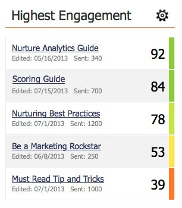

# Explicación de la puntuación de participación {#understanding-the-engagement-score}

La puntuación de participación facilita ver la eficacia del contenido en su programa de participación. La puntuación va del 0 al 100. Consulte [el panel Participación](/help/marketo/product-docs/email-marketing/drip-nurturing/reports-and-notifications/the-engagement-dashboard.md) para ver cómo puede realizar un seguimiento del rendimiento del contenido.

La puntuación se basa en un algoritmo propietario que tiene en cuenta el comportamiento comprometido (Apertura, Clic, Éxito del programa) y el comportamiento desactivado (Cancelación de la suscripción). Se compara con los correos electrónicos de estilo de goteo y crianza para ofrecer un promedio de 50. Para que las personas puedan interactuar con su contenido, la puntuación de participación se calcula 72 horas después de cada emisión. Además, la puntuación solo cubre los datos de **los últimos tres** retransmisiones.

>[!NOTE]
>
>Cuando los programas se utilizan como contenido en flujos, la puntuación de participación se basa en la pertenencia al programa y el estado de éxito, **not** interacción por correo electrónico (clics, aperturas, bajas de suscripción).

Las puntuaciones de participación son universales para todos los clientes. Puede compararlos para ver quién tiene el contenido más atractivo.

>[!NOTE]
>
>El algoritmo propietario también se aplica a la puntuación de participación en los programas de correo electrónico.

>[!MORELIKETHIS]
>
>[Explicación de los programas de participación](/help/marketo/product-docs/email-marketing/drip-nurturing/creating-an-engagement-program/understanding-engagement-programs.md)
