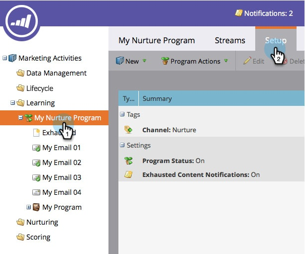
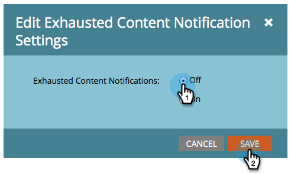

# Deshabilitar y habilitar notificaciones de contenido agotado {#disable-and-enable-exhausted-content-notifications}

Cuando las personas agotan todo el contenido en un flujo, Marketo puede enviarle una notificación. Puede deshabilitar o habilitar las notificaciones según sus necesidades. Así es cómo se hace.

1. Vaya a **[!UICONTROL Actividades de marketing]**.

   

1. Seleccione un programa de participación y haga clic en la ficha **[!UICONTROL Configuración]**.

   

1. Haga doble clic en **[!UICONTROL Notificaciones de contenido agotado]**.

   

1. Seleccione **[!UICONTROL Desactivado]** (o **[!UICONTROL Activado]**) y haga clic en **[!UICONTROL Guardar]**.

   

   ¡Súper! Si activa las notificaciones, verá algo en el propio flujo y recibirá una notificación por correo electrónico.
