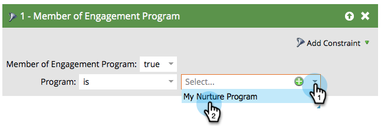
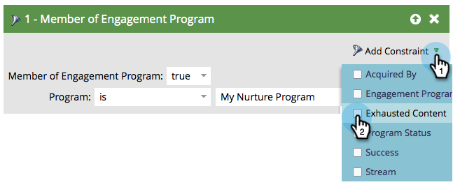

# Personas que tienen contenido agotado {#people-who-have-exhausted-content}

Cuando una persona ha recibido cada fragmento de contenido en un flujo, ha agotado todas las posibilidades y esperará inactivo hasta que se añada más. Puede encontrar personas que están &quot;agotadas&quot; de varias maneras.

## Filtro Miembro del programa de participación {#member-of-engagement-program-filter}

1. Cree una nueva lista inteligente y luego busque y arrastre el filtro **[!UICONTROL Miembro del programa de participación]**.

   

1. Busque y seleccione el programa de participación en el que buscar personas agotadas.

   

1. En **[!UICONTROL Agregar restricción]**, seleccione **[!UICONTROL Contenido agotado]**.

   

1. Establezca **[!UICONTROL Contenido agotado]** en **[!UICONTROL true]**.

   

   Simplemente ejecute esta lista inteligente para ver la lista de personas que han agotado todo el contenido del flujo en el que se encuentran.

## Pestaña Miembros {#members-tab}

1. Vaya a **[!UICONTROL Actividades de marketing]**.

   

1. Seleccione su programa de participación y vaya a la ficha **[!UICONTROL Miembros]**.

   

1. Observe la columna llamada **[!UICONTROL Contenido agotado]**.

   

   Esto muestra las personas que han agotado todo el contenido y las que no lo han hecho.

## Secuencia {#stream}

1. También puede ver el total de personas que han agotado el contenido en la ficha [!UICONTROL Transmisiones] de la propia emisión.

   

   >[!NOTE]
   >
   >Este número se actualizará inmediatamente después de cada conversión.
