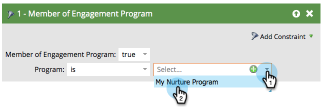

# Personas que han agotado el contenido {#people-who-have-exhausted-content}

Cuando una persona ha recibido cada parte de contenido en un flujo, ha agotado todas las posibilidades y espera inactivo hasta que se añada más. Se puede encontrar gente que está &quot;agotada&quot; de varias maneras.

## Miembro del filtro del Programa de participación {#member-of-engagement-program-filter}

1. Cree una nueva lista inteligente y, a continuación, busque y arrastre el **Miembro del programa de participación** filtro.

   

1. Encuentre y seleccione el programa de participación en el que encontrará personas agotadas.

   

1. En **Agregar restricción**, seleccione **Contenido agotado**.

   

1. Establezca **Contenido agotado** a **true**.

   

   Simplemente ejecute esta lista inteligente para ver la lista de personas que han agotado todo el contenido del flujo en el que se encuentran.

## Ficha Miembros {#members-tab}

1. Vaya a **Actividades de marketing**.

   

1. Seleccione su programa de participación y vaya a la **Miembros** pestaña .

   

1. Observe la columna llamada **Contenido agotado**.

   

   Esto le muestra a las personas que han agotado todo el contenido y a las que no lo han hecho.

## Secuencia {#stream}

1. También puede ver el total de personas que han agotado el contenido en la ficha Emisiones del propio flujo.

   

   >[!NOTE]
   >
   >Este número se actualizará inmediatamente después de cada conversión.
