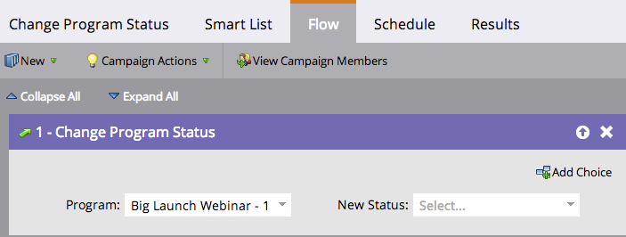
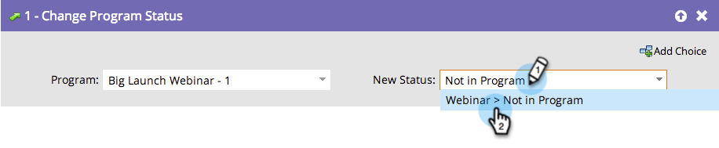

# Eliminación de un miembro de un programa de participación {#remove-a-member-from-an-engagement-program}

Puede quitar miembros de un programa de participación con el paso de flujo **[!UICONTROL Cambiar estado del programa]**.

>[!TIP]
>
>No lo use para pausar el contenido de una persona. Esto eliminará toda atribución en Analytics. Más información sobre cómo [pausar a las personas en un programa de participación](/help/marketo/product-docs/email-marketing/drip-nurturing/using-engagement-programs/pause-people-in-an-engagement-program.md).

## Paso de flujo {#flow-step}

1. Arrastre en el paso de flujo **[!UICONTROL Cambiar estado del programa]**.

   

   Elija el estado **[!UICONTROL No está en el programa]**.

   

   Todos los miembros que haya definido en la [lista inteligente](/help/marketo/product-docs/core-marketo-concepts/smart-lists-and-static-lists/creating-a-smart-list/create-a-smart-list.md) dejarán de estar en este programa de participación.

## Pausar personas  {#pause-people}

A veces, se desea pausar a las personas en un programa de participación y no eliminarlas. Esto se hace con la **[!UICONTROL cadencia del programa de participación de cambios]**.

>[!MORELIKETHIS]
>
>[Pausar personas en un programa de participación](/help/marketo/product-docs/email-marketing/drip-nurturing/using-engagement-programs/pause-people-in-an-engagement-program.md)
