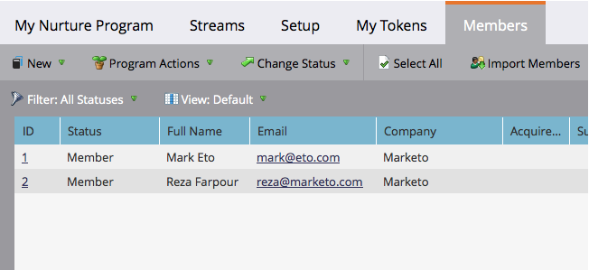

# Consulte Miembros de un programa de participación {#see-members-of-an-engagement-program}

Puede ver rápidamente los miembros de un programa de participación. Así es como.

1. En el programa de participación, haga clic con el botón derecho y seleccione **Ver miembros**.

   

   >[!NOTE]
   >
   >El  [Contenido agotado](/help/marketo/product-docs/email-marketing/drip-nurturing/creating-an-engagement-program/understanding-engagement-programs.md) el valor de la columna se actualiza después de cada conversión.

1. Ahora puede ver todos los miembros del programa.

   
