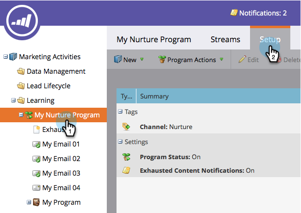

# Activar y desactivar un programa de participación {#turn-an-engagement-program-on-and-off}

Puede desactivar un programa de participación con solo pulsar un botón. Esto evitará que se envíe cualquier contenido.

1. Vaya a **[!UICONTROL Actividades de marketing]**.

   

1. Seleccione el programa de participación y haga clic en **[!UICONTROL Configuración]**.

   >[!NOTE]
   >
   >Los programas de participación están activados de forma predeterminada a menos que haya superado el límite de suscripción.

   

1. Haga doble clic en **[!UICONTROL Estado del programa]**.

   

1. Seleccione **[!UICONTROL Desactivado]** y haga clic en **[!UICONTROL Guardar]**.

   

Puede volver a activarlo si sigue los mismos pasos.
