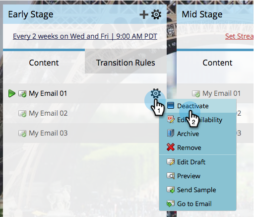

# Activar y desactivar el contenido del flujo {#activate-and-deactivate-stream-content}

El contenido de la emisión está desactivado de forma predeterminada. Active el contenido para enviarlo durante las emisiones de participación.

## Activar el contenido del flujo {#activate-stream-content}

1. Vaya a **Actividades de marketing**.

   

1. Seleccione su programa de participación y haga clic en el botón **Transmisiones** pestaña .

   

1. Pase el ratón sobre el contenido que quiera activar, haga clic en el icono de engranaje y, a continuación, haga clic en **Activar**.

   >[!NOTE]
   >
   >Los correos electrónicos deben aprobarse para activarlos.

   

   >[!TIP]
   >
   >También puede activar todo el contenido de un flujo haciendo clic en el icono de engranaje en el nivel superior y luego en **Activar todo el contenido**.

   ¡Buen trabajo! Ahora sabe cómo activar contenido en sus flujos.

## Desactivar contenido de flujo {#deactivate-stream-content}

1. Seleccione su programa de participación y haga clic en el botón **Transmisiones** pestaña .

   

1. Pase el ratón sobre el contenido que desea desactivar, haga clic en el icono de engranaje y, a continuación, haga clic en **Desactivar**.

   
