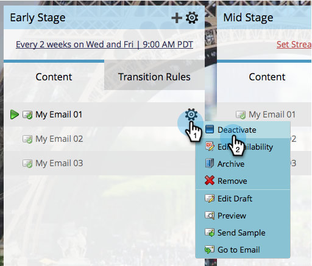

# Activar y desactivar contenido de flujo {#activate-and-deactivate-stream-content}

El contenido de la emisión está desactivado de forma predeterminada. Active el contenido para enviarlo durante los lanzamientos de participación.

## Activar contenido de flujo {#activate-stream-content}

1. Vaya a **[!UICONTROL Actividades de marketing]**.

   

1. Seleccione el programa de participación y haga clic en la ficha **[!UICONTROL Transmisiones]**.

   

1. Pase el ratón sobre el contenido que quiera activar, haga clic en el icono con forma de engranaje y luego haga clic en **[!UICONTROL Activar]**.

   >[!NOTE]
   >
   >Los correos electrónicos deben aprobarse para activarlos.

   

   >[!TIP]
   >
   >También puedes activar todo el contenido de un flujo si haces clic en el icono de engranaje en el nivel superior y luego haces clic en **[!UICONTROL Activar todo el contenido]**.

   ¡Buen trabajo! Ahora ya sabe cómo activar contenido en sus flujos.

## Desactivar contenido de la emisión {#deactivate-stream-content}

1. Seleccione el programa de participación y haga clic en la ficha **[!UICONTROL Transmisiones]**.

   

1. Pase el ratón sobre el contenido que quiera desactivar, haga clic en el icono con forma de engranaje y luego haga clic en **[!UICONTROL Desactivar]**.

   
