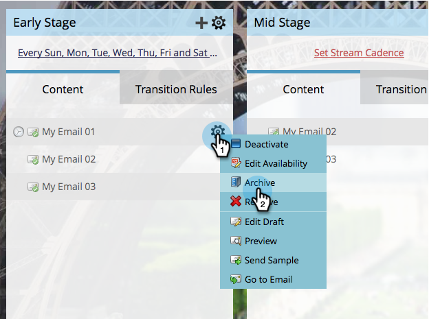

# Archivar y desarchivar contenido de flujo {#archive-and-unarchive-stream-content}

Si ya no quieres usar un fragmento de contenido en un flujo, puedes [quitarlo](/help/marketo/product-docs/email-marketing/drip-nurturing/using-stream-content/remove-stream-content.md) o archivarlo. Así se archiva el contenido.

>[!TIP]
>
>Al eliminar, se destruye todo el historial asociado; el archivado lo conserva.

## Archivar contenido de la emisión {#archive-stream-content}

1. Seleccione su programa de participación y vaya a la ficha **[!UICONTROL Transmisiones]**.

   

1. Pase el ratón sobre el correo electrónico que quiera archivar y luego, debajo del icono de engranaje, haga clic en **[!UICONTROL Archivar]**.

   

   Archivar si desea conservar el historial.

## Desarchivar contenido de la emisión {#unarchive-stream-content}

1. Seleccione su programa de participación y vaya a la ficha **[!UICONTROL Transmisiones]**.

   

1. Haz clic en el icono de engranaje de tu flujo y luego haz clic en **[!UICONTROL Mostrar contenido archivado]**.

   

1. Ahora que puedes ver el contenido archivado, haz clic en el icono de engranaje del contenido que deseas desarchivar y luego haz clic en **[!UICONTROL Desarchivar]**.

   

   Ahora este contenido está disponible para priorizar y activar.
