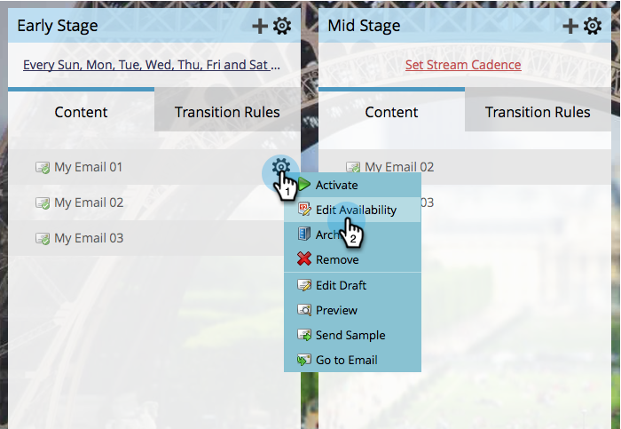

# Editar disponibilidad de contenido de flujo {#edit-availability-of-stream-content}

Puede establecer un intervalo de tiempo para que el contenido esté activo en el flujo. A continuación se muestra cómo.

1. Seleccione su programa de participación y vaya a la ficha **[!UICONTROL Transmisiones]**.

   

1. Haga clic en el icono con forma de engranaje del contenido que desee programar y, a continuación, seleccione **[!UICONTROL Editar disponibilidad]**.

   

1. Seleccione su fecha de **[!UICONTROL Activo desde]**, luego la fecha de **[!UICONTROL Activo hasta]** y haga clic en **[!UICONTROL Guardar]**.

   

   >[!TIP]
   >
   >Puede dejar **[!UICONTROL Activo hasta]** en blanco para que el contenido esté disponible para siempre.

   Verá el icono de reloj junto al contenido programado. Se activa e inactiva según la programación que haya establecido.

   
