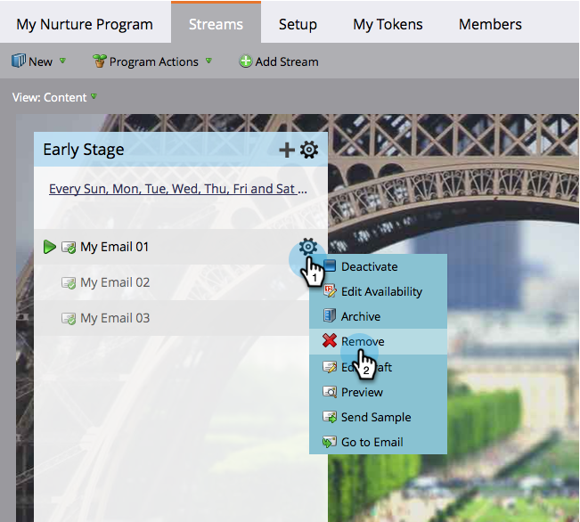

# Eliminar contenido de flujo {#remove-stream-content}

Puede eliminar o archivar un fragmento de contenido. A diferencia de la eliminación del contenido del flujo, [el archivado](archive-and-unarchive-stream-content.md) conserva todo el historial asociado al contenido. Si no te importa perder las estadísticas históricas de algún contenido y quieres eliminarlo, así es como hacerlo.

1. Vaya a **Actividades de marketing**.

   

1. Seleccione el programa de participación y, a continuación, haga clic en la ficha **Flujos**.

   

1. Pase el ratón sobre el contenido que desee eliminar, haga clic en el icono de engranaje cuando aparezca y haga clic en **Eliminar**.

   

   >[!CAUTION]
   >
   >Elimine el contenido solo si no le importa la historia. Si desea conservar la historia, [archivarla](archive-and-unarchive-stream-content.md) en su lugar.

   ¡Eso es todo! Ahora sabe cómo eliminar un fragmento de contenido.

