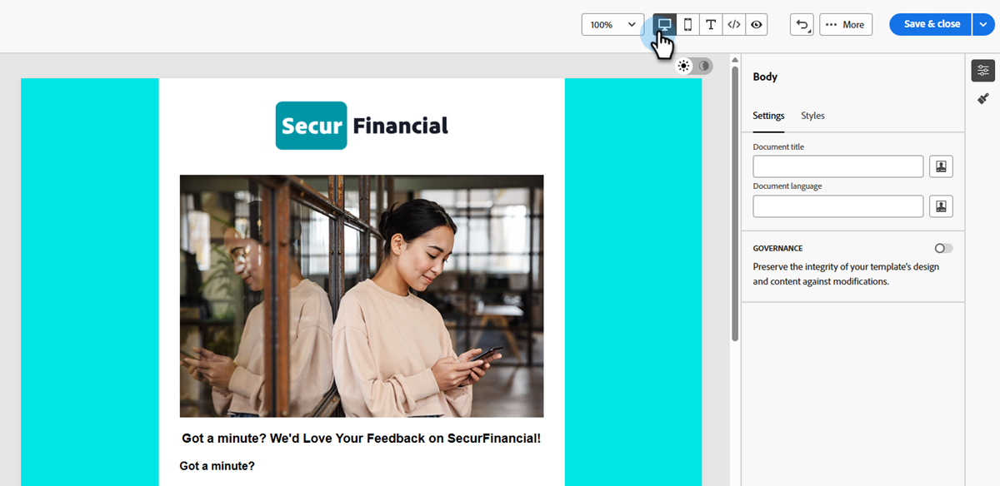

# Edición de plantillas de correo electrónico con el editor avanzado de HTML {#advanced-html-mode}

El modo avanzado de HTML le permite ver y editar el código fuente sin procesar de las plantillas de correo electrónico directamente desde la interfaz de Designer de correo electrónico [!DNL Marketo Engage].

Esta capacidad permite insertar expresiones avanzadas directamente en el origen. Cuando vuelva a la vista visual (Escritorio), el contenido se vuelve a procesar para que pueda comprobar su aspecto y seguir editando en cualquier vista.

## Mecanismos de protección {#guardrails}

Al utilizar el editor avanzado de HTML, las siguientes protecciones protegen la compatibilidad del contenido y establecen expectativas.

* El editor de HTML avanzado **no valida** su código. No comprueba errores de sintaxis ni diseños rotos. Revise el contenido cuidadosamente antes de guardarlo.

* Las futuras actualizaciones del sistema pueden sobrescribir los cambios realizados en el marcado predeterminado. **Es posible que los cambios no se mantengan**.

* La compatibilidad con [!DNL Adobe] **no puede solucionar ni resolver** problemas causados por cambios manuales y código personalizado. Mantenga una copia de seguridad del contenido en caso de que necesite revertirlo.

* No se puede simular contenido en la vista avanzada de HTML. Cambie a la vista de escritorio para previsualizar el contenido.

* Para garantizar la compatibilidad del contenido, **no puede guardar** en la vista avanzada de HTML. Cambie a la vista Escritorio cuando esté listo para guardar los cambios.

## Acceso al modo avanzado de HTML {#access-html-mode}

Para abrir el editor de HTML avanzado y editar el origen de la plantilla, siga estos pasos.

1. Abra o [cree una plantilla de correo electrónico](/help/marketo/product-docs/email-marketing/email-designer/email-template-authoring.md#create-an-email-template) en el Designer de correo electrónico.

1. En la pantalla _Editar plantilla de correo electrónico_, haga clic en el botón HTML en la esquina superior derecha.

   {width="800" zoomable="yes"}

1. La primera vez que abra el editor de HTML avanzado, aparecerá un mensaje de advertencia. Revíselo y haga clic en **[!UICONTROL Aceptar]** cuando haya terminado.

   

   >[!NOTE]
   >
   >Esta advertencia aparece la primera vez que abre el editor de HTML avanzado y se restablece cada mes.

1. Se muestra el editor avanzado de HTML.

   {width="800" zoomable="yes"}

1. Añada los cambios que desee al contenido del correo electrónico.

   >[!WARNING]
   >
   >Asegúrese de introducir el código HTML y CSS correcto, ya que no hay ningún proceso de validación de sintaxis y el Soporte técnico de Adobe no puede ayudarle con las ediciones de HTML.

1. La simulación y el guardado de contenido no están disponibles en la vista avanzada de HTML por motivos de compatibilidad. Vuelva a la vista Escritorio para obtener una vista previa del contenido y guardar los cambios.

   {width="800" zoomable="yes"}

   >[!NOTE]
   >
   >Las ediciones se conservan al cambiar de vista.
