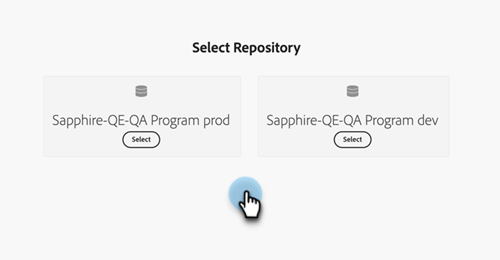

# Uso de recursos de Experience Manager {#work-with-experience-manager-assets}

Conecte su cuenta de _Adobe Experience Manager Assets as a Cloud Service_ a su instancia de Adobe Marketo Engage para poder aprovechar su repositorio de recursos de AEM en Marketo Engage Email Designer.

>[!NOTE]
>
>Actualmente, solo se admiten recursos de imagen de _Adobe Experience Manager Assets_ en Marketo Engage. Los cambios en los recursos deben realizarse desde el repositorio central de Adobe Experience Manager Assets. [Más información](https://experienceleague.adobe.com/en/docs/experience-manager-cloud-service/content/assets/manage/manage-digital-assets){target="_blank"}

## Vínculo a los servicios de nube de AEM {#link-to-your-aem-cloud-services}

Para poder utilizar esta capacidad, primero debe vincular AEM Cloud Services con Adobe Marketo Engage.

+++Vincular AEM Cloud Services y Marketo Engage

>[!NOTE]
>
>**Se requieren permisos de administración**

1. En Marketo Engage, vaya al área **Admin** y seleccione **Adobe Experience Manager** en el árbol de navegación izquierdo.

   {width="800" zoomable="yes"}

1. Haga clic en **Editar** junto a _Adobe Experience Manager Cloud Services_.

   {width="400" zoomable="yes"}

1. Seleccione uno o varios repositorios.

   {width="800" zoomable="yes"}

   >[!NOTE]
   >
   >Solo se muestran los repositorios que se han asociado en la misma organización de IMS que su suscripción a Marketo Engage.

1. Debe agregar un [certificado de credencial de servicio](https://experienceleague.adobe.com/es/docs/experience-manager-learn/getting-started-with-aem-headless/authentication/service-credentials) para configurar el repositorio. Haga clic en el botón **+ Agregar certificado**.

   {width="800" zoomable="yes"}

1. Arrastre y suelte el certificado (solo archivo JSON) o selecciónelo en el equipo. Haga clic en **Agregar** cuando haya terminado.

   {width="600" zoomable="yes"}

1. El repositorio configurado se muestra a continuación junto con el estado y la caducidad. Haga clic en el botón de los tres puntos (**...**) para ver el certificado. De lo contrario, has terminado.

   {width="700" zoomable="yes"}

Ahora se puede acceder a todas las imágenes de la biblioteca de administración de recursos digitales de ese repositorio desde Marketo Engage Email Designer.

+++

## Uso de recursos de AEM {#working-with-aem-assets}

Cuando usa estos recursos digitales, los cambios más recientes en _Assets as a Cloud Service_ se propagan automáticamente a las campañas de correo electrónico activas a través de referencias vinculadas. Si las imágenes se eliminan en _Adobe Experience Manager Assets as a Cloud Service_, aparecerán con una referencia rota en los correos electrónicos. Cuando se modifican o eliminan recursos que se utilizan actualmente en Marketo Engage, se notifica a los autores de correo electrónico sobre los cambios de imagen. Todos los cambios en los recursos deben realizarse en el repositorio central de Adobe Experience Manager Assets.

### Usar AEM Assets como origen de imagen {#use-aem-assets-as-the-image-source}

Si su entorno tiene una o más conexiones de repositorio de recursos, puede designar AEM Assets como origen de los recursos al crear o ver los detalles de un correo electrónico, una plantilla de correo electrónico o un fragmento visual.

* Al crear contenido nuevo, elija `AEM Assets` como el elemento **[!UICONTROL Image Source]** del cuadro de diálogo.

{width="400" zoomable="yes"}

* Al abrir un recurso de contenido existente, elija `AEM Assets` en la sección _[!UICONTROL Cuerpo]_ de la derecha.

{width="700" zoomable="yes"}

### Acceso a recursos para la creación {#access-assets-for-authoring}

>[!IMPORTANT]
>
>Un administrador debe añadir usuarios que necesiten acceder a los recursos a los perfiles de producto de Usuarios consumidores de Assets o Usuarios de Assets. [Más información](https://experienceleague.adobe.com/en/docs/experience-manager-cloud-service/content/security/ims-support#managing-products-and-user-access-in-admin-console)

En el editor de contenido visual, haga clic en el icono _Selector de recursos de Experience Manager_ en la barra lateral izquierda. Esto cambia el panel Herramientas a una lista de recursos disponibles en el repositorio seleccionado.

{width="700" zoomable="yes"}

Si tiene más de un repositorio de AEM conectado, haga clic en el botón **[!UICONTROL Administrar como]** para elegir el repositorio que desee usar.

{width="700" zoomable="yes"}

Elija el repositorio que desee.

{width="500" zoomable="yes"}

Existen varios métodos para agregar un recurso de imagen al lienzo visual:

* Arrastre y suelte una miniatura de imagen desde el panel de navegación izquierdo.

{width="700" zoomable="yes"}

* Agregue un componente de imagen al lienzo y haga clic en **[!UICONTROL Examinar]** para abrir el cuadro de diálogo _[!UICONTROL Seleccionar Assets]_.

  En el cuadro de diálogo, puede elegir una imagen del repositorio seleccionado.

  Hay varias herramientas disponibles para ayudarle a localizar el recurso que necesita.

{width="700" zoomable="yes"}

* Cambie **[!UICONTROL Repositorio]** en la parte superior derecha.

* Haga clic en **[!UICONTROL Administrar recursos]** en la parte superior derecha para abrir el repositorio de Assets en otra pestaña del explorador y usar las herramientas de administración de AEM Assets.

* Haga clic en el selector _Tipo de vista_ en la parte superior derecha para cambiar la pantalla a **[!UICONTROL Vista de lista]**, **[!UICONTROL Vista de cuadrícula]**, **[!UICONTROL Vista de galería]** o **[!UICONTROL Vista de cascada]**.

* Haga clic en el icono _Orden_ para cambiar el orden de clasificación entre ascendente y descendente.

* Haga clic en la flecha de menú **[!UICONTROL Ordenar por]** para cambiar los criterios de ordenación a **[!UICONTROL Nombre]**, **[!UICONTROL Tamaño]** o **[!UICONTROL Modificado]**.

* Haga clic en el icono _Filtrar_ en la parte superior izquierda para filtrar los elementos mostrados según sus criterios.

* Introduzca texto en el campo Buscar para filtrar los elementos mostrados para buscar una coincidencia del nombre del recurso.

{width="700" zoomable="yes"}
