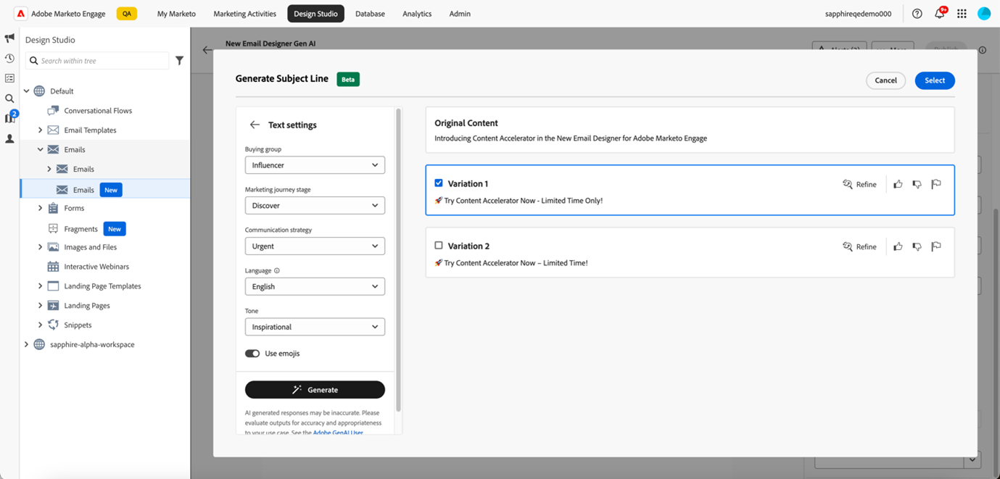
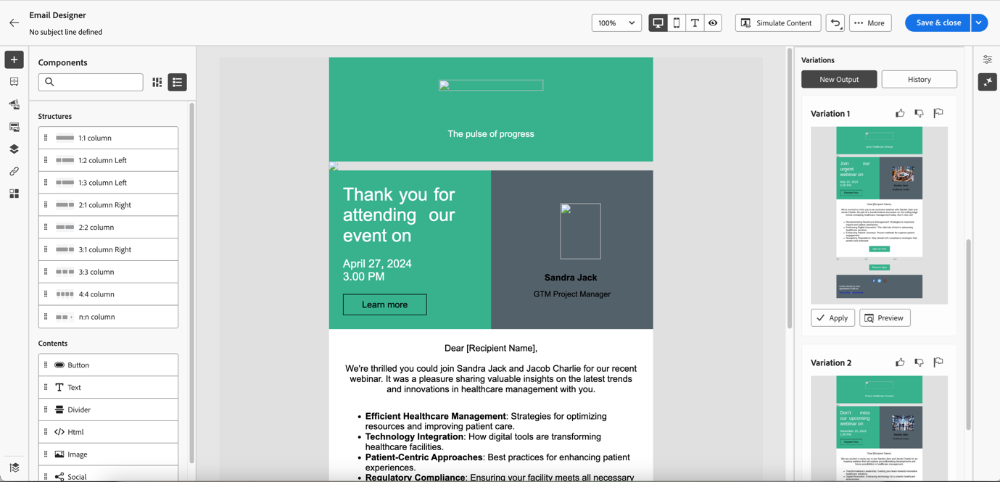

# Uso del asistente de IA {#use-the-ai-assistant}

El asistente de IA de Marketo Engage Email Designer le ayuda a crear correos electrónicos contemporáneos, eficaces e intuitivos. Esto se logra a través de la tecnología de IA generativa de Adobe y la biblioteca rápida junto con Firefly para la generación de imágenes que ayuda a crear contenido adecuado para una persona en particular / grupo de compra, etapa de recorrido de marketing, estrategia de comunicación, tono, etc. Los activos específicos de la marca también se pueden utilizar para crear contenido.

>[!PREREQUISITES]
>
>El Asistente de IA no está habilitado de forma predeterminada. En primer lugar, debe aceptar los términos principales de la generación de IA y los términos suplementarios para utilizar la funcionalidad de la generación de IA en el Designer de correo electrónico. Póngase en contacto con el equipo de cuenta de Adobe (su administrador de cuentas) para obtener más información.

Hay tres casos de uso principales para el asistente de IA:

* [Crea una línea de asunto](#create-a-subject-line) para tu correo electrónico
* [Crea contenido para una sección específica](#create-content-for-a-specific-section) de tu correo electrónico
* [Crear un correo electrónico completo](#create-an-entire-email) a partir de una plantilla seleccionada

## Crear una línea de asunto {#create-a-subject-line}

Cuando se cree un correo electrónico con la Nueva Designer de correo electrónico, introduzca una línea de asunto temporal.

Una vez creado el correo electrónico, la línea de asunto se encuentra en la columna _Detalles_, a la derecha. Haga clic en el botón del asistente de IA (  ) que se encuentra junto a él para obtener ayuda con la creación de una nueva línea de asunto mediante la funcionalidad de IA general.

Habilite la opción **Usar contenido de referencia** para que el asistente de IA personalice el nuevo contenido en función del contenido seleccionado.

Introduzca el mensaje para personalizar la línea de asunto. Introduzca la configuración de texto relevante y cargue cualquier recurso de marca que desee utilizar como referencia para crear una línea de asunto adecuada.

La configuración de texto incluye:

<table><tbody>
  <tr>
    <td style="width:25%"><b>Grupo de compras</b></td>
    <td>Grupo de compra específico al que se dirige (por ejemplo, Profesional, Influencer, Responsable de la toma de decisiones).</td>
  </tr>
  <tr>
    <td style="width:25%"><b>Fase de Recorrido de marketing</b></td>
    <td>Destinatarios en una fase de recorrido de marketing determinada (por ejemplo, Discover, Evaluar, Comprometer).</td>
  </tr>
  <tr>
    <td style="width:25%"><b>Estrategia de comunicación</b></td>
    <td>El objetivo de la comunicación (por ejemplo, urgente, prueba social, informativa).</td>
  </tr>
  <tr>
    <td style="width:25%"><b>Idioma</b></td>
    <td>Idioma en el que desea que se genere la línea de asunto.</td>
  </tr>
  <tr>
    <td style="width:25%"><b>Tono</b></td>
    <td>Tono en el que desea que se genere el contenido (por ejemplo, Inspiracional, Emocionante, Humorístico).</td>
  </tr>
  <tr>
    <td style="width:25%"><b>Emojis</b></td>
    <td>Permite incluir emojis en el contenido generado.</td>
  </tr>
</tbody>
</table>

Al hacer clic en **Generar**, aparecen ejemplos para que usted elija entre:

También puede cargar un recurso de marca para utilizar contenido dentro del recurso como referencia para crear la línea de asunto.

Para elegir una variación, seleccione su casilla de verificación y haga clic en **Seleccionar**. También puede modificarlo si hace clic en **Refinar**. Además, puede proporcionar comentarios haciendo clic en los iconos de los pulgares hacia arriba o hacia abajo para que la tecnología Gen-AI conozca sus preferencias.

Después de realizar la selección, la línea de asunto se rellena en los detalles del correo electrónico.

## Creación de contenido para una sección específica del correo electrónico {#create-content-for-a-specific-section}

Una vez creado el correo electrónico, tiene la opción de modificar determinadas secciones, imágenes o texto.

En este ejemplo, utilizamos una plantilla para el sector sanitario. Si la imagen existente del experto en atención médica no satisface sus necesidades, puede indicar al asistente de IA que cree su propia imagen de un experto en atención médica. Solo tiene que seleccionar el contenido de la imagen y hacer clic en el asistente de IA.

Introduzca los detalles relevantes en el mensaje, como &quot;generar una imagen para un experto en atención médica&quot; y añada la personalización que desee. También puede utilizar la biblioteca de mensajes (a la derecha del mensaje) si no está seguro de qué escribir.

Después de hacer clic en **Generar**, se crean varias variantes para que usted elija.

De forma similar a la imagen, también se pueden modificar las partes de texto del correo electrónico.

## Crear un correo electrónico completo a partir de una plantilla seleccionada {#create-an-entire-email}

Esta opción solo está disponible si el correo electrónico se crea con una plantilla existente. Puede ser una plantilla estándar proporcionada por el Designer de correo electrónico, una plantilla guardada que ya haya creado o una plantilla importada mediante la opción Importar HTML. Esta opción no está disponible si elige [Diseño desde cero](/help/marketo/product-docs/email-marketing/email-designer/email-authoring.md#design-from-scratch) para el correo electrónico.

Seleccione una plantilla sin seleccionar ningún componente y haga clic en el botón Asistente de IA en el Designer de correo electrónico.

Introduzca el mensaje correspondiente y elija la configuración de texto, los recursos de marca y cualquier configuración de imagen que desee para el correo electrónico.

Si desea generar imágenes con Firefly, seleccione la opción Configuración de imagen y seleccione la opción para **Generar imágenes con IA**.

Seleccione el _Tipo de contenido_, _Color y tono_, _Iluminación_ y _Composición_ deseados para crear imágenes de IA general para su correo electrónico. Haga clic en **Generar** cuando haya terminado.

Vea el aspecto que tendrá una variación en su correo electrónico al hacer clic en **Vista previa**. Elija una variación haciendo clic en **Aplicar**.
