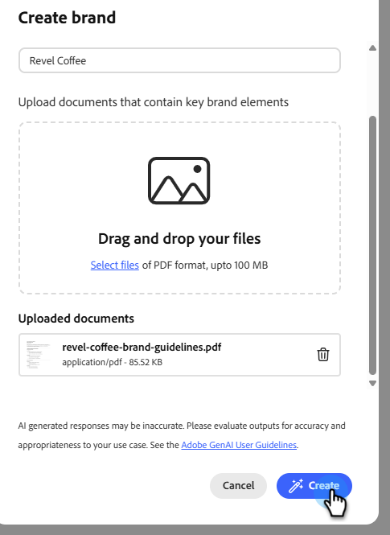

# Crear y administrar sus marcas {#create-and-manage-brands}

Las directrices de marca son un conjunto detallado de reglas y estándares que establecen la identidad visual y verbal de una marca. Actúan como referencia para mantener una representación de marca coherente en todas las plataformas de marketing y comunicación.

Introduzca y organice manualmente los detalles de su marca o cargue documentos de directrices de marca para la extracción automática de información.

>[!AVAILABILITY]
>
>Debe aceptar el [acuerdo de usuario](https://www.adobe.com/legal/licenses-terms/adobe-dx-gen-ai-user-guidelines.html){target="_blank"} para poder usar el Asistente de IA en Adobe Marketo Engage. Para obtener más información, póngase en contacto con el administrador de cuentas de Adobe.

## Acceso a marcas {#access}

Para tener acceso al menú **[!UICONTROL marcas]** en [!DNL Adobe Marketo Engage], los usuarios deben obtener el permiso correspondiente.

+++  Aprenda a asignar permisos relacionados con la marca

### Usuarios y roles {#users-and-roles}

1. En _Administrador_, seleccione **Usuarios y roles**.

1. Seleccione la función que desee.

1. Haga clic para expandir el menú **Access Design Studio**.

1. Seleccione **Acceder al asistente de IA** y haga clic en **Guardar**.

+++

## Crear y administrar su marca {#create-brand-kit}

Para crear y administrar las directrices de marca, puede escribir los detalles usted mismo o cargar el documento de directrices de marca para que la información se extraiga automáticamente.

1. En _Administrador_, seleccione **Nueva experiencia**.

   

1. Junto a _Administrar tus marcas_, haz clic en **Editar**.

   

1. Haga clic en **[!UICONTROL Crear marca]**.

1. Escriba un **[!UICONTROL Nombre]** para su marca.

1. Arrastre y suelte o seleccione su PDF para cargar las directrices de marca y extraer automáticamente la información de marca relevante. Haga clic en **[!UICONTROL Crear]**.

   Comienza el proceso de extracción de información. Puede tardar varios minutos en completarse.

   

1. El contenido y los estándares de creación visual ahora se rellenan automáticamente. Examine las diferentes pestañas para adaptar la información según sea necesario.

1. Desde el menú avanzado de cada sección o categoría, puede añadir referencias para extraer automáticamente información de marca relevante.

   Para quitar el contenido existente, usa las opciones **[!UICONTROL Borrar sección]** o **[!UICONTROL Borrar categoría]**.

   {width="800" zoomable="yes"}

   {width="800" zoomable="yes"}

1. Haga clic en **Filtro** para filtrar las directrices por canal o tipo de elemento.

   

1. Cuando termine de configurar, haga clic en **[!UICONTROL Guardar]** y luego en **[!UICONTROL Publicar]** para que las directrices de marca estén disponibles en el Asistente de IA.

1. Para hacer modificaciones a tu marca publicada, haz clic en **[!UICONTROL Editar marca]**.

   >[!NOTE]
   >
   >Esto crea una copia temporal en el modo de edición y reemplaza la versión activa después de publicarla.

   

1. En el panel **[!UICONTROL Marcas]**, abra el menú avanzado haciendo clic en el icono de tres puntos para:

* Ver marca
* Editar
* Duplicado
* Publicación
* Cancelar la publicación de
* Eliminar

  

Ahora se puede acceder a las directrices de marca desde la lista desplegable **[!UICONTROL Marca]** del menú Asistente de IA, lo que le permite generar contenido y recursos alineados con las especificaciones.

### Establecer una marca predeterminada {#default-brand}

Puede designar una marca publicada como predeterminada para que se aplique automáticamente al generar contenido y calcular las puntuaciones de alineación durante la creación de la campaña.

Para establecer una marca predeterminada, ve a tu panel **[!UICONTROL Marcas]**. Abra el menú avanzado haciendo clic en el icono de tres puntos y seleccionando **[!UICONTROL Marcar como marca predeterminada]**.

