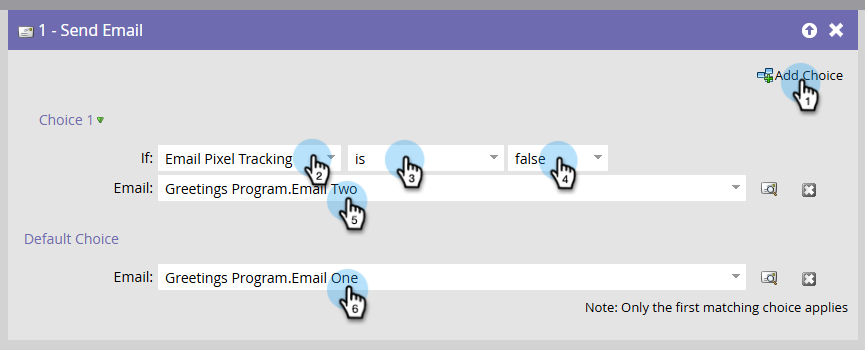

# Directrices de CNIL: seguimiento condicional de aperturas por correo electrónico {#cnil}

Aprenda a configurar Marketo Engage para que acepte el consentimiento del usuario final para el seguimiento de aperturas de correo electrónico (píxeles), en consonancia con las [directrices de CNIL](https://experienceleaguecommunities.adobe.com/adobe-marketo-engage-27/understanding-cnil-s-updated-guidance-on-email-open-tracking-251632){target="_blank"}. El método utiliza un campo booleano personalizado para determinar qué variante de correo electrónico recibe una persona, una con el seguimiento de aperturas habilitado o otra con él deshabilitado.

## Paso 1: Crear un campo booleano personalizado {#custom-field}

1. En el área **Administrador**, haga clic en **Administración de campos** y seleccione **Nuevo campo personalizado**.

   

1. Para _Objeto_, elija **Persona**. Para _Type_, elija **Boolean**. Para _Name_, escriba &quot;Seguimiento de píxeles de correo electrónico&quot; (el nombre de API se rellena automáticamente). Haga clic en **Crear**.

   

## Paso 2: Rellenar el campo de consentimiento {#populate}

1. Establezca el valor del campo Seguimiento de píxeles de correo electrónico para cada persona a través de la importación de datos (sincronización de API o [carga CSV](https://experienceleague.adobe.com/en/docs/marketo/using/getting-started/quick-wins/import-a-list-of-people){target="_blank"}).

   

1. Asegúrese de que el campo personalizado esté asignado correctamente.

   

>[!NOTE]
>
>En adelante, puede capturar los datos directamente durante la cumplimentación de un formulario, lo que permite a la persona incluirse en el seguimiento de aperturas de correo electrónico o excluirse de él.

## Paso 3: Crear variantes de correo electrónico {#variants}

Cree dos correos electrónicos. Tenga en cuenta que el seguimiento de aperturas de correo electrónico está habilitado de forma predeterminada para el Designer de correo electrónico y el editor de correo electrónico heredado.

* **Correo electrónico uno (seguimiento de aperturas habilitado)**: Después de crear el correo electrónico, no se requiere ninguna otra acción. Mantenga el seguimiento de aperturas habilitado.

* **Correo electrónico dos (seguimiento de aperturas deshabilitado)**: Clone el correo electrónico uno y deshabilite el seguimiento de aperturas.

  

En el Designer de correo electrónico, la casilla de verificación **Deshabilitar seguimiento de aperturas** se encuentra en la pestaña _Detalles_ del panel _Resumen_, a la derecha del correo electrónico. En el editor de correo electrónico heredado, se encuentra la casilla de verificación **Deshabilitar seguimiento de aperturas** en el menú _Configuración de correo electrónico_.

**Diseñador de correo electrónico**

{width="800" zoomable="yes"}

**Editor de correo electrónico heredado**

{width="800" zoomable="yes"}

## Paso 4: Configuración de la campaña inteligente {#smart-campaign}

[Cree una campaña inteligente](https://experienceleague.adobe.com/en/docs/marketo/using/product-docs/core-marketo-concepts/smart-campaigns/creating-a-smart-campaign/create-a-new-smart-campaign){target="_blank"} para determinar qué correo electrónico recibe cada persona.

1. En la pestaña _Flujo_ de su campaña inteligente, inserte el paso de flujo **Enviar correo electrónico**.

   {width="800" zoomable="yes"}

1. En el paso de flujo, haga clic en **Agregar opción**. En la opción 1, establezca **if** en _Seguimiento de píxeles de correo electrónico_, establezca el operador en _is_ y establezca el valor en _false_. Para **Correo electrónico**, seleccione _Correo electrónico dos_.

1. En la opción predeterminada, establezca **Correo electrónico** en _Correo electrónico uno_.

   

Esto garantiza que las personas que no hayan aceptado abrir el seguimiento reciban el correo electrónico sin seguimiento, mientras que las personas que hayan aceptado recibir el correo electrónico con seguimiento estándar.
