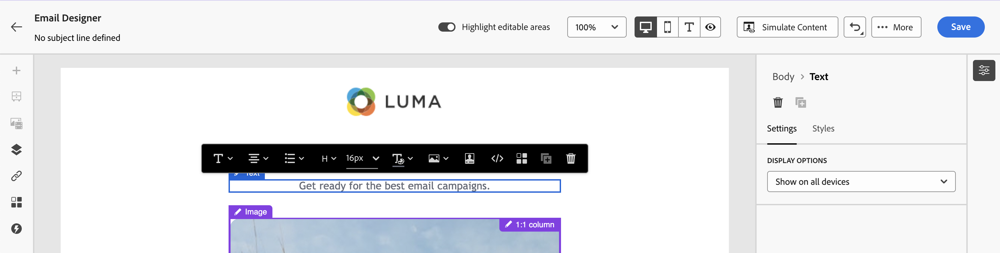

# Bloqueo del contenido en las plantillas de correo electrónico {#lock-content-email-templates}

Marketo Engage le permite bloquear contenido en plantillas de correo electrónico, ya sea bloqueando toda la plantilla o estructuras/componentes específicos. Esto le permite evitar ediciones o eliminaciones no intencionadas, lo que le proporciona un mayor control sobre la personalización de las plantillas y mejora la eficacia y fiabilidad de sus campañas de correo electrónico.

>[!AVAILABILITY]
>
>Los usuarios con permisos para crear plantillas de contenido pueden activar el bloqueo de contenido.

El bloqueo de contenido se puede aplicar en el nivel **structure** o en el nivel **component**.

* Cuando una estructura está bloqueada:

   * Todo el contenido de esa estructura también está bloqueado.
   * No se puede añadir contenido a la estructura.
   * De forma predeterminada, no se puede eliminar la estructura. Puede anular esta restricción activando la opción Permitir eliminación.
   * Los componentes de contenido individuales dentro de la estructura bloqueada se pueden establecer como editables.

* Cuando una estructura es editable (estructura no bloqueada):

   * Los componentes de contenido individuales se pueden bloquear dentro de esa estructura.
   * De forma predeterminada, no se puede eliminar un componente si está bloqueado o si la opción &quot;Solo bloqueo de contenido editable&quot; está seleccionada. Puede anular esta restricción activando la opción Permitir eliminación.

## Bloquear una plantilla de correo electrónico {#lock-an-email-template}

### Habilitar el bloqueo de contenido {#enable-content-locking}

Puede activar el bloqueo de contenido para una plantilla de correo electrónico directamente en la Designer de correo electrónico, tanto si está creando una plantilla nueva como si está editando una existente.

1. Abra o cree una plantilla de correo electrónico y acceda a la pantalla de edición de contenido en el Designer de correo electrónico.

1. En el panel **[!UICONTROL Cuerpo]** de la derecha, habilite la opción **[!UICONTROL Gobernanza]**.

1. En la lista desplegable **[!UICONTROL Modo]**, seleccione el modo de bloqueo que desee para la plantilla:

   * **[!UICONTROL Bloqueo de contenido]**: Bloquee secciones específicas de contenido dentro de la plantilla. De forma predeterminada, todas las estructuras y componentes se pueden editar. A continuación, puede bloquear selectivamente elementos individuales.
   * **[!UICONTROL Solo lectura]**: bloquee todo el contenido de la plantilla para evitar cualquier modificación.

   {width="800" zoomable="yes"}

1. Si seleccionó el modo **[!UICONTROL Bloqueo de contenido]**, puede definir con más detalle cómo los usuarios pueden interactuar con la plantilla. Habilite la opción **[!UICONTROL Habilitar edición de contenido]** y elija una de las siguientes opciones:

   * **[!UICONTROL Permitir la adición de estructura y contenido]**: los usuarios pueden agregar estructuras entre las existentes y agregar componentes de contenido o fragmentos dentro de estructuras editables.

   * **[!UICONTROL Permitir solo la adición de contenido]**: los usuarios pueden agregar componentes de contenido o fragmentos dentro de estructuras editables, pero no pueden agregar ni duplicar estructuras.

1. Después de seleccionar el modo de bloqueo, puede definir qué estructuras o componentes bloquear si ha seleccionado el modo **[!UICONTROL Bloqueo de contenido]**:

   * [Aprenda a bloquear estructuras](#lock-structures)
   * [Aprenda a bloquear componentes](#lock-components)

   Si eligió el modo **[!UICONTROL Solo lectura]**, puede finalizar y guardar la plantilla.

Puede ajustar la configuración de **[!UICONTROL Governance]** en cualquier momento al diseñar la plantilla seleccionando el cuerpo de la plantilla. Para ello, haga clic en el vínculo **[!UICONTROL Cuerpo]** en el carril de navegación ubicado en la parte superior del panel derecho.

{width="800" zoomable="yes"}

### Bloqueo de estructuras {#lock-structures}

Para bloquear una estructura dentro de la plantilla:

1. Seleccione la estructura que desee bloquear.

1. En la lista desplegable **[!UICONTROL Bloquear tipo]**, elija **[!UICONTROL Bloqueado]**.

   {width="800" zoomable="yes"}

   >[!NOTE]
   >
   >De forma predeterminada, los usuarios no pueden eliminar las estructuras bloqueadas. Puede anular esta restricción habilitando la opción **[!UICONTROL Permitir eliminación]**.

Después de bloquear una estructura, no se pueden duplicar ni agregar más componentes o fragmentos de contenido dentro de ella. Todos los componentes de una estructura bloqueada también están bloqueados de forma predeterminada. Para hacer que un componente se pueda editar dentro de una estructura bloqueada:

1. Seleccione el componente que desea desbloquear.

1. Habilitar la opción **[!UICONTROL Usar bloqueo específico]**.

1. En la lista desplegable **[!UICONTROL Bloquear tipo]**, elija **[!UICONTROL Editable]**. Para permitir la edición de contenido al bloquear estilos, seleccione **[!UICONTROL Solo contenido editable]**. [Aprenda a bloquear componentes](#lock-components)

   {width="800" zoomable="yes"}

### Bloqueo de componentes {#lock-components}

Para bloquear un componente específico dentro de una estructura:

1. Seleccione el componente y habilite la opción **[!UICONTROL Usar bloqueo específico]** en el panel derecho.

1. En la lista desplegable **[!UICONTROL Tipo de bloqueo]**, seleccione la opción de bloqueo que prefiera:

   {width="800" zoomable="yes"}

   * **[!UICONTROL Bloqueo de contenido editable solamente]**: Bloquee los estilos del componente pero permita la edición de contenido.
   * **[!UICONTROL Bloqueado]**: bloquea completamente el contenido y los estilos del componente.

   >[!NOTE]
   >
   >El tipo de bloqueo **[!UICONTROL Editable]** permite a los usuarios editar un componente, incluso dentro de una estructura bloqueada. [Aprenda a bloquear estructuras](#lock-structures)

1. De forma predeterminada, los usuarios no pueden eliminar los componentes bloqueados. Puede habilitar la eliminación activando la opción **[!UICONTROL Permitir eliminación]**.

### Identificar contenido bloqueado {#identify-locked-content}

Para identificar fácilmente las estructuras y los componentes bloqueados dentro de la plantilla, use el **[!UICONTROL árbol de navegación]** ubicado en el menú del lado izquierdo. Este menú proporciona una visión general de todos los elementos de plantilla, resaltando los elementos bloqueados con un icono de candado y los elementos editables con un icono de lápiz.

En el ejemplo siguiente, el control está habilitado para el cuerpo de la plantilla. La *estructura 2* está bloqueada con *componente 1* editable, mientras que la *estructura 3* está bloqueada por completo.

{width="800" zoomable="yes"}

## Uso de plantillas con contenido bloqueado {#use-templates-with-locked-content}

Cuando se usa una plantilla con contenido bloqueado, aparece el mensaje **[!UICONTROL Gobernanza habilitada]** en el panel derecho.

Según el tipo de bloqueo aplicado a la plantilla, puede realizar diferentes acciones en las estructuras y componentes de la plantilla. Para identificar rápidamente todas las áreas editables dentro de la plantilla, habilite la opción **[!UICONTROL Resaltar áreas editables]**.

Por ejemplo, en la plantilla siguiente, todas las áreas son editables, excepto la imagen superior que se ha bloqueado, lo que significa que no puede editarla ni quitarla.

{width="800" zoomable="yes"}

Estos son algunos ejemplos de edición de correos electrónicos y de la configuración de bloqueo de contenido asociada que se ha configurado:

<table>
<thead>
  <tr>
    <th>Tipo de bloqueo de contenido</th>
    <th>Configuración de plantilla</th>
    <th>Edición por correo electrónico</th>
  </tr></thead>
<tbody>
  <tr>
    <td>Plantilla de contenido de solo lectura</td>
    <td></td>
    <td></td>
  </tr>
  <tr>
    <td>El contenido completo es editable, pero los usuarios no pueden agregar ninguna estructura ni componente</td>
    <td></td>
    <td></td>
  </tr>
  <tr>
    <td>Estructura bloqueada que no se puede eliminar</td>
    <td></td>
    <td></td>
  </tr>
  <tr>
    <td>Componente con estilos bloqueados y que no se puede eliminar. Los usuarios solo pueden modificar el contenido.</td>
    <td></td>
    <td></td>
  </tr>
  <tr>
    <td>Componente editable dentro de una estructura bloqueada.</td>
    <td></td>
    <td></td>
  </tr>
</tbody>
</table>
