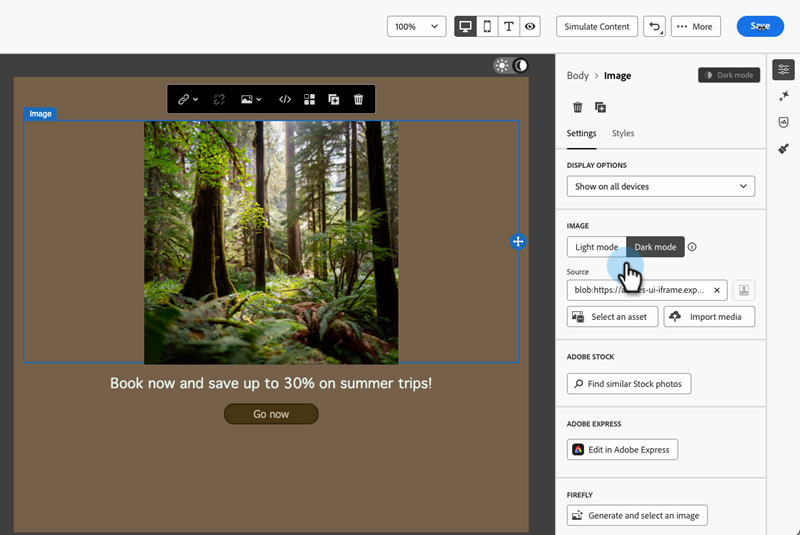

# Modo oscuro {#dark-mode}

Al diseñar los mensajes de correo electrónico, el Designer de correo electrónico le permite cambiar a la vista **[!UICONTROL Modo oscuro]**.

En **[!UICONTROL modo oscuro]**, puede definir la configuración personalizada específica que se mostrará al admitir clientes de correo electrónico cuando su modo oscuro esté activado.

## ¿Qué es el modo oscuro? {#what-is-dark-mode}

El modo oscuro permite a los clientes de correo electrónico y a las aplicaciones mostrar correos electrónicos con fondos más oscuros y colores más claros para el texto, los botones y otros elementos de la interfaz de usuario. Ayuda a reducir la fatiga ocular, ahorrar batería y mejorar la legibilidad en entornos con poca luz para una experiencia de visualización más cómoda.

## Mecanismos de protección {#guardrails}

El procesamiento en modo oscuro puede variar significativamente en distintos clientes de correo electrónico.

Antes de utilizar el modo oscuro, es importante comprender cómo lo gestionan los clientes de correo electrónico principales. Hay tres casos que se deben distinguir:

### Clientes que no admiten el modo oscuro {#not-supporting}

Algunos clientes de correo electrónico no admiten esta función en absoluto, como:

* Yahoo!Mail
* AOL

Tanto si define la configuración personalizada de modo oscuro como si no, estos clientes de correo electrónico no muestran ningún procesamiento de modo oscuro.

### Clientes que aplican su propio modo oscuro {#default-support}

Algunos clientes de correo electrónico aplican sistemáticamente su propio modo oscuro predeterminado para todos los correos electrónicos recibidos. Los colores, fondos, imágenes, etc. se ajustan automáticamente con la configuración del modo oscuro específica de ese cliente de correo electrónico. No es posible realizar ninguna modificación externa.

Algunos ejemplos son:

* Gmail (Desktop Webmail, iOS, Android, Mobile Webmail)
* Outlook Windows
* Outlook Windows Mail

En este caso, si define la configuración personalizada del modo oscuro en el Designer de correo electrónico, dicha configuración se sobrescribe con la configuración del cliente de correo electrónico.

Por lo tanto, mientras que estos clientes de correo electrónico sí gestionan el modo oscuro, su diseño específico del modo oscuro no se procesará.

### Clientes que admiten el modo oscuro personalizado {#custom-dark-mode}

Algunos clientes de correo electrónico ofrecen la opción de procesar el modo oscuro personalizado con la consulta `@media (prefers-color-scheme: dark)`, que es el método utilizado por [!DNL Marketo Engage] Email Designer.

Los principales clientes que administran esta opción son:

* Apple Mail macOS
* Apple Mail iOS
* Outlook macOS
* Outlook.com
* Outlook iOS
* Outlook Android

Se debe mostrar la configuración definida en el Designer de correo electrónico.

>[!NOTE]
>
>Aprenda a definir la [configuración personalizada del modo oscuro](#define-custom-dark-mode) en el Designer de correo electrónico.

Algunas restricciones pueden aplicarse según cada cliente de correo electrónico. Por ejemplo, algunos clientes (por ejemplo, Apple Mail 16) no generan el modo oscuro si hay imágenes presentes.

Para obtener resultados óptimos, pruebe el contenido en los clientes de correo electrónico a los que está dirigiendo. Para ver una simulación en cada cliente, use la función [Procesamiento de correo electrónico](/help/marketo/product-docs/email-marketing/email-designer/test-email-rendering.md) en el Designer de correo electrónico.

## Modo oscuro en el Diseñador de correo electrónico {#dark-mode-email-designer}

Cuando se trata del modo oscuro en el Designer de correo electrónico, hay dos aspectos que hay que tener en cuenta:

* Puede obtener una previsualización del modo oscuro predeterminado en la mayoría de los clientes de correo electrónico de soporte. [Más información](#preview-dark-mode)

* Si desea anular la configuración predeterminada de los clientes de correo electrónico de soporte, puede definir la configuración personalizada del modo oscuro en el correo electrónico que está editando. [Más información](#define-custom-dark-mode)

### Previsualizar modo oscuro predeterminado {#preview-dark-mode}

Obtenga información sobre cómo acceder al modo oscuro en Email Designer y obtenga una previsualización de la configuración predeterminada del modo oscuro.

1. En la página de inicio de Email Designer, seleccione la opción **[!UICONTROL Diseñar desde cero]**.

1. Agregue [estructuras y contenido](/help/marketo/product-docs/email-marketing/email-designer/email-authoring.md#add-structure-and-content) a su correo electrónico.

1. En la parte superior derecha, habilite la opción **[!UICONTROL Modo oscuro]**.

   

1. Se muestra la previsualización predeterminada del modo oscuro.

   

De forma predeterminada, la previsualización en modo oscuro de Email Designer aplica el esquema de colores &quot;inversión de color completo&quot; a todos los elementos, excepto a las imágenes y los iconos.

Esto significa que detecta áreas con elementos claros y oscuros y los invierte, de modo que los fondos claros se vuelven oscuros y el texto oscuro se vuelve claro, mientras que los fondos oscuros se vuelven claros y el texto claro se vuelve oscuro.

>[!CAUTION]
>
>La renderización final puede variar según el cliente de correo electrónico del destinatario. Para ver una simulación para cada cliente de correo electrónico, use la función [Procesamiento de correo electrónico](/help/marketo/product-docs/email-marketing/email-designer/test-email-rendering.md).

### Definir modo oscuro personalizado {#define-custom-dark-mode}

Después de cambiar a **[!UICONTROL Modo oscuro]**, puede elegir editar elementos de estilo específicos de su contenido que se mostrarán solo cuando el modo oscuro esté habilitado en el cliente de correo electrónico del destinatario (siempre que admita esa función).

>[!IMPORTANT]
>
>El procesamiento final del modo oscuro depende de cada cliente de correo electrónico, por lo que los resultados pueden variar de un cliente a otro. [Más información](#guardrails)

Para aprovechar el estilo de modo oscuro personalizado de Email Designer, Marketo Engage usa la consulta CSS `@media (prefers-color-scheme: dark)`, que detecta si el cliente de correo electrónico del usuario está configurado en modo oscuro y aplica el diseño de tema oscuro definido en el correo electrónico.

Para definir la configuración personalizada del modo oscuro, siga los pasos a continuación.

1. Cambie a la [vista previa en modo oscuro](#preview-dark-mode) en el Designer de correo electrónico.

1. Edite cualquier atributo de color de estilo, como texto, fondos, botones, etc.

1. No puede cambiar los colores de las imágenes y los iconos, pero puede definir recursos específicos solo para el modo oscuro. Para ello, seleccione cualquier imagen. Cambie a **[!UICONTROL Modo oscuro]** con el conmutador específico del panel **[!UICONTROL Configuración]** y seleccione un recurso diferente.

   

1. En cualquier momento puedes **[!UICONTROL Cambiar a la vista en vivo]** para ver cómo se puede presentar tu contenido en varios tamaños de dispositivo. En esta vista, seleccione el conmutador Modo oscuro para previsualizar la versión en modo oscuro del contenido en diferentes dispositivos.

   

   >[!NOTE]
   >
   >La vista en directo es una previsualización genérica diseñada para comparar el aspecto que podría tener la renderización en varios tamaños de dispositivo. La renderización final puede variar según el cliente de correo electrónico del destinatario.

1. Cuando esté satisfecho con los cambios del modo oscuro, haga clic en **[!UICONTROL Simular contenido]**.

   

1. Seleccione **[!UICONTROL Procesar correo electrónico]** y conéctese a su cuenta de Litmus. Puede ver el procesamiento final del modo oscuro para varios clientes de correo electrónico. Más información sobre [Procesamiento de correo electrónico](/help/marketo/product-docs/email-marketing/email-designer/test-email-rendering.md).

   >[!IMPORTANT]
   >
   >Aunque la simulación se aproxima mucho al modo oscuro en que aparecerán los correos electrónicos, el procesamiento real puede diferir debido a variaciones en los proveedores de servicios de correo electrónico o la configuración del dispositivo.

## Prácticas recomendadas {#best-practices}

A medida que la adopción del modo oscuro aumenta en los principales clientes de correo electrónico, es esencial tener en cuenta cómo se procesan los mensajes de correo electrónico en los entornos claro y oscuro, tanto si utiliza [modo oscuro personalizado](#define-custom-dark-mode) como si no.

El modo oscuro puede alterar los colores, los fondos y las imágenes, a veces anulando las opciones de diseño. Para garantizar la coherencia visual, la accesibilidad y la integridad de la marca, siga las prácticas recomendadas que se enumeran a continuación.

**Optimizar imágenes y logotipos**

* Guarde los logotipos e iconos como PNG con fondos transparentes para evitar cuadros blancos visibles en modo oscuro.

* Evite imágenes con fondos blancos o claros codificados.

* Si la transparencia no es una opción, coloque las imágenes sobre un fondo sólido en el diseño para evitar incómodas inversiones de color.

**Observe sus fondos**

* Asegúrese de que haya suficiente contraste entre los colores del texto y del fondo para facilitar la lectura tanto en los modos claro como oscuro.

* Evite depender únicamente de los colores de fondo para el contenido crítico. Algunos clientes omiten los colores de fondo en el modo oscuro, por lo que asegúrese de que la información clave sigue visible.

**Diseñar contenido accesible en modo oscuro**

* Utilice combinaciones de colores fáciles de distinguir para las personas con daltonismo.

* Utilice una paleta de medios tonos para garantizar el contraste con fondos claros y oscuros.

* Utilice combinaciones de colores accesibles con alto contraste para mejorar la legibilidad y cumplir los estándares de las Directrices de accesibilidad del contenido web (WCAG). Utilice herramientas como el verificador de contraste de WebAIM para verificar el contraste de color.

* Evite las fuentes delgadas, ya que pueden afectar a la legibilidad. Si su marca requiere una fuente fina, atíguela en modo oscuro.

* Omita el blanco puro sobre el negro puro, ya que puede causar distensión ocular y algunos clientes de correo electrónico podrían invertirlo automáticamente.

* Proporcionar un estilo de reserva accesible si no se admite el modo oscuro.

**Pruebe sus correos electrónicos en el entorno de modo oscuro**

* Use la [vista previa en modo oscuro](#preview-dark-mode) de Email Designer, que usa esquemas de color invertidos para detectar los problemas de forma temprana.

* Utilice la función [Procesamiento de correo electrónico](/help/marketo/product-docs/email-marketing/email-designer/test-email-rendering.md) que aprovecha Litmus para simular los diseños en los principales clientes de correo electrónico y ver cómo se comportan los colores y las imágenes en el modo oscuro.
