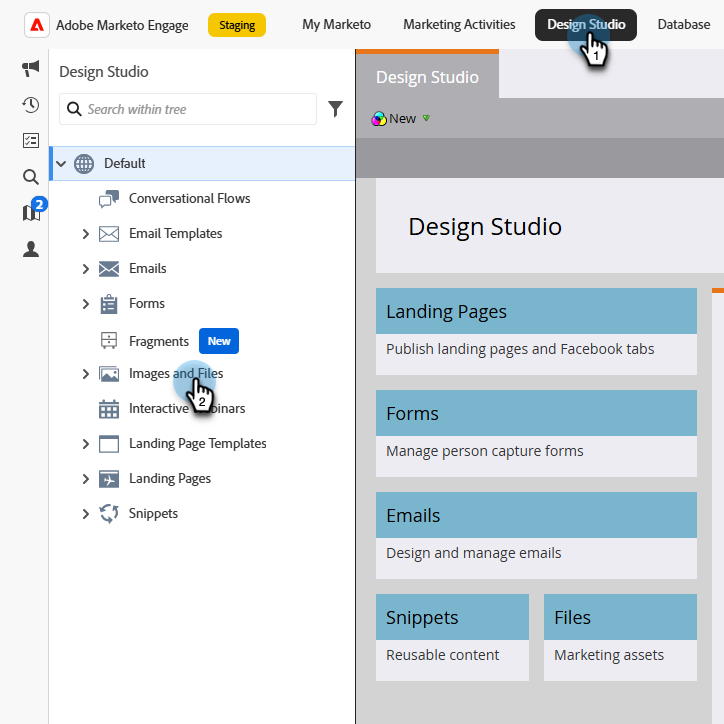
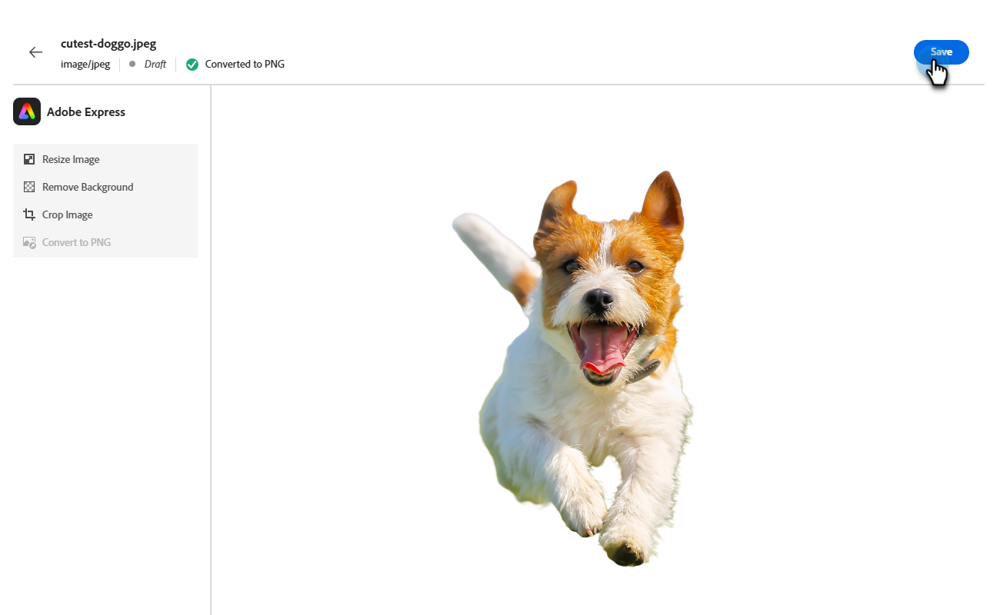

# Edición de imágenes con Adobe Express {#edit-images-with-adobe-express}

Adobe Marketo Engage se integra de forma nativa con Adobe Express, lo que le permite acceder a una variedad de herramientas de edición de imágenes. Puede utilizar estas herramientas para modificar las imágenes en Marketo Engage Design Studio. La integración ofrece las siguientes ventajas clave:

* Se ha aumentado la reutilización del contenido editando y guardando nuevas imágenes en Marketo Engage.

* Se ha reducido el tiempo y el esfuerzo necesarios para actualizar imágenes o crear nuevas versiones de imágenes existentes.

>[!NOTE]
>
>Adobe Express solo admite los formatos de archivo de imagen PNG y JPEG en este momento.

## Acceso al editor de Adobe Express {#access-the-adobe-express-editor}

Existen dos formas de acceder al editor de Adobe Express:

* Haga clic en el nombre de la imagen
* _Menú desplegable de acciones de imágenes y archivos_

>[!BEGINTABS]

>[!TAB Haga clic en el nombre de la imagen]

1. En Marketo Engage, vaya a **[!UICONTROL Design Studio]** y seleccione **[!UICONTROL Imágenes y archivos]**.

   {width="600" zoomable="yes"}

1. Seleccione la imagen que desee editar.

   {width="600" zoomable="yes"}

   >[!NOTE]
   >
   >* Para ver los recursos por área de trabajo y carpeta, abra la estructura haciendo clic en el icono **[!UICONTROL Mostrar carpetas]** en la parte superior izquierda.
   >
   >* Para ordenar la tabla por cualquiera de las columnas, haga clic en el título de la columna. La flecha de la fila de título indica la columna de ordenación y el orden actuales.

1. En la ficha _Detalles_ de la imagen, haga clic en **[!UICONTROL Editar en Adobe Express]**.

   {width="600" zoomable="yes"}

   >[!CAUTION]
   >
   >Si ya se hace referencia a la imagen en una plantilla de correo electrónico o de correo electrónico, las ediciones realizadas actualizarán la imagen en cualquier lugar donde se esté utilizando actualmente.

>[!TAB Acciones de imagen y archivo]

1. En Marketo Engage, vaya a **[!UICONTROL Design Studio]** y seleccione **[!UICONTROL Imágenes y archivos]**.

   {width="600" zoomable="yes"}

   >[!NOTE]
   >
   >* Para ver los recursos por área de trabajo y carpeta, abra la estructura haciendo clic en el icono **[!UICONTROL Mostrar carpetas]** en la parte superior izquierda.
   >
   >* Para ordenar la tabla por cualquiera de las columnas, haga clic en el título de la columna. La flecha de la fila de título indica la columna de ordenación y el orden actuales.

1. Seleccione la casilla de verificación situada junto a la imagen que desea editar. En la lista desplegable **[!UICONTROL Acciones de imagen y archivo]**, seleccione **[!UICONTROL Editar en Adobe Express]**.

   {width="600" zoomable="yes"}

   >[!CAUTION]
   >
   >Si ya se hace referencia a la imagen en una plantilla de correo electrónico o de correo electrónico, las ediciones realizadas actualizarán la imagen en cualquier lugar donde se esté utilizando actualmente.

>[!ENDTABS]

## Licencia de Adobe Express Enterprise {#adobe-express-enterprise-license}

### Usuarios con una licencia Enterprise {#users-with-an-enterprise-license}

Si tiene una licencia Enterprise para Adobe Express, tiene acceso al editor Express completo. Puede ajustar la configuración de la imagen como el color, el brillo, la nitidez, el contraste, el tamaño y mucho más. La opción AI Magic permite eliminar fondos, insertar y quitar objetos y borrar partes de una imagen. Visite la [Guía del usuario de Adobe Express](https://helpx.adobe.com/es/express/user-guide.html){target="_blank"} para obtener más información sobre cada configuración.

>[!IMPORTANT]
>
>La licencia adquirida debe estar en la misma organización de IMS que la suscripción de Marketo Engage para acceder a todas las funcionalidades de edición de Adobe Express. Además, cada usuario individual debe tener una licencia en Adobe Express. Los usuarios [sin licencia](#users-without-an-enterprise-license) solo pueden acceder a las acciones rápidas en Adobe Express.

### Usuarios sin licencia Enterprise {#users-without-an-enterprise-license}

Para los que no tengan una licencia Enterprise, seguirá teniendo acceso a varias funciones de edición de acciones rápidas. Estas son las características:

* [Redimensionar imagen](#resize-image)
* [Quitar fondo](#remove-background)
* [Recortar imagen](#crop-image)
* [Convertir a PNG/JPEG](#convert-to-png-jpeg)

Se puede acceder a las funciones en la parte izquierda de la página de imagen.

{width="800" zoomable="yes"}

#### Redimensionar imagen {#resize-image}

1. Haga clic en **Cambiar tamaño de imagen**.

1. Realice los cambios que desee y haga clic en **Aplicar** cuando haya terminado.

{width="800" zoomable="yes"}

<table><tbody>
  <tr>
    <td style="width:25%"><b>Proporción de aspecto</b></td>
    <td>En la lista desplegable <b>Proporción de aspecto</b>, elige <b>Estándar</b> para elegir entre tamaños de foto comunes precalculados o <b>Personalizado</b> para establecer tu propia anchura/altura. También puede elegir el tamaño estándar de una plataforma de medios sociales específica (Pinterest, Snapchat, etc.).</td>
  </tr>
  <tr>
    <td style="width:25%"><b>Anchura y altura</b></td>
    <td>De forma predeterminada, la proporción de aspecto está bloqueada, manteniendo las mismas proporciones de imagen al ajustar su tamaño. Si lo desea, puede seleccionar el botón de bloqueo para desbloquear la relación de aspecto.</td>
  </tr>
  <tr>
    <td style="width:25%"><b>Restablecer</b></td>
    <td>Haga clic en <b>Restablecer</b> para eliminar las ediciones realizadas en la imagen y devolverla a su estado original.</td>
  </tr>
  <tr>
    <td style="width:25%"><b>Zoom y recorte</b></td>
    <td>Haga clic en <b>Zoom y recorte</b> para ampliar áreas específicas de la imagen. Al hacer clic en <b>Aplicar</b> después de aplicar el zoom, se recorta la imagen según lo que se muestra actualmente.</td>
  </tr>
</tbody>
</table>

#### Quitar fondo {#remove-background}

1. Haga clic en **Quitar fondo**.

1. Adobe Express muestra la imagen sin fondo. Si satisface sus necesidades, haga clic en **Aplicar**.

{width="800" zoomable="yes"}

>[!TIP]
>
>Si no estás satisfecho con el resultado, simplemente haz clic en **X** para cerrar la ventana.

#### Recortar imagen {#crop-image}

1. Haga clic en **[!UICONTROL Recortar imagen]**.

1. Arrastre las esquinas de la imagen para crear el recorte deseado.

{width="800" zoomable="yes"}

1. Haga clic en **[!UICONTROL Aplicar]** cuando haya terminado.

#### Convertir a PNG/JPEG {#convert-to-png-jpeg}

Convertir un archivo PNG en un archivo JPEG o un archivo JPEG en un archivo PNG.

1. Haga clic en **[!UICONTROL Convertir a PNG/JPEG]**.

{width="800" zoomable="yes"}

1. Haga clic en **[!UICONTROL Aplicar]**.

## Guarde el trabajo {#save-your-work}

Cuando hayas terminado con todas las ediciones, haz clic en **Guardar** para guardar el trabajo.

{width="800" zoomable="yes"}

La imagen editada se guarda en la misma carpeta que la imagen original.
