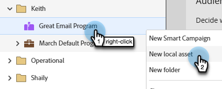
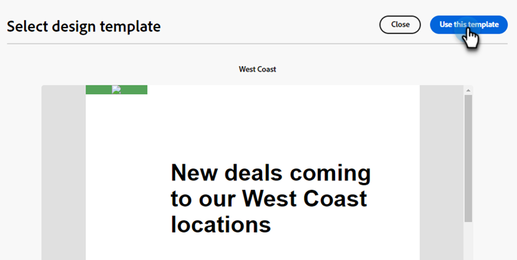

# Creación de correo electrónico {#email-authoring}

Obtenga información sobre cómo crear, personalizar y previsualizar correos electrónicos en el nuevo Designer de correo electrónico del Marketo Engage.

>[!PREREQUISITES]
>
>Para acceder al nuevo diseñador de correo electrónico, la suscripción de Marketo Engage debe migrarse al [Sistema Identity Management de Adobe (IMS)](https://experienceleague.adobe.com/en/docs/marketo/using/product-docs/administration/marketo-with-adobe-identity/adobe-identity-management-overview). Si el suyo aún no se ha actualizado y desea solicitar que se agilice, comuníquese con el equipo de cuenta de Adobe (su administrador de cuentas) o con [Soporte técnico de Marketo](https://nation.marketo.com/t5/support/ct-p/Support).

## Crear un correo electrónico {#create-an-email}

Los correos electrónicos del Designer de correo electrónico solo se pueden crear en Design Studio y se hace referencia a ellos en Campañas/listas inteligentes, o bien se pueden crear/utilizar directamente en los programas de correo electrónico en este momento.

>[!BEGINTABS]

>[!TAB Estudio de diseño]

1. Inicie sesión en el Marketo Engage a través de [Adobe Experience Cloud](https://experiencecloud.adobe.com/){target="_blank"}.

1. En Mi Marketo, seleccione **Design Studio**.

   

1. En el árbol, seleccione **Correos electrónicos (nuevo editor)**.

   

1. Haga clic en el botón **Crear correo electrónico**.

   

1. Introduzca un nombre de correo electrónico y una línea de asunto. Haga clic en **Crear**.

   

>[!TAB Programa de correo electrónico]

1. Inicie sesión en el Marketo Engage a través de [Adobe Experience Cloud](https://experiencecloud.adobe.com/){target="_blank"}.

1. Busque y seleccione (o cree) su programa de correo electrónico.

   

1. Tiene dos opciones para crear un nuevo correo electrónico. Haga clic con el botón derecho en el nombre de su programa de correo electrónico y seleccione **Nuevo recurso local** o haga clic en el botón **+Nuevo correo electrónico** en el cuadro Correo electrónico del panel. En este ejemplo, haremos lo primero.

   

1. Seleccione **Correo electrónico (nuevo editor)**.

   

1. Introduzca un nombre de correo electrónico y una línea de asunto. Haga clic en **Crear**.

   

>[!ENDTABS]

Eso es todo. Ahora es el momento de diseñar su correo electrónico.

## Elija su tipo de contenido {#choose-your-content-type}

1. En el correo electrónico que acaba de crear, haga clic en **Agregar contenido de correo electrónico**.

   

1. Se carga la página _Crear tu correo electrónico_. Puede elegir entre algunas opciones:

* [Diseñe desde cero](#design-from-scratch) con el editor de correo electrónico visual

* [Importe su propio HTML](#import-html) a través de un HTML o archivo zip

* [Seleccione una plantilla existente](#choose-a-template) (una de nuestras muestras o una que ya haya guardado)

### Diseñe desde cero {#design-from-scratch}

Cuando comience desde cero en el editor de correo electrónico, utilice las opciones siguientes para definir el contenido.

1. En la página _Crear tu correo electrónico_, selecciona **Diseñar desde cero**.

1. Agregue [estructura y contenido](#add-structure-and-content) a su correo electrónico.

1. Agregar [imágenes](#add-assets).

1. [Personaliza](#personalize-content) tu contenido.

1. Revisar vínculos y [editar seguimiento](#edit-url-tracking).

### Importar HTML {#import-html}

Puede importar contenido existente del HTML para diseñar el correo electrónico. El contenido puede ser:

* Archivo de HTML con una hoja de estilos incorporada

* Archivo .zip que incluye un archivo de HTML, la hoja de estilos (.css) y las imágenes

>[!NOTE]
>
>No hay restricciones en la estructura de archivos .zip. Sin embargo, las referencias deben ser relativas y ajustarse a la estructura de árbol de la carpeta .zip.

1. En la página Diseñar su plantilla, seleccione **HTML de importación**.

1. Arrastre y suelte el HTML o archivo .zip deseado (o seleccione un archivo del equipo) y haga clic en **Importar**.

   

>[!NOTE]
>
>Cuando se carga el contenido del HTML, el contenido se encuentra en modo de compatibilidad. En este modo, solo puede personalizar el texto, agregar vínculos o agregar recursos al contenido.

Puede realizar los cambios que desee en el contenido importado con [las herramientas visuales del editor de correo electrónico](#add-structure-and-content).

### Elija una plantilla {#choose-a-template}

Existen dos tipos de plantillas para elegir.

* **Plantillas de ejemplo**: El Marketo Engage ofrece cuatro plantillas de correo electrónico predeterminadas.

* **Plantillas guardadas**: son plantillas que creó desde cero mediante el menú Plantillas o un mensaje de correo electrónico que creó y eligió guardar como plantilla.

>[!BEGINTABS]

>[!TAB Plantillas de muestra]

Elija una de las plantillas listas para usar para empezar con su diseño de plantillas de correo electrónico.

1. La pestaña Plantillas de muestra está abierta de forma predeterminada.

1. Seleccione la plantilla que desee utilizar.

   

1. Haga clic en **Usar esta plantilla**.

   

1. Edite el contenido como desee con el diseñador de contenido visual.

>[!TAB Plantillas guardadas]

1. Haga clic en la ficha **Plantillas guardadas** y seleccione la plantilla que desee.

   

1. Haga clic en **Usar esta plantilla**.

   

1. Edite el contenido como desee con el diseñador de contenido visual.

>[!ENDTABS]

## Añadir estructura y contenido {#add-structure-and-content}

1. Para empezar a crear o modificar contenido, arrastre y suelte un elemento de Estructuras en el lienzo. Edite su configuración en el panel de la derecha.

   >[!TIP]
   >
   >Seleccione el componente de columna n:n para definir el número de columnas que desea (entre tres y 10). También puede definir el ancho de cada columna moviendo las flechas debajo de la columna.

   

   >[!NOTE]
   >
   >Cada tamaño de columna no puede ser inferior al 10 % de la anchura total del componente de estructura. Solo se pueden eliminar columnas vacías.

1. En la sección Contenido, arrastre sobre los elementos deseados y suéltelos en uno o más componentes de estructura.

   

1. Cada componente se puede personalizar mediante las pestañas Settings o Style. Cambie la fuente, el estilo del texto, el margen, etc.

### Añadir fragmentos {#add-fragments}

1. Para acceder a tus fragmentos, selecciona el icono _Fragmentos_ (  ) en el panel de navegación izquierdo.

   {width="700" zoomable="yes"}

1. Arrastre y suelte cualquiera de los fragmentos en el marcador de posición del componente estructural.

El editor procesa el fragmento dentro de la sección o el elemento de la estructura de correo electrónico. El contenido del fragmento se actualiza dinámicamente dentro de la estructura para mostrar cómo aparece el contenido en el correo electrónico.

>[!TIP]
>
>Si desea que el fragmento ocupe todo el diseño horizontal dentro del correo electrónico, agregue una estructura de columna 1:1 y, a continuación, arrastre y suelte el fragmento en él.

Una vez guardado el correo electrónico, aparecerá en la ficha _[!UICONTROL Utilizado por]_ de la página de detalles del fragmento. Los fragmentos agregados a una plantilla de correo electrónico no se pueden editar dentro de la plantilla; el fragmento de origen define el contenido.

### Añadir Assets {#add-assets}

Agregue imágenes que estén almacenadas en la sección [Imágenes y archivos](/help/marketo/product-docs/demand-generation/images-and-files/add-images-and-files-to-marketo.md){target="_blank"} de la instancia de Marketo Engage.

>[!NOTE]
>
>Sólo puede agregar imágenes en el nuevo diseñador, no en otros tipos de archivo en este momento.

1. Para acceder a sus imágenes, haga clic en el icono Selector de recursos.

   

1. Arrastre y suelte la imagen deseada en un componente de estructura.

   

   >[!NOTE]
   >
   >Para reemplazar una imagen existente, selecciónela y haga clic en **Seleccionar un recurso** en la pestaña Configuración a la derecha.

### Capas, configuración y estilos {#layers-settings-styles}

Abra el árbol de navegación para acceder a estructuras específicas y a sus columnas/componentes para una edición más granular. Para acceder a, haga clic en el icono del árbol de navegación.

En el ejemplo siguiente se describen los pasos para ajustar el relleno y la alineación vertical dentro de un componente de estructura compuesto por columnas.

1. Seleccione la columna en el componente de estructura directamente en el lienzo o mediante el _árbol de navegación_ que se muestra a la izquierda.

1. En la barra de herramientas de la columna, haga clic en la herramienta _[!UICONTROL Seleccionar una columna]_ y elija la que desee editar.

   También puede seleccionarlo en el árbol de estructura. Los parámetros editables de esa columna se muestran en las fichas _[!UICONTROL Configuración]_ y _[!UICONTROL Estilos]_ de la derecha.

   

1. Para editar las propiedades de la columna, haga clic en la ficha _[!UICONTROL Estilos]_ de la derecha y cámbielas según sus necesidades:

   * Para **[!UICONTROL Background]**, cambie el color de fondo según sea necesario.

     Desactive la casilla de verificación para un fondo transparente. Habilite la configuración de **[!UICONTROL imagen de fondo]** para usar una imagen como fondo en lugar de un color sólido.

   * Para **[!UICONTROL Alignment]**, selecciona el icono _Top_, _Middle_ o _Bottom_.
   * Para **[!UICONTROL Padding]**, defina el relleno para todos los lados.

     Seleccione **[!UICONTROL relleno diferente para cada lado]** si desea ajustar el relleno. Haga clic en el icono _Bloquear_ para interrumpir la sincronización.

   * Expanda la sección **[!UICONTROL Avanzado]** para definir estilos en línea para la columna.

   

1. Repita estos pasos según sea necesario para ajustar la alineación y el relleno de las demás columnas del componente.

1. Guarde los cambios.

### Personalizar contenido {#personalize-content}

Los tokens funcionan en el nuevo editor del mismo modo que en el antiguo, pero el icono tiene un aspecto diferente. El ejemplo siguiente describe cómo agregar un token de nombre con texto de reserva.

1. Seleccione el componente de texto. Coloque el cursor donde desee que aparezca el token y haga clic en el icono **Agregar personalización**.

   

1. Haga clic en el [tipo de token](/help/marketo/product-docs/demand-generation/landing-pages/personalizing-landing-pages/tokens-overview.md){target="_blank"} deseado.

   

1. Busque el token deseado y haga clic en el icono **...** (al hacer clic en el icono + se agrega un token sin texto de reserva).

   

   >[!NOTE]
   >
   >&quot;Texto de reserva&quot; es el nuevo término del editor para el valor predeterminado. Ejemplo: ``{{lead.First Name:default=Friend}}``. Se recomienda en caso de que no haya ningún valor para la persona en el campo que elija.

1. Establece el texto de reserva y haz clic en **Agregar**.

   

1. Haga clic en **Guardar**.

### Editar seguimiento de URL {#edit-url-tracking}

A veces no se desea habilitar la URL de seguimiento de Marketo en un vínculo de un mensaje de correo electrónico. Esto resulta útil cuando la página de destino no admite parámetros de URL y puede provocar que se rompa un vínculo.

1. Haga clic en el icono Links para mostrar todas las direcciones URL del correo electrónico.

   

1. Haga clic en el icono de lápiz para editar el seguimiento de cualquier vínculo deseado.

1. Haga clic en el menú desplegable **Tipo de seguimiento** y realice la selección.

   

   <table><tbody>
     <tr>
       <td><b>Seguimiento sin mkt_tok</b></td>
       <td>Activa el seguimiento en la dirección URL sin usar el parámetro de cadena de consulta mkt_tok en la dirección URL de destino</td>
     </tr>
     <tr>
       <td><b>Seguimiento con mkt_tok</b></td>
       <td>Activa el seguimiento en la URL con el uso del parámetro de cadena de consulta mkt_tok en la URL de destino</td>
     </tr>
     <tr>
       <td><b>No rastrear</b></td>
       <td>Deshabilita el seguimiento de la dirección URL</td>
     </tr>
   </tbody>
   </table>

1. De forma opcional, puede asignar una etiqueta a la dirección URL o agregar etiquetas.

1. Haga clic en **Guardar** cuando termine.

## Comprobar alertas {#check-alerts}

A medida que diseña el contenido, las alertas se muestran en la parte superior derecha de la pantalla cuando falta la configuración clave.

Existen dos tipos de alertas:

**Advertencias**

Las advertencias hacen referencia a recomendaciones y prácticas recomendadas, como:

* **El vínculo de no participación no está presente en el cuerpo del correo electrónico**: aunque los vínculos de cancelación de suscripción son un requisito, se recomienda agregarlos al cuerpo del correo electrónico.

>[!NOTE]
>
>No es necesario agregar una opción de cancelación de suscripción para [Correos electrónicos operativos](/help/marketo/product-docs/email-marketing/general/functions-in-the-editor/make-an-email-operational.md) (que no sean de marketing).

* **La versión de texto del HTML está vacía**: debe definir una versión de texto del cuerpo del correo electrónico para los casos en los que no se pueda mostrar el contenido del HTML.

* **El vínculo vacío está presente en el cuerpo del correo electrónico**: compruebe que todos los vínculos del correo electrónico sean correctos.

* **El tamaño del correo electrónico ha superado el límite de 100 KB**: para una entrega óptima, asegúrese de que el tamaño del correo electrónico no supere los 100 KB.

**Errores**

Los errores impiden enviar o probar el correo electrónico hasta que se resuelvan:

* **Falta la línea de asunto**: se requiere una línea de asunto de correo electrónico.

* **La versión de correo electrónico del mensaje está vacía**: este error se produce cuando no se ha configurado el contenido del correo electrónico.

## Prueba del correo electrónico {#test-your-email}

Cuando se define el contenido del mensaje, puede utilizar perfiles de prueba para previsualizarlo, enviar pruebas y controlar cómo se procesa en clientes populares de escritorio, móviles y basados en web. Si ha insertado contenido personalizado, puede comprobar cómo se muestra en el mensaje mediante los datos del perfil de prueba.

Para obtener una vista previa del contenido del correo electrónico, haga clic en **Simular contenido** y, a continuación, agregue un perfil de prueba para comprobar el mensaje mediante los datos del perfil de prueba.

## Referencia a un correo electrónico {#reference-an-email}

Si ha creado el correo electrónico dentro de un programa de correo electrónico, solo se puede utilizar en ese programa. Si creó su correo electrónico en Design Studio, se puede hacer referencia a él desde campañas inteligentes o listas inteligentes como lo haría con cualquier otro correo electrónico.

* Haga referencia a él en una lista inteligente al [seguir los pasos habituales](/help/marketo/product-docs/core-marketo-concepts/smart-lists-and-static-lists/creating-a-smart-list/create-a-smart-list.md).

* Haga referencia a él en una campaña inteligente al [seguir los pasos habituales](/help/marketo/product-docs/core-marketo-concepts/smart-campaigns/creating-a-smart-campaign/create-a-new-smart-campaign.md).

>[!NOTE]
>
>Solo se puede hacer referencia a los correos electrónicos guardados. No hay estado &quot;aprobado&quot; en el nuevo diseñador de correo electrónico.

>[!MORELIKETHIS]
>
>[Plantillas de correo electrónico](/help/marketo/product-docs/email-marketing/email-designer/email-template.md){target="_blank"}: Aprenda a crear, diseñar y obtener acceso a una plantilla de correo electrónico en el nuevo diseñador.
