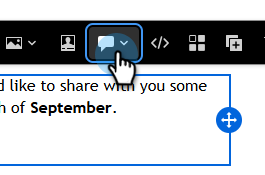
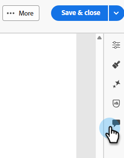

# Colaboración por correo electrónico {#email-collaboration}

La colaboración y los comentarios de correo electrónico permiten a los equipos de marketing revisar, debatir y finalizar sin problemas los recursos de correo electrónico en Adobe Marketo Engage Email Designer. En lugar de compartir borradores con herramientas externas (como chat, hilos de correo electrónico, hojas de cálculo, etc.), puede realizar comentarios, sugerir ediciones y resolver comentarios en tiempo real. Esto optimiza el flujo de trabajo, reduce los errores y garantiza que las partes interesadas estén alineadas antes de que se envíe una campaña de correo electrónico.

## Permisos {#permissions}

Los usuarios que tengan permisos de edición para un recurso de correo electrónico podrán comentar, etiquetar y ver comentarios. Los usuarios con permisos de solo lectura para enviar recursos por correo electrónico **no** podrán agregar o ver comentarios.

## Añadir comentarios {#add-comments}

1. Al crear o editar un correo electrónico en la Designer de correo electrónico, haga clic en una estructura, columna o contenido (texto, imagen, botón, etc.) sobre cualquier sección editable.

   

1. Haga clic en el icono de comentario.

   

1. Escriba comentarios, preguntas o sugerencias.

   

>[!NOTE]
>
>Etiquete compañeros de equipo con @mentions (por ejemplo, &quot;@John, actualice el Boletín de invierno&quot;).

## Ver todos los comentarios {#view-all-comments}

1. Haga clic en el icono _Collaboration_ que se encuentra en el lado derecho.

   

1. Responder rápidamente a un comentario o marcarlo como me gusta.

   

1. Haga clic en el icono **...** para obtener más acciones.

   

## Resolver comentarios {#resolve-comments}

Cada hilo de comentarios incluye:

* Responder: Continuar la conversación
* Resolver: marcar el comentario como resuelto
* Anular resolución: si son necesarias más ediciones
* Eliminar: elimina el comentario de su elemento de diseño
* Eliminar: elimina permanentemente el comentario

>[!NOTE]
>
>Los hilos resueltos están ocultos de forma predeterminada, pero se pueden volver a consultar seleccionando el hilo deseado en el filtro.

## Notificaciones {#notifications}

Los integrantes del equipo que están etiquetados reciben notificaciones por correo electrónico o por pulsos.

Las notificaciones se activan para:

* Nuevos comentarios
* Menciones (@username)
* Resoluciones

## Prácticas recomendadas {#best-practices}

* Use @mentions para asegurarse de que los comentarios llegan rápidamente al miembro del equipo correcto.

* Agrupe los comentarios relacionados en un único hilo de comentarios en lugar de en varias notas dispersas.

* Resuelva siempre los comentarios una vez dirigidos para mantener un flujo de trabajo limpio.

* Guardar una versión aprobada final para fines de cumplimiento/auditoría.
