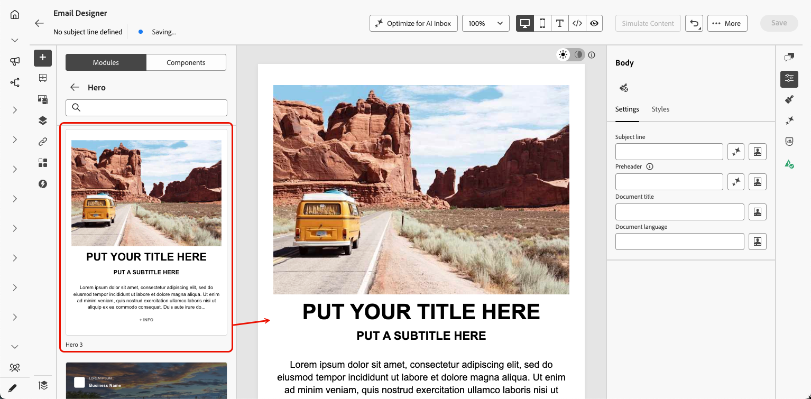

# Uso de módulos de en el Designer de correo electrónico {#email-modules}

Email Designer incluye una biblioteca de módulos: bloques de contenido completamente estructurados y listos para usar, diseñados para acelerar el ensamblado de correos electrónicos y promover la coherencia del diseño en todas las comunicaciones.

A diferencia de los [componentes de contenido](/help/marketo/product-docs/email-marketing/email-designer/email-authoring.md#add-structure-and-content), que son marcadores de posición vacíos que se configuran desde cero, los módulos son secciones creadas previamente (como un encabezado con marca, una cuadrícula de tarjeta de producto o un pie de página con vínculos de no participación) que se colocan directamente en el lienzo y se personalizan desde allí.

>[!NOTE]
>
>Los módulos no son fragmentos. Existen dentro del correo electrónico que está diseñando. Sin embargo, después de personalizar un módulo según sus necesidades, puede guardarlo como [fragmento visual](/help/marketo/product-docs/email-marketing/email-designer/fragments.md#visual-fragments) para reutilizarlo en otros mensajes y correos electrónicos.

## Acceso e inserción de módulos {#access-modules}

Para mostrar y aprovechar los módulos disponibles en Designer de correo electrónico, siga los pasos a continuación.

1. Abra el correo electrónico deseado.

1. En el panel izquierdo, haga clic en la ficha **[!UICONTROL Módulos]**.

   

1. Examine las categorías de módulos disponibles o utilice la barra de búsqueda para filtrar por nombre.

1. Haga clic en la flecha **>** situada junto a una categoría para expandirla y ver las variantes de diseño disponibles.

1. Busque la variante de módulo que desee utilizar y arrástrela y suéltela directamente en el lienzo del correo electrónico.

   

1. El módulo se inserta con su contenido predeterminado. Haga clic en cualquier elemento del lienzo para empezar a editar contenido en línea. Haga clic en cualquier área de texto para escribir directamente o haga clic en una imagen para reemplazarla con la biblioteca de recursos.

   >[!NOTE]
   >
   >Cuando se aplican temáticas de correo electrónico al contenido, los módulos heredan automáticamente los estilos de temáticas aplicados, lo que garantiza la coherencia de la marca en todo el diseño.

1. Use las fichas **[!UICONTROL Configuración]** y **[!UICONTROL Estilos]** del panel derecho para ajustar las propiedades y el estilo, tal como lo haría para cualquier otro elemento de correo electrónico.

   {width="70%"}

1. También puede agregar [componentes de contenido](/help/marketo/product-docs/email-marketing/email-designer/email-authoring.md#add-structure-and-content) directamente al módulo. Cambie a la ficha **[!UICONTROL Componentes]** en el panel izquierdo y, a continuación, arrastre y suelte un componente en el módulo. El componente hereda el estilo del módulo de forma predeterminada, pero puede anularlo según sea necesario.

   {width="60%"}

## Módulos disponibles {#available-modules}

Las siguientes categorías de módulos están disponibles de forma predeterminada. Existen varias variantes de diseño para cada módulo, por ejemplo, cuadrículas de una sola columna, dos columnas y tres columnas. Expanda las categorías del módulo para seleccionar la variante que se adapte al diseño.

| Módulo | Descripción |
|---|---|
| **[!UICONTROL Encabezados]** | Encabezado de correo electrónico de marca con su logotipo, vínculos de navegación y texto introductorio. |
| **[!UICONTROL Héroe]** | Sección de banner de ancho completo: ideal para promociones, anuncios o apertores de campañas. |
| **[!UICONTROL Testimonio]** | Citas de clientes o pruebas sociales en un formato coherente y con estilo. |
| **[!UICONTROL Tarjetas]** | Productos, artículos o elementos de contenido en diseños de cuadrícula de una o varias columnas. |
| **[!UICONTROL Equipos]** | Integrantes del equipo, autores o oradores con una foto, un nombre y una función. |
| **[!UICONTROL Pies de página]** | Pie de página completo del correo electrónico con vínculos de navegación, iconos de medios sociales, copia legal y vínculos obligatorios de exclusión y de página espejo. |
