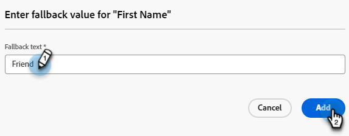

# Plantillas de correo electrónico {#email-templates}

Para un proceso de diseño acelerado y mejorado, puede crear plantillas de correo electrónico independientes para reutilizar fácilmente el contenido personalizado.

>[!PREREQUISITES]
>
>Para acceder al nuevo diseñador de correo electrónico, la suscripción de Marketo Engage debe migrarse al [Sistema Identity Management de Adobe (IMS)](https://experienceleague.adobe.com/en/docs/marketo/using/product-docs/administration/marketo-with-adobe-identity/adobe-identity-management-overview). Si el suyo aún no se ha actualizado y desea solicitar que se agilice, comuníquese con el equipo de cuenta de Adobe (su administrador de cuentas) o con [Soporte técnico de Marketo](https://nation.marketo.com/t5/support/ct-p/Support).

>[!NOTE]
>
>Las plantillas de correo electrónico del nuevo diseñador de correo electrónico solo se pueden utilizar para crear correos electrónicos en el nuevo diseñador. No se puede hacer referencia a ellos en el antiguo editor de correo electrónico.

## Creación de una plantilla de correo electrónico {#create-an-email-template}

1. Inicie sesión en el Marketo Engage a través de [Adobe Experience Cloud](https://experiencecloud.adobe.com/){target="_blank"}.

1. En Mi Marketo, seleccione **Design Studio**.

   

1. En el árbol, seleccione **Plantillas de correo electrónico (nuevo editor)**.

   

1. Haga clic en el botón **Crear plantilla**.

   

1. Introduzca un nombre de plantilla y una descripción opcional. Haga clic en **Crear**.

   

## Diseño de la plantilla {#design-your-template}

En la página _Diseña tu plantilla_, puedes elegir entre algunas opciones. [Diseñe desde cero](#design-from-scratch), [importe su propio HTML](#import-html) o [seleccione una plantilla existente](#choose-a-template) (una de nuestras muestras o una que ya haya guardado).

### Diseñe desde cero {#design-from-scratch}

Defina su contenido añadiendo y moviendo elementos estructurales con sencillas acciones de arrastrar y soltar.

1. En la página _Diseña tu plantilla_, selecciona **Diseñar desde cero**.

1. Agregar [estructura y contenido](#add-structure-and-content).

### Importe su HTML {#import-your-html}

Puede importar contenido existente del HTML para diseñar sus plantillas de correo electrónico. El contenido puede ser:

* Archivo de HTML con una hoja de estilos incorporada

* Archivo .zip que incluye un archivo de HTML, la hoja de estilos (.css) y las imágenes

>[!NOTE]
>
>No hay restricciones en la estructura de archivos .zip. Sin embargo, las referencias deben ser relativas y ajustarse a la estructura de árbol de la carpeta .zip.

1. En la página _Diseña tu plantilla_, selecciona **HTML de importación**.

1. Arrastre y suelte el HTML o archivo .zip deseado (o seleccione un archivo del equipo) y haga clic en **Importar**.

   

   >[!NOTE]
   >
   >Cuando se carga el contenido del HTML, el contenido se encuentra en modo de compatibilidad. En este modo, solo puede personalizar el texto, agregar vínculos o agregar recursos al contenido.

1. Para poder aprovechar los componentes de contenido de Designer de correo electrónico, haga clic en la pestaña **convertidor de HTML** y luego en **Convertir**.

   >[!CAUTION]
   >
   >El uso de una etiqueta `<table>` como primera capa en un archivo de HTML puede causar la pérdida de estilo, incluida la configuración del fondo y el ancho en la etiqueta de capa superior.

Ahora puede personalizar el archivo importado según sea necesario con el editor de correo electrónico visual.

### Elija una plantilla {#choose-a-template}

Existen dos tipos de plantillas para elegir.

* **Plantillas de ejemplo**: El Marketo Engage ofrece cuatro plantillas de correo electrónico predeterminadas.

* **Plantillas guardadas**: son plantillas que creó desde cero mediante el menú Plantillas o un mensaje de correo electrónico que creó y eligió guardar como plantilla.

>[!BEGINTABS]

>[!TAB Plantillas de muestra]

Elija una de las plantillas listas para usar para empezar con su diseño de plantillas de correo electrónico.

1. La pestaña Plantillas de muestra está abierta de forma predeterminada.

1. Seleccione la plantilla que desee utilizar.

   

1. Haga clic en **Usar esta plantilla**.

   

1. Edite el contenido como desee con el diseñador de contenido visual.

>[!TAB Plantillas guardadas]

1. Haga clic en la ficha **Plantillas guardadas** y seleccione la plantilla que desee.

   

1. Haga clic en **Usar esta plantilla**.

   

1. Edite el contenido como desee con el diseñador de contenido visual.

>[!ENDTABS]

## Añadir estructura y contenido {#add-structure-and-content}

1. Para empezar a crear o modificar contenido, arrastre y suelte un elemento de Estructuras en el lienzo. Edite su configuración en el panel de la derecha.

   >[!TIP]
   >
   >Seleccione el componente de columna n:n para definir el número de columnas que desea (entre tres y 10). También puede definir el ancho de cada columna moviendo las flechas debajo de la columna.

   

   >[!NOTE]
   >
   >Cada tamaño de columna no puede ser inferior al 10 % de la anchura total del componente de estructura. Solo se pueden eliminar columnas vacías.

1. En la sección Contenido, arrastre sobre los elementos deseados y suéltelos en uno o más componentes de estructura.

   

1. Cada componente se puede personalizar mediante las pestañas Settings o Style. Cambie la fuente, el estilo del texto, el margen, etc.

### Añadir Assets {#add-assets}

Agregue imágenes que estén almacenadas en la sección [Imágenes y archivos](/help/marketo/product-docs/demand-generation/images-and-files/add-images-and-files-to-marketo.md){target="_blank"} de la instancia de Marketo Engage.

>[!NOTE]
>
>Sólo puede agregar imágenes en el nuevo diseñador, no en otros tipos de archivo en este momento.

1. Para acceder a sus imágenes, haga clic en el icono Selector de recursos.

   

1. Arrastre y suelte la imagen deseada en un componente de estructura.

   

   >[!NOTE]
   >
   >Para reemplazar una imagen existente, selecciónela y haga clic en **Seleccionar un recurso** en la pestaña Configuración a la derecha.

### Capas, configuración y estilos {#layers-settings-styles}

Abra el árbol de navegación para acceder a estructuras específicas y a sus columnas/componentes para una edición más granular. Para acceder a, haga clic en el icono del árbol de navegación.

En el ejemplo siguiente se describen los pasos para ajustar el relleno y la alineación vertical dentro de un componente de estructura compuesto por columnas.

1. Seleccione la columna en el componente de estructura directamente en el lienzo o mediante el _árbol de navegación_ que se muestra a la izquierda.

1. En la barra de herramientas de la columna, haga clic en la herramienta _[!UICONTROL Seleccionar una columna]_ y elija la que desee editar.

   También puede seleccionarlo en el árbol de estructura. Los parámetros editables de esa columna se muestran en las fichas _[!UICONTROL Configuración]_ y _[!UICONTROL Estilos]_ de la derecha.

   

1. Para editar las propiedades de la columna, haga clic en la ficha _[!UICONTROL Estilos]_ de la derecha y cámbielas según sus necesidades:

   * Para **[!UICONTROL Background]**, cambie el color de fondo según sea necesario.

     Desactive la casilla de verificación para un fondo transparente. Habilite la configuración de **[!UICONTROL imagen de fondo]** para usar una imagen como fondo en lugar de un color sólido.

   * Para **[!UICONTROL Alignment]**, selecciona el icono _Top_, _Middle_ o _Bottom_.
   * Para **[!UICONTROL Padding]**, defina el relleno para todos los lados.

     Seleccione **[!UICONTROL relleno diferente para cada lado]** si desea ajustar el relleno. Haga clic en el icono _Bloquear_ para interrumpir la sincronización.

   * Expanda la sección **[!UICONTROL Avanzado]** para definir estilos en línea para la columna.

   

1. Repita estos pasos según sea necesario para ajustar la alineación y el relleno de las demás columnas del componente.

1. Guarde los cambios.

### Personalizar contenido {#personalize-content}

Los tokens funcionan en el nuevo editor del mismo modo que en el antiguo, pero el icono tiene un aspecto diferente. El ejemplo siguiente describe cómo agregar un token de nombre con texto de reserva.

1. Seleccione el componente de texto. Coloque el cursor donde desee que aparezca el token y haga clic en el icono **Agregar personalización**.

   

1. Haga clic en el [tipo de token](/help/marketo/product-docs/demand-generation/landing-pages/personalizing-landing-pages/tokens-overview.md){target="_blank"} deseado.

   

1. Busque el token deseado y haga clic en el icono **...** (al hacer clic en el icono + se agrega un token sin texto de reserva).

   

   >[!NOTE]
   >
   >&quot;Texto de reserva&quot; es el nuevo término del editor para el valor predeterminado. Ejemplo: ``{{lead.First Name:default=Friend}}``. Se recomienda en caso de que no haya ningún valor para la persona en el campo que elija.

1. Establece el texto de reserva y haz clic en **Agregar**.

   

1. Haga clic en **Guardar**.

### Editar seguimiento de URL {#edit-url-tracking}

A veces no se desea habilitar la URL de seguimiento de Marketo en un vínculo de un mensaje de correo electrónico. Esto resulta útil cuando la página de destino no admite parámetros de URL y puede provocar que se rompa un vínculo.

1. Haga clic en el icono Links para mostrar todas las direcciones URL del correo electrónico.

   

1. Haga clic en el icono de lápiz para editar el seguimiento de cualquier vínculo deseado.

1. Haga clic en el menú desplegable **Tipo de seguimiento** y realice la selección.

   

   <table><tbody>
     <tr>
       <td><b>Seguimiento sin mkt_tok</b></td>
       <td>Activa el seguimiento en la dirección URL sin usar el parámetro de cadena de consulta mkt_tok en la dirección URL de destino</td>
     </tr>
     <tr>
       <td><b>Seguimiento con mkt_tok</b></td>
       <td>Activa el seguimiento en la URL con el uso del parámetro de cadena de consulta mkt_tok en la URL de destino</td>
     </tr>
     <tr>
       <td><b>No rastrear</b></td>
       <td>Deshabilita el seguimiento de la dirección URL</td>
     </tr>
   </tbody>
   </table>

1. De forma opcional, puede asignar una etiqueta a la dirección URL o agregar etiquetas.

1. Haga clic en **Guardar** cuando termine.

### Ver opciones {#view-options}

Aproveche las opciones de vista y validación de contenido disponibles en el editor de correo electrónico visual.

* Acercar/alejar el contenido mediante las opciones de zoom preestablecidas.

* Vea el contenido en equipos de escritorio, dispositivos móviles o solo texto/texto sin formato.

   * Haga clic en el icono de vista en directo (ojo) para previsualizar el contenido en todos los dispositivos.

   * Seleccione uno de los dispositivos predeterminados o introduzca dimensiones personalizadas para obtener una vista previa del contenido.

### Más opciones {#more-options}

Desde las opciones **Más** del editor de contenido, puede realizar las siguientes acciones:

* **Restablecer plantilla**: seleccione esta opción para borrar el lienzo visual del diseñador de correo electrónico en una pizarra en blanco y reiniciar la creación de contenido.

* **Cambia tu diseño**: vuelve a la página _Diseña tu plantilla_. Desde aquí, puede realizar cualquier acción como se describe en la sección [Diseñar su plantilla](#design-your-template).

* **HTML de exportación**: descargue el contenido del lienzo visual en su sistema local en formato de HTML empaquetado como archivo zip.

## Ver detalles de la plantilla {#view-template-details}

En la página de lista _Plantillas de correo electrónico_, haga clic en el nombre de una plantilla de correo electrónico para ver sus detalles.

(assets/view-template-details-1.png

Se pueden editar detalles básicos como el nombre y la descripción. Haga clic fuera del campo que ha editado para guardar los cambios.

Haga clic en **Más** para eliminar o duplicar rápidamente su plantilla.

Si hay alertas activas (errores/advertencias para la plantilla de correo electrónico), haga clic en Alertas para ver la información.

>[!NOTE]
>
>Aunque estas alertas no prohíben el uso de la plantilla de correo electrónico para la creación de correos electrónicos, la información proporciona visibilidad sobre lo que podría no funcionar y las actualizaciones necesarias antes de que el correo electrónico se pueda utilizar para la entrega.

## Ver plantilla de correo electrónico utilizada por referencias {#email-template-used-by-references}

En el resumen de la plantilla de correo electrónico, haga clic en la ficha **Utilizada por** para ver los detalles de dónde se ha utilizado esta plantilla de correo electrónico en Marketo Engage.

## Editar plantillas de correo electrónico {#edit-email-templates}

Esta acción se puede realizar desde:

* Pestaña Detalles: haga clic en **Editar plantilla de correo electrónico**.

Esta acción lo lleva a la página _Diseñar su plantilla_ o a la página del editor de contenido visual en función del último estado guardado de la plantilla de correo electrónico. Desde aquí puede editar el contenido de su plantilla de correo electrónico según sea necesario. Consulte Creación de plantillas de correo electrónico para obtener información sobre las opciones de edición.

## Duplicar plantillas de correo electrónico {#duplicate-email-templates}

Existen dos formas de duplicar una plantilla de correo electrónico:

* En los detalles de la plantilla de correo electrónico de la derecha, haga clic en **Más** y seleccione **Duplicar**.

  

* En la página de listado de _Plantillas de correo electrónico_, haga clic en el icono Más acciones (tres puntos) de la plantilla de correo electrónico deseada y elija **Duplicado**.

En el cuadro de diálogo, introduzca un nombre único y una descripción opcional. Haga clic en **Duplicar** cuando haya terminado.

La plantilla de correo electrónico duplicada aparecerá en la página del listado de _plantillas de correo electrónico_.

## Eliminar plantillas de correo electrónico {#delete-email-templates}

Existen dos formas de eliminar una plantilla de correo electrónico.

>[!CAUTION]
>
>La eliminación de una plantilla de correo electrónico no se puede deshacer.

* En los detalles de la plantilla de correo electrónico de la derecha, haga clic en **Más** y seleccione **Eliminar**.

  

* En la página de listado de _Plantillas de correo electrónico_, haga clic en el icono Más acciones (tres puntos) de la plantilla de correo electrónico que quiera y elija **Eliminar**.

## Acciones masivas {#bulk-actions}

En la página de lista _Plantillas de correo electrónico_, seleccione varias plantillas seleccionando las casillas de verificación de la izquierda. Aparece un titular en la parte inferior.

**Eliminar**: puede eliminar un máximo de 20 plantillas al mismo tiempo. Un cuadro de diálogo de confirmación le permite anular la acción o confirmar la eliminación.

>[!MORELIKETHIS]
>
>[Creación de correo electrónico](/help/marketo/product-docs/email-marketing/email-designer/email-authoring.md){target="_blank"}: Aprenda a crear, diseñar y hacer referencia a un correo electrónico en el nuevo diseñador.
