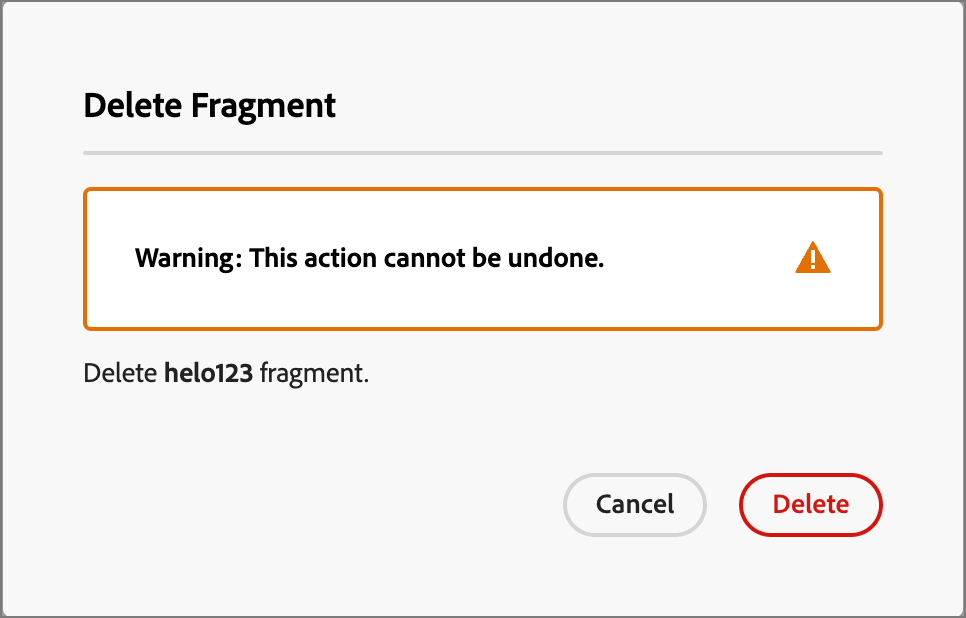

# Fragmentos

Un fragmento es un componente reutilizable al que se puede hacer referencia en uno o varios correos electrónicos y plantillas de correo electrónico. Normalmente es un bloque de contenido (texto, imagen o ambos) que se puede insertar rápidamente en el proyecto. Con esta funcionalidad, puede crear previamente varios bloques de contenido personalizado para combinar el contenido del correo electrónico y mejorar el proceso de diseño. Los casos de uso comunes incluyen bloques de contenido de encabezado/pie de página para correo electrónico, titulares de invitaciones a eventos, mensajes de temporada y mucho más.

Para aprovechar al máximo los fragmentos de sus flujos de trabajo:

* _Crear fragmentos_: cree fragmentos visuales, ya sea desde cero o guardando el contenido como un fragmento desde el editor de contenido visual.
* _Reutilizar fragmentos_: utilícelos tantas veces como sea necesario en el contenido.

## Fragmentos visuales {#visual-fragments}

Los fragmentos visuales son bloques visuales predefinidos creados (mediante el editor de contenido visual) que se pueden reutilizar en varios correos electrónicos o plantillas de correo electrónico.

## Acceso y administración de fragmentos {#access-and-manage-fragments}

Para acceder a los fragmentos visuales, vaya a **Design Studio** en Marketo Engage. En el árbol de la izquierda, haga clic en **[!UICONTROL Fragmentos (nuevos)]**.

{width="600" zoomable="yes"}

De manera predeterminada, la tabla está ordenada por la columna _[!UICONTROL Modificada]_. Haga clic en otros títulos de columna para cambiar por qué se ordena la tabla. Vuelva a hacer clic en el mismo título para cambiar entre ascendente y descendente.

### Buscar y filtrar

Utilice la barra de búsqueda para buscar un fragmento por nombre. Haga clic en el icono _Filtro_ (  ) para mostrar las opciones de filtro disponibles y elegir la configuración que desee.

{width="700" zoomable="yes"}

### Personalizar las columnas {#customize-the-column-display}

Personalice las columnas que desee mostrar en la tabla haciendo clic en el icono _Personalizar tabla_ (  ) en la parte superior derecha.

Seleccione las columnas que desee y haga clic en **[!UICONTROL Aplicar]**.

{width="400" zoomable="yes"}

### Estado del fragmento {#fragment-status}

El estado del fragmento determina su disponibilidad para utilizarlo en un correo electrónico o plantilla de correo electrónico y los cambios que puede realizar en él.

<table>
<tbody>
  <tr>
    <td width="25%"><b>Borrador</b></td>
    <td width="75%">Cuando crea un fragmento, está en estado de borrador. Permanece como borrador hasta que se publica para utilizarlo en un correo electrónico o en una plantilla de correo electrónico.
    
Acciones disponibles:
    <li>Editar todos los detalles</li>
    <li>Editar en el diseñador visual</li>
    <li>Publicar</li>
    <li>Duplicado</li>
    <li>Eliminar</li>
  </td>
  <tr>
    <td><b>Publicadas</b></td>
    <td>Al publicar un fragmento, pasa a estar disponible para su uso en un correo electrónico o plantilla de correo electrónico. El contenido de fragmento publicado no se puede modificar en el diseñador visual.
    
Acciones disponibles:
    <li>Editar descripción</li>
    <li>Añadir a un correo electrónico o plantilla</li>
    <li>Crear versión de borrador</li>
    <li>Duplicado</li>
    <li>Eliminar (si no está en uso)</li>
    </td>
  </tr>
  <tr>
    <td style="width:25%"><b>Publicado con borrador</b></td>
    <td style="width:75%">Cuando crea un borrador a partir de un fragmento publicado, la versión publicada permanece disponible para su uso en una plantilla de correo electrónico o correo electrónico, y el contenido del borrador se puede modificar en el diseñador visual. Si publica la versión de borrador, reemplazará la versión publicada actual y el contenido se actualizará en <i>todos</i> los correos electrónicos y las plantillas de correo electrónico en los que esté en uso. 
    
Acciones disponibles:
    <li>Editar descripción</li>
    <li>Añadir a un correo electrónico o plantilla</li>
    <li>Editar versión de borrador en el diseñador visual</li>
    <li>Publicar versión de borrador</li>
    <li>Duplicado</li>
    <li>Eliminar (si no está en uso)</li>
    </td>
  </tr>
</tbody>
</table>

## Creación de fragmentos {#create-fragments}

1. Para crear un nuevo fragmento visual, haga clic en **[!UICONTROL Crear fragmento]** en la parte superior derecha de la página de la lista de fragmentos.

   {width="700" zoomable="yes"}

1. Asigne un **[!UICONTROL Nombre]** al fragmento y una **[!UICONTROL Descripción]** opcional.

   _Requisitos de fragmento_

   * Nombre: máximo de 100 caracteres, debe ser único, sin distinción de mayúsculas y minúsculas
   * Descripción: 300 caracteres como máximo
   * Caracteres: los caracteres alfanuméricos y especiales están bien
   * Los caracteres reservados **_no se permiten_**: `\ / : * ? " < > |`

   {width="400" zoomable="yes"}

1. Haga clic en **[!UICONTROL Crear]**.

   {width="400" zoomable="yes"}

   >[!NOTE]
   >
   >No se puede modificar el **tipo** de un fragmento en este momento.

   El diseñador visual se abre con un lienzo vacío.

1. Use las [herramientas de diseño de contenido](/help/marketo/product-docs/email-marketing/email-designer/email-authoring.md#add-structure-and-content){target="_blank"} para crear el contenido del fragmento visual.

1. Haga clic en **[!UICONTROL Guardar]** en cualquier momento para guardar el fragmento de borrador.

1. Cuando esté listo para que el fragmento esté disponible para usarlo en un correo electrónico o plantilla de correo electrónico, haga clic en **[!UICONTROL Publicar]**.

## Ver detalles del fragmento {#view-fragment-details}

Haga clic en el nombre de cualquier fragmento de la página de lista para abrir la página de detalles del fragmento. Puede editar el fragmento, cambiarle el nombre o actualizar su descripción. Realice actualizaciones y haga clic fuera del nombre o del campo de descripción para guardar los cambios.

>[!NOTE]
>
>Si un fragmento publicado está siendo utilizado por una plantilla de correo electrónico o de correo electrónico, no puede cambiar su nombre ni editar el contenido. Puede crear una versión de borrador si desea realizar cambios en el fragmento.

{width="600" zoomable="yes"}

Haga clic en **[!UICONTROL Editar fragmento]** para abrir el fragmento en el editor de contenido visual.

Salga de la vista en cualquier momento haciendo clic en la flecha _Atrás_ en la parte superior izquierda, que le devuelve a la página de lista _Fragmentos_.

## Ver fragmento utilizado por referencias {#view-fragment-used-by-references}

En la página de detalles del fragmento, haga clic en la ficha **[!UICONTROL Utilizado por]** para ver los detalles de dónde se está utilizando el fragmento en Marketo Engage.

>[!IMPORTANT]
>
>Un fragmento que esté siendo utilizado actualmente por un correo electrónico o una plantilla de correo electrónico no se puede eliminar.

{width="600" zoomable="yes"}

Haga clic en el vínculo para abrir el correo electrónico o la plantilla de correo electrónico correspondiente donde se utiliza el fragmento.

## Eliminar fragmentos {#delete-fragments}

Debido a que un fragmento que se encuentra actualmente en uso por una plantilla de correo electrónico o de correo electrónico no se puede eliminar, asegúrese de comprobar las referencias de _usado por_ antes de iniciar la eliminación de un fragmento. Además, una eliminación no se puede deshacer, por lo que debe comprobarla antes de iniciar una acción de eliminación.

Puede eliminar un fragmento mediante cualquiera de los siguientes métodos:

* En los detalles del fragmento a la derecha, haga clic en **[!UICONTROL Eliminar]**.
* En la página de lista _[!UICONTROL Fragmentos]_, haga clic en los puntos suspensivos junto al fragmento y elija **[!UICONTROL Eliminar]**.

Esta acción abre un cuadro de diálogo de confirmación. Puede anular el proceso haciendo clic en **[!UICONTROL Cancelar]** o en **[!UICONTROL Eliminar]** para confirmar la eliminación.

{width="400"}

## Editar fragmentos {#edit-fragments}

Las ediciones en un fragmento dependen de su estado actual:

* Cuando un fragmento tiene el estado _Borrador_, puede editar cualquiera de sus detalles y el contenido visual.
* Cuando un fragmento tiene el estado _Publicado_, puede editar la descripción del fragmento, pero no el nombre. No puede editar el contenido visual.
* Cuando un fragmento está en _Publicado con estado de borrador_, la edición de los detalles se limita a la descripción. También puede editar el contenido visual de la versión de borrador.

>[!BEGINTABS]

>[!TAB Borrador]

1. En la página de lista _[!UICONTROL Fragmentos]_, haga clic en el nombre del fragmento para abrirlo.

   Se muestra una previsualización del contenido visual, con los detalles del fragmento a la derecha.

1. Realice las ediciones que desee.

   {width="600" zoomable="yes"}

1. Para realizar cambios en el contenido en el diseñador visual, haga clic en **[!UICONTROL Editar fragmento]**. Haga clic en **Guardar** cuando termine.

1. Haga clic en **[!UICONTROL Guardar]** o **[!UICONTROL Guardar y cerrar]** para volver a los detalles del fragmento.

1. Si desea que el fragmento esté disponible para su uso en un correo electrónico o plantilla de correo electrónico, haga clic en **[!UICONTROL Publicar]**.

>[!TAB Publicado]

1. En la página de lista _[!UICONTROL Fragmentos]_, haga clic en el nombre del fragmento para abrirlo.

   Se muestra una previsualización del contenido visual, con los detalles del fragmento a la derecha.

1. Modifique la descripción, si es necesario.

   Para un fragmento publicado, todos los demás detalles no se pueden cambiar.

1. Si desea actualizar el contenido, haga clic en **[!UICONTROL Crear versión de borrador]** en la parte superior derecha.

   Haga clic en **[!UICONTROL Aceptar]** en el cuadro de diálogo para abrir la versión de borrador en el diseñador visual. Puede cambiar el `image source` KG - LINK HERE si es necesario.

   {width="300"}

1. Haga clic en **[!UICONTROL Guardar]** o **[!UICONTROL Guardar y cerrar]** para volver a los detalles del fragmento.

1. Si desea que el fragmento esté disponible para su uso en un correo electrónico o plantilla de correo electrónico, haga clic en **[!UICONTROL Publicar]**.

>[!NOTE]
>
>Cuando publica la versión de borrador, reemplaza la versión publicada actual y el contenido se actualiza en los correos electrónicos y las plantillas de correo electrónico donde ya se utiliza.

>[!TAB Publicado con borrador]

Hay dos formas de abrir la versión de borrador para editarla desde la página de listado _[!UICONTROL Fragmentos]_:

* Haga clic en el icono _Más_ (**...**) junto al nombre del fragmento y elija **[!UICONTROL Abrir versión de borrador]**.

  {width="300"}

* Haga clic en el nombre del fragmento para abrirlo. A continuación, haga clic en **[!UICONTROL Abrir versión de borrador]** en la parte superior derecha.

Se mostrará una vista previa del contenido visual de la versión de borrador, con los detalles del fragmento a la derecha.

Para actualizar el contenido:

1. Haga clic en **[!UICONTROL Editar fragmento]** en la parte superior derecha. Haga clic en **Guardar** cuando termine.

1. Haga clic en **[!UICONTROL Guardar]** o **[!UICONTROL Guardar y cerrar]** para volver a los detalles del fragmento.

1. Si desea que el fragmento esté disponible para su uso en un correo electrónico o plantilla de correo electrónico, haga clic en **[!UICONTROL Publicar]**.

>[!NOTE]
>
>Cuando publica la versión de borrador, reemplaza la versión publicada actual y el contenido se actualiza en los correos electrónicos y las plantillas de correo electrónico donde ya se utiliza.

>[!ENDTABS]

## Duplicar fragmentos {#duplicate-fragments}

Puede duplicar un fragmento mediante cualquiera de los siguientes métodos:

* En la página de listado de _[!UICONTROL Fragmentos]_, haga clic en el icono _Más_ (**...**) junto al nombre del fragmento y elija **[!UICONTROL Duplicado]**.
* En la parte superior derecha de la página de detalles del fragmento, haga clic en **[!UICONTROL ... Más]** y elige **[!UICONTROL Duplicar]**.

{width="600" zoomable="yes"}

En el cuadro de diálogo, introduzca un nombre único y una descripción opcional. Haga clic en **[!UICONTROL Duplicar]**.

{width="400"}

El fragmento duplicado aparecerá en la lista _Fragmentos_.

## Guardar un nuevo fragmento del contenido del correo electrónico o de la plantilla {#save-a-new-fragment-from-email-or-template-content}

Al crear o editar un correo electrónico o una plantilla de correo electrónico en el editor de contenido visual, puede guardar todo o parte del contenido como un fragmento para reutilizarlo.

1. Para guardar contenido como un fragmento, haga clic en **[!UICONTROL Más]** y elija **[!UICONTROL Guardar como fragmento]**.

1. Seleccione los diferentes elementos que desea incluir en el fragmento.

   Para seleccionar varias estructuras, mantenga pulsado el botón Mayús o Control.

   Solo puede seleccionar estructuras adyacentes entre sí.

1. Con el contenido seleccionado, haz clic en **[!UICONTROL Crear]** en la parte superior derecha.

1. En el cuadro de diálogo, escriba un nombre y una descripción opcional para el fragmento y haga clic en **[!UICONTROL Crear]**.

A continuación, el fragmento se mostrará en la página de lista _Fragmentos_ y estará disponible para su uso en correos electrónicos y plantillas de correo electrónico.

## Añadir fragmentos visuales al contenido del correo electrónico o de la plantilla {#add-visual-fragments-to-your-email-or-template-content}

Los fragmentos están diseñados para su reutilización. Puede añadir hasta 30 en un correo electrónico o plantilla de correo electrónico, y solo se pueden anidar hasta un nivel.

* [Añadir un fragmento a un correo electrónico](/help/marketo/product-docs/email-marketing/email-designer/email-authoring.md#add-fragments)

* [Añadir un fragmento a una plantilla de correo electrónico](/help/marketo/product-docs/email-marketing/email-designer/email-template-authoring.md#add-fragments)

El contenido del fragmento se actualiza dinámicamente dentro de la estructura para procesar una representación visual de cómo aparece el contenido en el correo electrónico.

>[!TIP]
>
>Si desea que el fragmento ocupe todo el diseño horizontal del correo electrónico, agregue una estructura de columna [!UICONTROL 1:1] y, a continuación, arrastre y suelte el fragmento en él.

Una vez guardada la plantilla de correo electrónico/correo electrónico, aparecerá en la página de detalles del fragmento cuando se seleccione la pestaña _[!UICONTROL Utilizado por]_. Los fragmentos añadidos no se pueden editar dentro del correo electrónico o la plantilla; el fragmento de origen publicado define el contenido.

## Acciones de fragmento durante la creación de correos electrónicos y plantillas {#fragment-actions-during-email-and-template-authoring}

Cuando se añade un fragmento a un correo electrónico o a una plantilla de correo electrónico, su contenido no se puede editar dentro del correo electrónico o la plantilla. Sin embargo, puede aplicar las siguientes acciones:

* **[!UICONTROL Eliminar]**: elimina el fragmento del contenido actual del correo electrónico o de la plantilla de correo electrónico (el origen del fragmento no se ve afectado).
* **[!UICONTROL Actualizar]**: esto actualiza el contenido del fragmento en el correo electrónico o la plantilla de correo electrónico actual. La actualización es útil cuando desea reflejar cualquier edición reciente en el fragmento después de la adición al correo electrónico o a la plantilla de correo electrónico.
* **[!UICONTROL Duplicado]**: duplica el fragmento en el mismo correo electrónico o plantilla de correo electrónico dentro del editor. El fragmento duplicado se agrega justo debajo del original.
* **[!UICONTROL Abrir fragmento]**: Se abrirá una nueva pestaña del explorador con la página del editor de fragmentos y los detalles.
* **[!UICONTROL Romper herencia]**: esto rompe la herencia del fragmento (y sus cambios) del origen. Utilice esta acción para que el contenido del fragmento esté disponible como contenido independiente y editable dentro del correo electrónico o la plantilla de correo electrónico. Esta acción también quita el correo electrónico o la plantilla de correo electrónico de la referencia _Utilizada por_ para el fragmento original.

Al seleccionar el fragmento en la página del editor, estas acciones están disponibles en la barra de herramientas contextual y en el panel de propiedades de la derecha.

{width="600" zoomable="yes"}
