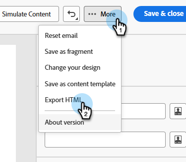

# Integración de GenStudio para Marketo Engage {#genstudio-integration-for-marketo-engage}

Adobe GenStudio for Performance Marketing es una aplicación generativa de IA-First que le permite crear sus propios anuncios y correos electrónicos para impulsar campañas de marketing personalizadas e impactantes que cumplan con los estándares de su marca y las políticas de su empresa. Ofrece una serie de herramientas que simplifican las complejidades de la creación de contenido.

>[!INFO]
>
>Más información sobre [GenStudio for Performance Marketing](https://experienceleague.adobe.com/es/docs/genstudio-for-performance-marketing/user-guide/home){target="_blank"}.

## Aprovechamiento de las funciones de GenStudio en Marketo Engage {#leverage-genstudio-capabilities}

Con esta integración, un experto en marketing técnico que utilice Marketo Engage para desarrollar y automatizar campañas de correo electrónico puede colaborar con un experto en marketing que cree contenido mediante GenStudio. Esto les permite integrar fácilmente contenido de marca de GenStudio en Marketo Engage.

## Exportación de una plantilla de HTML de Marketo Engage a GenStudio {#export-an-html-template}

Exporte fácilmente una plantilla que incluya las directrices de su marca a GenStudio for Performance Marketing.

1. En Marketo Engage, acceda al contenido del correo electrónico.

1. En Email Designer, haga clic en el botón **Más** y seleccione **Exportar HTML**.

   

1. [Cargar la plantilla exportada de HTML](https://experienceleague.adobe.com/en/docs/genstudio-for-performance-marketing/user-guide/content/templates/use-templates#templates-from-ajo-and-marketo){target="_blank"} en GenStudio for Performance Marketing.

1. En GenStudio, use esta plantilla para [crear varias variaciones de correo electrónico](https://experienceleague.adobe.com/en/docs/genstudio-for-performance-marketing/user-guide/create/create-email-experience){target="_blank"} con peticiones de datos de IA y guardarlas.

## Aprovechamiento de las experiencias de GenStudio en Marketo Engage {#leverage-genstudio-experiences}

Para aprovechar las variaciones de correo electrónico de GenStudio que creó importándolas a Marketo Engage, siga los pasos a continuación.

1. En Marketo Engage, [cree un correo electrónico](/help/marketo/product-docs/email-marketing/email-designer/email-authoring.md#create-an-email).

1. En la página Detalles del correo electrónico, haga clic en **Editar contenido del correo electrónico**.

   

1. Seleccione **Importar HTML**.

   

1. Haga clic en el botón **Adobe GenStudio for Performance Marketing**.

   

1. Examine las experiencias de GenStudio para empezar a crear contenido. Puede filtrar las experiencias según criterios como productos, personalidades, marcas o incluso colores.

1. Seleccione una experiencia y haga clic en **Usar**.

   {width="800" zoomable="yes"}

1. El contenido seleccionado se muestra en el Designer de correo electrónico.

   {width="800" zoomable="yes"}

>[!NOTE]
>
>Las experiencias de GenStudio creadas a partir de una plantilla de Marketo Engage se importan directamente en el Designer de correo electrónico. Las experiencias de GenStudio creadas sin una plantilla de Marketo Engage se importan en modo de compatibilidad.

Use las [herramientas de edición de contenido de correo electrónico](/help/marketo/product-docs/email-marketing/email-designer/email-authoring.md#add-structure-and-content){target="_blank"} y los [campos de personalización](/help/marketo/product-docs/email-marketing/email-designer/email-authoring.md#personalize-content){target="_blank"} para editar su correo electrónico como desee.
