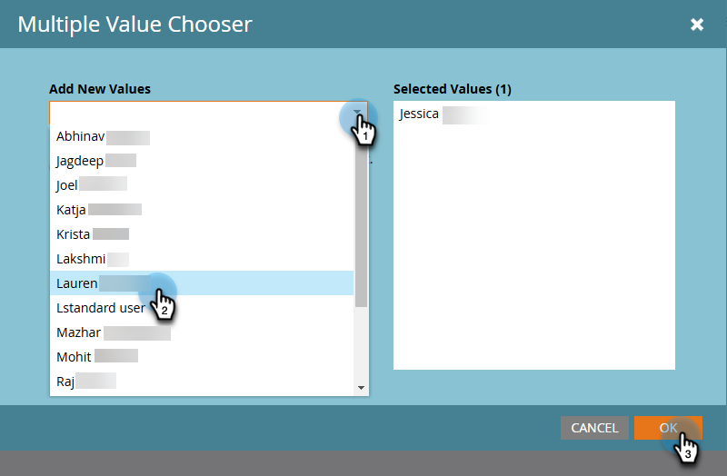

# Información general {#overview}

Bienvenido al nuevo Adobe Marketo Engage Email Designer.

El diseñador de correo electrónico es la última innovación en Marketo Engage diseñada para proporcionar una experiencia de creación de plantillas de correo electrónico y correo electrónico renovada para mejorar la productividad y la eficacia al proporcionar un editor visual de arrastrar y soltar junto con plantillas predeterminadas estándar. Cree fácilmente plantillas de correo electrónico personalizadas sin tener que gastar dinero en proveedores.

>[!NOTE]
>
>Aunque se puede acceder a Email Designer en todos los exploradores principales, en este momento no se admite la funcionalidad completa de Firefox.

## Cómo acceder a {#how-to-access}

+++Obtenga información sobre cómo acceder al diseñador de correo electrónico

Para acceder al nuevo diseñador de correo electrónico, la suscripción de Marketo Engage debe migrarse al [Sistema Identity Management de Adobe (IMS)](https://experienceleague.adobe.com/es/docs/marketo/using/product-docs/administration/marketo-with-adobe-identity/adobe-identity-management-overview). Si el suyo aún no se ha actualizado y desea solicitar que se agilice, póngase en contacto con el equipo de cuenta de Adobe (su administrador de cuentas) o con el [Soporte técnico de Marketo](https://nation.marketo.com/t5/support/ct-p/Support).

### Adición de usuarios {#add-users}

1. En Marketo Engage, vaya al área de **[!UICONTROL Administración]** y seleccione **[!UICONTROL Nuevo Designer de correo electrónico]**.

   {width="600" zoomable="yes"}

1. Haga clic en **[!UICONTROL Agregar usuarios]**.

   {width="600" zoomable="yes"}

1. En el menú desplegable **[!UICONTROL Agregar nuevos valores]**, seleccione los usuarios que desee. Haga clic en **[!UICONTROL Aceptar]** cuando haya terminado.

   {width="600" zoomable="yes"}

+++

## Artículos disponibles {#available-articles}

* [Creación de correo electrónico](/help/marketo/product-docs/email-marketing/email-designer/email-authoring.md){target="_blank"}: Aprenda a crear, diseñar y hacer referencia a un correo electrónico en el nuevo editor.

* [Creación de plantillas de correo electrónico](/help/marketo/product-docs/email-marketing/email-designer/email-template-authoring.md){target="_blank"}: Aprenda a crear, diseñar y acceder a una plantilla de correo electrónico en el nuevo editor.

* [Fragmentos](/help/marketo/product-docs/email-marketing/email-designer/fragments.md){target="_blank"}: aprenda a crear y utilizar fragmentos de contenido visual como componentes reutilizables para correos electrónicos y plantillas de correo electrónico.

* [Fragmentos personalizables](/help/marketo/product-docs/email-marketing/email-designer/customizable-fragments.md){target="_blank"}: Aprenda a personalizar fragmentos haciendo que algunos de sus campos sean editables.

* [Trabaje con recursos de AEM](/help/marketo/product-docs/email-marketing/email-designer/aem-assets.md){target="_blank"}: Aprenda a acceder fácilmente a sus recursos digitales de AEM para usarlos en Marketo Engage.

* [Editar imágenes con Adobe Express](/help/marketo/product-docs/email-marketing/email-designer/edit-images-adobe-express.md){target="_blank"}: Aprenda a editar imágenes en el editor de correo electrónico de Adobe Marketo Engage con Adobe Express.

* [Use el asistente de IA](/help/marketo/product-docs/email-marketing/email-designer/ai-assistant.md){target="_blank"}: aproveche la tecnología de IA generativa de Adobe para agregar texto o imágenes útiles a sus correos electrónicos.

* [Bloquear contenido en plantillas de correo electrónico](/help/marketo/product-docs/email-marketing/email-designer/content-locking.md){target="_blank"}: aprenda a bloquear contenido en plantillas de correo electrónico para evitar ediciones o eliminaciones no intencionales.

* [Comparación de características](/help/marketo/product-docs/email-marketing/email-designer/feature-comparison.md){target="_blank"}: compare la disponibilidad de características del editor de correo electrónico anterior (Editor de correo electrónico 2.0) y del nuevo Designer de correo electrónico.

## Preguntas frecuentes {#faq}

**¿Seguirá funcionando el antiguo editor de correo electrónico? Si es así, ¿por cuánto tiempo?**

Sí, el antiguo editor de correo electrónico (clásico) coexistirá con el nuevo diseñador de correo electrónico. Los correos electrónicos creados en el editor clásico permanecerán. No hay fecha de cuándo el editor clásico quedará obsoleto en este momento, pero seguirá funcionando a lo largo de 2025.

**¿En qué programas puedo usar los nuevos correos electrónicos de Designer de correo electrónico?**

Los nuevos correos electrónicos de Designer de correo electrónico son accesibles en todos los programas (con la única excepción de los programas de seminarios web interactivos). La clonación también está disponible.

**¿Funcionarán las plantillas de correo electrónico existentes en el nuevo diseñador? Si no es así, ¿es necesario crear plantillas con el nuevo diseñador para que todas las secciones/módulos se correspondan con el aspecto que queremos que tenga el contenido?**

No se puede hacer referencia a las plantillas de correo electrónico del editor clásico en el nuevo diseñador. Tendrá que crear nuevas plantillas en el nuevo diseñador. Sin embargo, _puede_ importar HTML de plantilla en el nuevo diseñador y realizar los ajustes necesarios. **Nota**: La compatibilidad de plantillas de editor clásico con el nuevo diseñador estará disponible pronto.

**¿Puedo mover fácilmente nuevos recursos de diseñador a un programa diferente?**

En este momento no. Pero esa funcionalidad estará disponible pronto.

**¿Se pueden editar los recursos mediante API en el nuevo diseñador de correo electrónico?**

Assets que se está editando mediante API no es compatible con el nuevo diseñador de correo electrónico en este momento.

**¿Hay alguna forma de reforzar la marca (fuentes, logotipos y colores)?**

Bloquear secciones de contenido es parte del nuevo diseñador y bloquear estilos, colores, etc. estará disponible próximamente.

**¿Hará que los módulos para plantillas sean más personalizables y escalables?**

Sí, absolutamente, más personalizable con nuestro editor de WYSIWYG (lo que se ve es lo que se obtiene).

**¿Cómo funciona el proceso de creación de plantillas de correo electrónico en el nuevo diseñador? ¿Es WYSIWYG o requiere conocimientos de HTML?**

Es WYSIWYG; no es necesario tener conocimientos de HTML. Puede crear fácilmente plantillas en el diseñador, lo que reduce la necesidad de desarrolladores web externos. Sin embargo, aún tiene la opción de actualizar CSS y editar secciones individuales a través de HTML. También estamos trabajando en una forma de migrar fácilmente las plantillas del editor clásico al nuevo diseñador.

**¿Admite el nuevo diseñador de correo electrónico el lenguaje AMP?**

En este momento no admite AMP.

**El contenido dinámico por atributo es excelente, pero ¿sigue funcionando el contenido dinámico por segmento?**

Actualmente, el nuevo diseñador solo admite atributos, pero estamos trabajando para que se añadan segmentos en una versión futura.

**¿Cómo puedo saber si nuestra suscripción a Marketo Engage se ha migrado a IMS (Adobe Admin Console)?**

Si inicias sesión en Marketo Engage a través de [Adobe Experience Cloud](https://experiencecloud.adobe.com/){target="_blank"}, se ha migrado tu suscripción.

**¿Qué exploradores puedo usar con el nuevo Designer de correo electrónico?**

Se recomienda utilizar Google Chrome, Apple Safari o Microsoft Edge. La compatibilidad total con Mozilla Firefox estará disponible más adelante.
