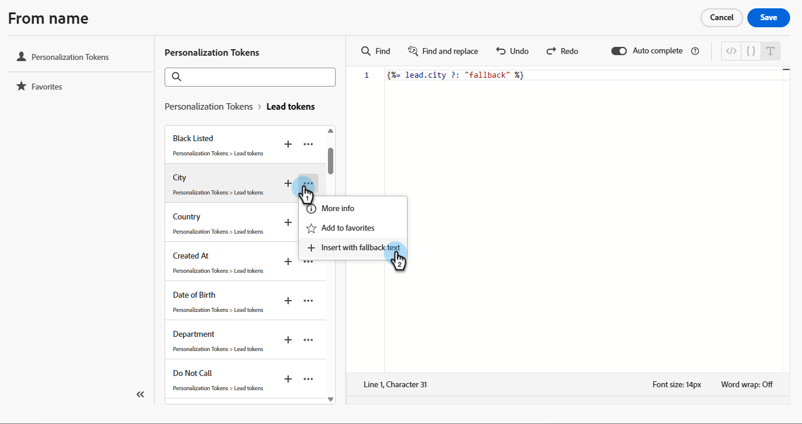

# Tokens de Personalization {#personalization-tokens}

El diseñador de correo electrónico tiene un formato diferente al editor de correo electrónico clásico en cuanto a los tokens de personalización de correo electrónico. El cambio se implementó para mejorar la compatibilidad con los scripts del Handlebar y optimizar el proceso de creación de correos electrónicos.

>[!AVAILABILITY]
>
>A partir del 23 de mayo de 2025, esta función se aprovisionará para usuarios de Marketo Engage por lotes, con una región actualizada por semana. Durante el despliegue, cualquier correo electrónico creado con el nuevo diseñador de correo electrónico migrará automáticamente los tokens existentes al nuevo formato. Con esta actualización, todos los tokens estarán disponibles únicamente en inglés.

## Caso de uso principal {#primary-use-case}

Esta mejora beneficia principalmente a aquellos que realizan la transición de [Secuencias de comandos de Velocity](https://experienceleague.adobe.com/es/docs/marketo-developer/marketo/email-scripting){target="_blank"} a Secuencias de comandos de Handlebar. El nuevo diseñador de correo electrónico solo admite el nuevo formato de token. El formato actualizado elimina espacios e introduce una estructura de texto predeterminada revisada, lo que garantiza una experiencia de script más fluida y eficaz.

## Experiencia del token {#token-experience}

Un vistazo a la experiencia del token, tanto antiguo como nuevo.

### Formato antiguo {#old-format}

En el editor de correo electrónico clásico, puede agregar tokens con espacios, como `lead.Anonymous IP` o `member.registration code`. El formato del texto predeterminado era: `{{lead.City:default=fallback}}`

{width="800" zoomable="yes"}

### Nuevo formato {#new-format}

En el diseñador de correo electrónico, debe usar [minúscula](https://developer.mozilla.org/en-US/docs/Glossary/Camel_case) o guiones bajos para los tokens (por ejemplo, `lead.anonymousIP` o `member.registration_code`). El formato del texto predeterminado también cambia a ``.

{width="800" zoomable="yes"}

## Cosas que hay que tener en cuenta {#things-to-note}

* El editor de personalización también incluye las siguientes funciones para facilitar la creación:

   * Deshacer/rehacer
   * Buscar/buscar y reemplazar
   * Autocompletar

* **Todos** los tokens anteriormente admitidos en Marketo Engage son compatibles con el nuevo editor de personalización.
