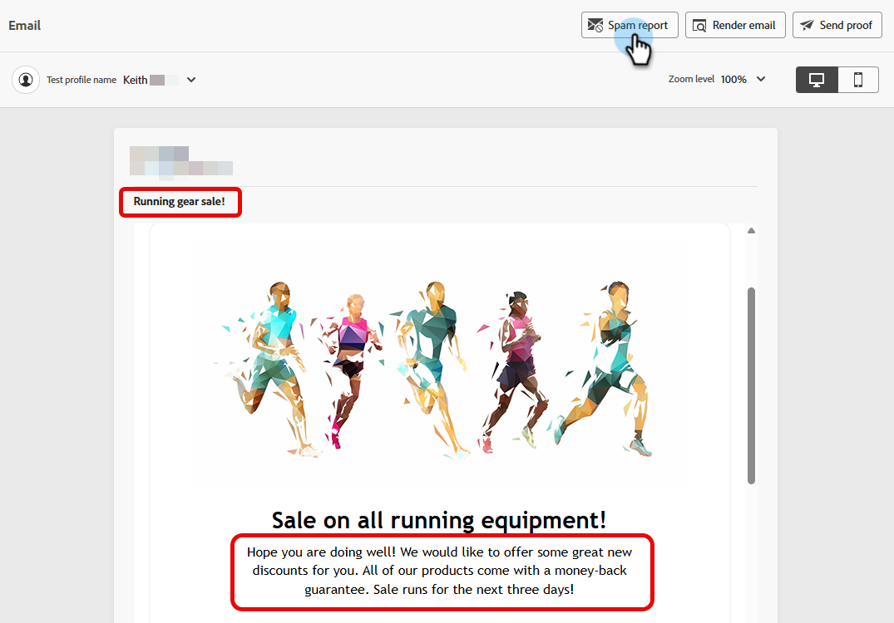

# Informe sobre correo electrónico spam {#email-spam-report}

Con SpamAssassin en Marketo Engage, puede probar el contenido del correo electrónico y ver la probabilidad de que los ISP/proveedores de buzones de correo lo marquen como correo no deseado.

SpamAssassin analiza el contenido y asigna una puntuación basada en distintos criterios. Cuanto más baja sea la puntuación, mejor. Es importante mantener una puntuación baja, ya que el envío de correos electrónicos con una puntuación alta puede afectar negativamente a la capacidad de envío general.

## Acceso al informe de spam {#access-the-spam-report}

1. En el correo electrónico, haga clic en **Simular contenido**.

   {width="600" zoomable="yes"}

   >[!NOTE]
   >
   >Si aún no ha agregado un perfil de prueba, tendrá que hacerlo justo después del paso 1.

1. Haga clic en el botón **Informe de spam**.

   

1. Se genera un informe de spam.

   {width="600" zoomable="yes"}

1. Compruebe las puntuaciones y descripciones de cada elemento.

   >[!IMPORTANT]
   >
   >Si la puntuación general es mayor de 5, el correo electrónico puede bloquearse o marcarse como correo no deseado durante la entrega.

1. Si considera que la puntuación es demasiado alta, edite el contenido en el Designer de correo electrónico en función de los resultados del informe y, a continuación, vuelva a ejecutar el **informe de correo no deseado**.

   {width="800" zoomable="yes"}

Cuando la puntuación es de tu agrado, está lista para ser enviada.

{width="800" zoomable="yes"}

>[!NOTE]
>
>La puntuación de spam se deriva mediante SpamAssassin y las reglas no son propiedad de Adobe. Encontrará más detalles sobre estas reglas en la [documentación de SpamAssassin](https://spamassassin.apache.org/#_blank){target="_blank"}. Se puede ver una lista completa de errores [aquí](https://spamassassin.apache.org/old/tests_3_0_x.html){target="_blank"}.
