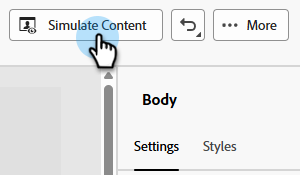
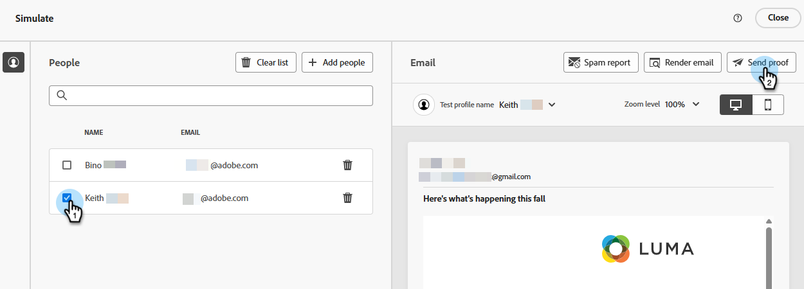
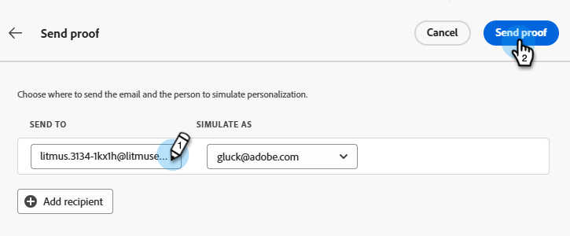

# Prueba del procesamiento de correo electrónico con Litmus {#test-email-rendering-with-litmus}

Use su cuenta de [Litmus](https://www.litmus.com/email-testing) en Marketo Engage para ver al instante cómo se procesa su correo electrónico en los clientes de correo electrónico más populares.

>[!AVAILABILITY]
>
>Esta función está disponible para todos los usuarios de Marketo Engage que tengan una cuenta activa de Litmus.

## Usuarios de Litmus Enterprise {#litmus-enterprise}

Los siguientes pasos son para usuarios del [Plan Litmus Enterprise](https://www.litmus.com/pricing/enterprise){target="_blank"}.

1. En la pantalla _Editar contenido de correo electrónico_, haga clic en el botón **Simular contenido**.

   

1. Seleccione el destinatario de la prueba y haga clic en el botón **Procesar correo electrónico**.

   {width="800" zoomable="yes"}

1. Si aún no lo ha hecho, **conecte su cuenta Litmus**. Si ya lo ha hecho, vaya al paso 6.

   {width="800" zoomable="yes"}

1. Escriba sus credenciales de Litmus y haga clic en **Iniciar sesión**.

   >[!IMPORTANT]
   >
   >Al conectar su cuenta de Litmus a Marketo Engage, acepta que los correos electrónicos de prueba se envíen a Litmus. Después de enviar, Adobe ya no administra esos correos electrónicos de prueba. Como tal, la política de correo electrónico de retención de datos de Litmus se aplica a esos correos electrónicos, incluidos los datos de personalización que se pueden incluir en ellos.

1. Haga clic en **Conectar** para completar la integración.

   

1. Haga clic en el botón **Ejecutar prueba** para generar vistas previas de correo electrónico.

1. Consulte el aspecto del contenido en clientes de correo electrónico populares basados en web, móviles y equipos de escritorio. Haga clic en tantas miniaturas como desee previsualizar.

   {width="800" zoomable="yes"}

   >[!NOTE]
   >
   >Aprenda a [personalizar la lista de clientes de correo electrónico predeterminada](https://help.litmus.com/article/227-change-your-default-email-clients-list).

1. Cuando termine de probar, haga clic en la flecha hacia atrás de la esquina superior izquierda para volver a la pantalla _Simular contenido_.

   

**PASO OPCIONAL**: si decide realizar cambios en su correo electrónico, después de hacer clic en **Procesar correo electrónico** para verlos, asegúrese de hacer clic también en el botón **Reintentar** en la parte superior derecha de la pantalla de Litmus _Vistas previas de correo electrónico_.

## Usuarios principales de Litmus {#litmus-core}

Los siguientes pasos son para usuarios del [Plan básico Litmus](https://www.litmus.com/pricing/){target="_blank"}.

1. En su cuenta de Litmus, recupere la dirección de correo electrónico de la prueba haciendo clic en el botón **Copiar dirección de la prueba** en la pantalla _Prueba_.

   {width="800" zoomable="yes"}

1. En Marketo Engage, vaya a la pantalla _Editar contenido de correo electrónico_ del correo electrónico deseado y haga clic en el botón **Simular contenido**.

   {width="600" zoomable="yes"}

1. Seleccione los destinatarios de la prueba y haga clic en el botón **Enviar prueba**.

   {width="800" zoomable="yes"}

1. Escriba la dirección de correo electrónico de Litmus que copió en el paso 1 y haga clic en **Enviar prueba** de nuevo.

   

1. Revise el correo electrónico dentro de su cuenta de Litmus (en la carpeta correspondiente a la dirección de correo electrónico que copió de Litmus).

   {width="800" zoomable="yes"}
